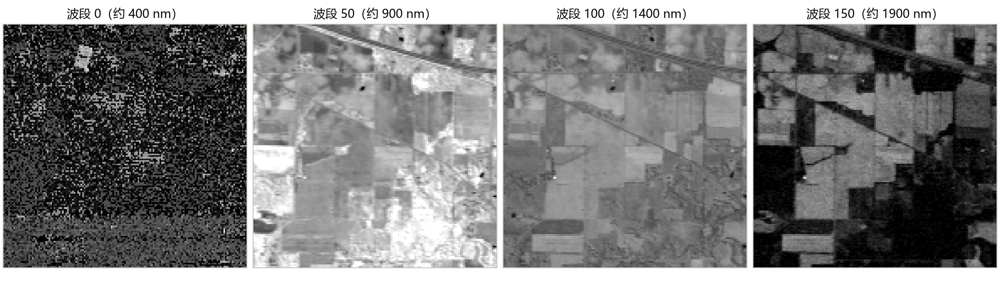
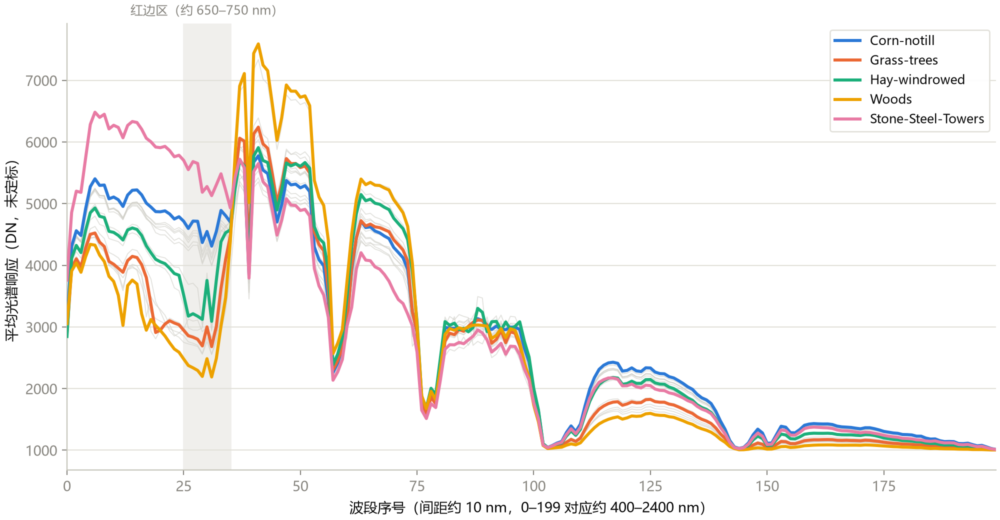
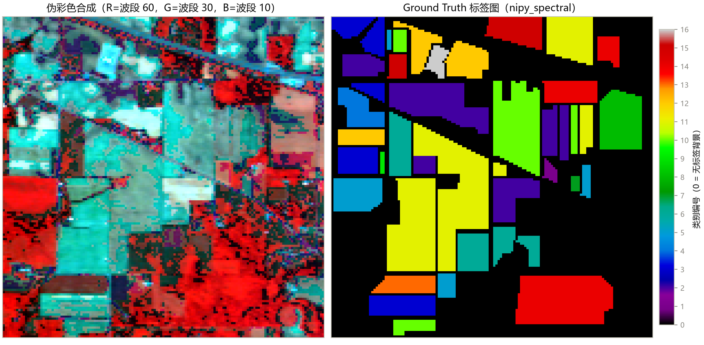
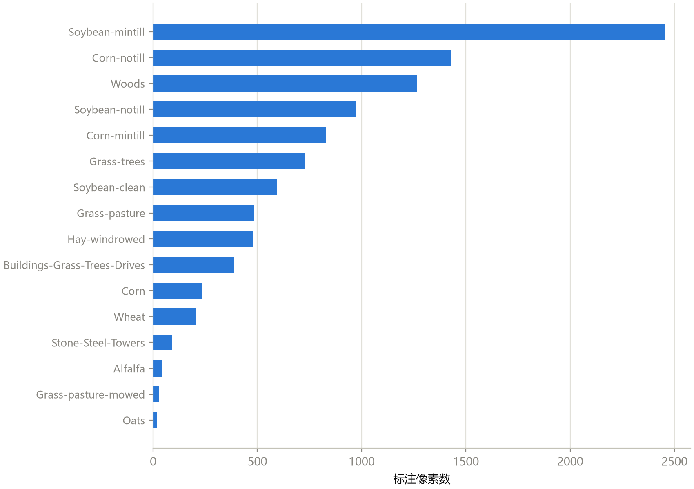

# 第 1 章 高光谱成像基础

> **Hyperspectral Imaging Fundamentals**

状态：✅ 已完成

---

## 本章定位

全课程的起点，不要求任何遥感或深度学习基础。学完本章，你应当能回答"高光谱图像到底是什么"，并亲手把 Indian Pines 数据集读出来、看明白。后续所有章节——实验协议（第 2 章）、传统基线（第 3 章）、patch 数据工程（第 4 章）、各类深度模型（第 5–10 章）乃至论文写作（第 13 章）——都建立在对这个数据形态的理解之上。

## 学习目标 / Learning Objectives

- 理解从 RGB → 多光谱 → 高光谱的演进，以及"高光谱"的界定标准（数十至数百个连续窄波段）
- 理解**数据立方体（data cube）**的三维结构 `(H, W, B)`，以及"图像 + 光谱"的双重属性
- 认识代表性成像光谱仪与传感器（AVIRIS、ROSIS、Hyperion 及新一代星载平台）和常见公开数据集
- 掌握 Indian Pines 场景的来历、尺寸、200 波段的由来与 16 类地物标签
- 会用 `scipy.io.loadmat` / `spectral` / `matplotlib` 加载并可视化：单波段图、伪彩色图、像元光谱曲线、Ground Truth 标签图

---

## 1.1 什么是高光谱成像

普通数码相机记录的是 RGB 三个很宽的通道。而物质对光的反射率随波长变化，这条**反射光谱曲线（reflectance spectrum）**就像物质的"指纹"——健康植被在红光边缘（约 700 nm）反射率陡升（即**红边 red edge**），水体在近红外强烈吸收，不同矿物各有独特的吸收谷。要利用这些指纹，相机必须能把光按更细的波长切开。

按波段数量和宽度，光学遥感影像通常分为三类：

| 类型 | 波段数 | 单波段宽度 | 波段连续性 | 例子 |
|---|---|---|---|---|
| 全色 (Panchromatic) | 1 | 很宽（覆盖整个可见光） | — | QuickBird 全色 |
| RGB / 多光谱 (Multispectral) | 3 ~ 10 余个 | 较宽（数十至上百 nm） | **不连续**，跳着采样 | Landsat OLI（7–9 波段）、Sentinel-2（13 波段） |
| 高光谱 (Hyperspectral) | 数十至数百个 | 窄（约 5–10 nm） | **连续**，光谱维近乎无缝 | AVIRIS（224 波段）、GF-5 AHSI（330 波段） |

高光谱的决定性特征不只是"波段多"，而是**连续性**：因为相邻波段几乎无缝衔接，可以逐像元重建出一条完整、连续的反射光谱曲线，而不只是曲线上的几个采样点。这一学科因此被称为**成像光谱学（imaging spectroscopy）**——"每个像素都要拿到一条光谱"。

当然这是有代价的。波段切得越窄，每个波段分到的光能量越少，信噪比与空间分辨率都要让步：高光谱影像的空间分辨率通常远低于同期的多光谱卫星（从数米到数十米不等）。**光谱分辨率、空间分辨率、信噪比（以及幅宽/重访周期）之间的权衡**是理解一切成像光谱仪设计的主线。

> 术语说明：遥感文献里对图像的最小单元称**像元（pixel）**，本课程沿用"像素/像元"两种说法；"光谱分辨率"指能区分的最小波长间隔，不要与"光谱范围"（覆盖的波长区间）混淆。

## 1.2 成像光谱仪与传感器速览

成像光谱仪的主流原理是**推扫式（push-broom）**成像：飞行器前进时，线阵探测器每瞬间记录垂直于飞行方向的一条线上的全部像元光谱，逐线拼出整幅立方体；入射光经光栅等色散元件按波长展开，分配到不同的探测器列上。

代表传感器一览（参数为量级参考，以各任务官方文档为准）：

| 传感器 | 平台 | 国家/机构 | 波段数 | 光谱范围 (μm) | 备注 |
|---|---|---|---|---|---|
| **AVIRIS** | 机载 | 美国 JPL | 224 | 0.4–2.45 | 1987 年起，经典基准数据集的主要来源（Indian Pines、Salinas） |
| **ROSIS** | 机载 | 意大利/德国 | 115 | 0.43–0.86 | Pavia 系列数据集来源 |
| **Hyperion** | 星载 (EO-1) | 美国 NASA | 220 | 0.4–2.5 | 首批星载高光谱（2000）；Botswana 数据集来源 |
| CHRIS/PROBA | 星载 | ESA | 至多 63 | 0.4–1.05 | 可编程波段模式 |
| GF-5 AHSI | 星载 | 中国 | 330 | 0.4–2.5 | 高分五号可见短波红外高光谱相机（2018） |
| PRISMA / EnMAP | 星载 | 意大利 ASI / 德国 DLR | 约 230 / 224 | 0.4–2.5 | 新一代业务化星载高光谱（2019 / 2022） |

对本课程而言，只需记住一件事：**印度松树（Indian Pines）数据来自机载 AVIRIS**，Pavia University 来自 ROSIS——后面看到数据集参数时，能对上传感器来源即可。

## 1.3 数据立方体与像元光谱

高光谱图像在数学上就是一个三维数组：**数据立方体（data cube）**，记作 `(H, W, B)`——行高 × 列宽 × 波段数。它同时是两种东西：

1. **一摞图像**：固定波段 `cube[:, :, b]` 得到一幅灰度影像——"某个波长下这片地表长什么样"；
2. **一束光谱**：固定位置 `cube[i, j, :]` 得到一条曲线——"这个像元在所有波长下的反射指纹"。

图 1-1 沿波段轴切了四刀（Indian Pines，全局 2–99.5 百分位拉伸）。可以看到：可见光蓝端（波段 0）信噪比低、噪声明显；约 900 nm 的近红外波段（波段 50）地物对比度最好，农田结构清晰；而在约 1400 nm 与 1900 nm 附近的水汽强吸收区（波段 100、150），辐射能量大幅衰减——这正是 1.4 节里 Indian Pines"200 波段"的由来。



**图 1-1**　Indian Pines 数据立方体沿波段轴的四个切片（灰度图，全局 2–99.5% 百分位拉伸）。注意波段 0 的噪声与波段 100/150 的水汽吸收导致的能量衰减。

把视角换成"每个像元一条曲线"，就是高光谱分类的物理依据。图 1-2 画出了 Indian Pines 中 16 类地物的平均光谱（按类别对像元取均值），突出显示 5 个代表类别：

- **Stone-Steel-Towers**（粉色）：整体最亮，是人工材料的高反射特征；
- **Hay-windrowed**（青绿）：干草堆，可见光到近红外都很高且平缓——没有植被的吸收谷；
- **Grass-trees / Woods**（橙/黄）：典型植被曲线——红边区（灰色竖带，约 650–750 nm）反射率陡升，近红外出现高台，约 970 nm 与 1200 nm 有水分吸收小谷；
- **Corn-notill**（蓝色）：收割后留茬的玉米地，近红外亮度明显低于活植被——光谱"指纹"确实区分得了这些地物；
- 同时也能看到难点：两类植被（Grass-trees 与 Woods）的曲线形状非常接近，只靠光谱难以彻底分开——这正是后文"加入空间信息"的动机之一。



**图 1-2**　Indian Pines 全部 16 类的平均光谱曲线（灰色细线为未突出显示的类别，彩色为 5 个代表类别）。灰色竖带为植被红边区。注意约 75–80 与 100–110 波段处的两个水汽吸收深谷。

最后补充两个概念：

- **DN 与反射率**：`.mat` 里的原始数值是未定标的量化辐射值（Digital Number, DN，本数据范围约 955–9604）。科研中有时会做大气校正转为反射率（0–1），但基准数据集分类实验通常直接用原始 DN——本课程全程如此。
- **混合像元（mixed pixel）**：当一个像元的地面范围（此处 20 m × 20 m）内包含多种材料时，它记录的是几种纯物质光谱的混合。像元级分类假设每个像元"属于"一个类别，而更精细的**光谱解混（spectral unmixing）**研究的就是这个亚像元问题——本课程点到为止，知道这个词即可。

## 1.4 常用公开数据集总览

高光谱分类文献有一组"公认的"基准数据集，绝大多数论文会在其中 2–4 个上报告结果。选数据集就是选实验协议的一部分（第 12 章会展开）：

| 数据集 | 传感器 | 尺寸 (H×W×B) | 空间分辨率 | 类别数 | 年代 |
|---|---|---|---|---|---|
| **Indian Pines (IP)** | AVIRIS | 145×145×200 | 20 m | 16 | 1992 |
| **Salinas (SA)** | AVIRIS | 512×217×204 | 3.7 m | 16 | 1998 |
| **Pavia University (PU)** | ROSIS | 610×340×103 | 1.3 m | 9 | 2001 |
| Houston 2013 / 2018 | CASI / ITRES | 竞赛规格 | ~2.5 m | 15 / 20 | GRSS 数据融合竞赛 |
| Kennedy Space Center (KSC) | AVIRIS | 512×614×176 | 18 m | 13 | 1996 |
| Botswana | Hyperion | 1476×256×145 | 30 m | 14 | 2001 |

本仓库代码里预留了 `IP / SA / PU` 三套配置（见 `src/hsi_learning/data.py` 的 `DATASET_SPECS`），当前数据目录只有 Indian Pines。三者合计覆盖了"粗分辨率农业场景 + 细分辨率城市场景"两大典型形态，是入门后补实验的最小集合。

### Indian Pines 详解

Indian Pines 是本课程的主数据集，值得把细节说清楚：

- **来历**：1992 年 6 月 12 日 AVIRIS 在美国印第安纳州西北部的印度松树试验场（Purdue 大学农场一带）采集，纯农业场景，种植着不同耕作方式的玉米、大豆、小麦、苜蓿、草场与树林。
- **尺寸与分辨率**：145×145 像元，空间分辨率 20 m；光谱范围约 0.4–2.5 μm。
- **"corrected" 的含义**：原始 AVIRIS 场景有 220 个波段；去除水汽吸收与低信噪比的 20 个波段（原始编号 104–108、150–163、220）后剩 200 个波段，即 `Indian_pines_corrected.mat`——这是论文实验的标准版本。仓库里另有一份未裁剪的 `Indian_pines.mat`，仅作对照，**实验一律用 corrected**。
- **16 类地物**：从 Alfalfa（苜蓿）到 Stone-Steel-Towers（钢塔），既包括作物（还细分 notill / mintill / clean 等耕作方式），也包括树林、人工建筑。完整类别与样本量见 1.6 节。
- **标注率**：全图 21025 个像元中，10249 个有标注（约 48.7%），其余为无标签背景。

数据集官方下载页见本章末"延伸阅读"（EHU 大学的 Hyperspectral Remote Sensing Scenes 页面），`notebooks/01` 的开头也附了链接。

## 1.5 用 Python 读取与可视化

`.mat` 是 MATLAB 的数据格式，Python 侧用 `scipy.io.loadmat` 读取，得到一个字典：`__header__` 等是元信息，真正的数组在以数据集命名的键里。下面是与 `notebooks/01` 对应的最小流程：

```python
import numpy as np
import matplotlib.pyplot as plt
from scipy.io import loadmat

# 1. 读取数据立方体
mat = loadmat("dataset/Indian_pines_corrected.mat")
print(mat.keys())                    # 找到真正的数据键名
cube = mat["indian_pines_corrected"] # (145, 145, 200)
print(cube.shape)

# 2. 读取 Ground Truth
gt = loadmat("dataset/Indian_pines_gt.mat")["indian_pines_gt"]  # (145, 145)
print(np.unique(gt))                 # [ 0  1  2 ... 16]

# 3. 单波段图（近红外波段，农田结构最清晰）
band = cube[:, :, 50]
band_disp = (band - band.min()) / (band.max() - band.min())   # 简易拉伸
plt.imshow(band_disp, cmap="gray")
```

仓库把这套流程封装成了函数（`src/hsi_learning/data.py`），后续所有 notebook 和脚本都直接用它：

```python
from hsi_learning.data import load_hsi_dataset

cube, gt, class_names = load_hsi_dataset("IP", dataset_dir="dataset")
# cube: float32, gt: int64, class_names: 16 个类别名（按标签 1–16 顺序）
```

三个工程要点，值得现在就记住：

1. **键名因数据集而异**。`indian_pines_corrected`、`salinas_corrected`、`paviaU` 各不相同——手写键名容易错，`load_hsi_dataset` 用统一配置表解决了这个问题。
2. **维度布局约定**。本课程约定 `(H, W, B)`（与 `scipy.io` 读出的布局一致）；但很多深度学习论文和 PyTorch 代码用 `(B, H, W)` 甚至把光谱维放在最后一维的 `(H, W, C)`——读别人的代码时先确认波段轴在哪，再谈其他。
3. **可视化四件套**。单波段灰度图、伪彩色合成、像元光谱曲线、标签图——本仓库所有结果图统一使用 `nipy_spectral` 配色（README Notes 里的约定，第 12 章讲论文图表规范时会再回到这一点）。

伪彩色合成的思路是把三个波段当作 RGB 三通道显示。经典做法（标准假彩色，CIR）把近红外波段放到红色通道，于是健康植被呈现红色：

```python
def stretch(img, low=2, high=98):           # 百分位拉伸，避免极值压暗画面
    lo, hi = np.percentile(img, [low, high])
    return np.clip((img - lo) / (hi - lo), 0, 1)

rgb = np.stack([stretch(cube[:, :, 60]),    # R <- 近红外
                stretch(cube[:, :, 30]),    # G <- 红
                stretch(cube[:, :, 10])],   # B <- 绿
               axis=2)
```



**图 1-3**　左：伪彩色合成（R=波段 60，G=波段 30，B=波段 10），红色调即茂密植被；右：Ground Truth 标签图（`nipy_spectral` 配色，颜色条为类别编号，0 为无标签背景）。对照左右两图，能直观感受"农田地块"的空间结构。

## 1.6 Ground Truth 与背景类

Ground Truth（GT）图与影像同尺寸，每个像元的取值：

- `0`：**无标签背景**——不参与训练，也不参与任何指标计算。这些像元可能是未 survey 的地块、道路或其他未标注地物；
- `1–16`：类别编号，对应 `class_names[class_id - 1]`。

一个对后续所有章节都重要的观察是**类别极不均衡**。图 1-4 从大到小画出了 16 类的标注像元数：最大的 Soybean-mintill 有 2455 个像元，最小的 Oats 只有 20 个——相差 123 倍；Alfalfa（46）、Grass-pasture-mowed（28）、Oats（20）这三个"小类"加起来不到总样本的 1%。



**图 1-4**　Indian Pines 16 类的标注像元数（共 10249 个）。类别不均衡直接引出两个问题：准确率（OA）会被大类主导；小类在每个类别只有几十个样本时几乎学不到东西。这两点正是第 2 章评价指标（AA/Kappa）与划分策略要处理的核心问题。

---

## 配套实操 / Hands-on

- `notebooks/01_data_reading_and_visualization.ipynb` —— 逐步对应本章：
  - **数据读取**（cell 3–11）：`loadmat` 读入两个 `.mat`、查看 keys 与 shape、`np.unique(gt)` 确认标签取值；
  - **数据可视化**（cell 13–14）：单波段展示与波段间对比；
  - **直观展示**（cell 16–21）：`seaborn`/`plotly` 的交互式光谱曲线与标签图渲染。
- 跑完 notebook 后，用 `scripts/generate_ch01_figures.py`（`python scripts/generate_ch01_figures.py`，仅需 numpy/scipy/matplotlib）重新生成本章四张图，检查你对每个环节的理解。

## 本章要点 / Key Takeaways

- 中文：高光谱图像是"图像 + 光谱"的三维立方体 `(H, W, B)`，连续窄波段使每个像元拥有可辨物质的反射光谱指纹；Indian Pines（145×145×200，AVIRIS 1992，20 m 分辨率，16 类 10249 个标注像元）是全课程的主基准；波段 0 噪声大、水汽吸收区能量低、类别样本量相差两个数量级，这三个事实分别对应后文的波段裁剪、PCA/模型设计与评价指标选择。
- English: A hyperspectral image is a 3-D cube `(H, W, B)` where contiguous narrow bands give every pixel a material-discriminating reflectance fingerprint; Indian Pines (145×145×200, AVIRIS 1992, 20 m GSD, 16 classes, 10,249 labeled pixels) is the course's primary benchmark. Noisy blue-edge bands, strong water-vapor absorption dips, and two-orders-of-magnitude class imbalance are the three data facts that later chapters answer with band removal, PCA/model design, and metric choice respectively.

## 自测题 / Self-check

1. 高光谱与多光谱的本质区别是什么？波段数量之外还有哪个关键属性？
2. Indian Pines 的数据立方体形状是什么？每个维度分别代表什么？"corrected" 版本裁掉了哪些波段、为什么？
3. 为什么 Ground Truth 图中标签 0 的像素不参与训练与评测？
4. 图 1-2 中 Grass-trees 与 Woods 的光谱曲线形状接近，为什么这对分类是难题？后面章节会用什么思路缓解？

<details>
<summary><strong>参考答案（先自己回答再看）</strong></summary>

1. 关键属性是**波段连续性**：高光谱以约 5–10 nm 的窄波段近乎无缝覆盖整个光谱范围，能逐像元重建完整的连续光谱曲线；多光谱只在几个宽波段上离散采样，无法重建曲线形态。波段数量只是表象，连续性才是"成像光谱学"成立的根基。
2. 形状 `(145, 145, 200)`：前两维是图像的空间行列（对应 20 m × 20 m 的地面范围），第三维是光谱波段。"corrected" 是从原始 220 波段中剔除 20 个水汽吸收与低信噪比波段（原始编号 104–108、150–163、220）后的 200 波段标准版本——图 1-1 中波段 100/150 的能量塌陷就是被裁掉的区域附近。
3. 标签 0 表示"未标注/未知地物"：它不属于任何已知类别，既没有监督信号可学，也不该给任何模型计分——若把 0 当作一个类别训练，或把它算进指标，实验就失去了可比性。第 2 章的划分与指标函数都会显式跳过背景。
4. 曲线形状接近意味着光谱可分性差，仅凭"这个像元长什么样"（光谱特征）会在这两类上互相混淆；缓解思路是引入**空间上下文**——相邻像元属于同一地物地块（同类像元在空间上连片），这正是第 4 章 patch 范式与第 6 章及以后空间/谱空联合模型的出发点。
</details>

## 延伸阅读 / Further Reading

- Goetz, A. F. H., Vane, G., Solomon, J. E., Rock, B. N., "Imaging spectrometry for earth remote sensing," *Science*, 1985.——成像光谱学的开山之作，"光谱指纹"思想的源头。
- Vane, G., et al., "The Airborne Visible/Infrared Imaging Spectrometer (AVIRIS)," *Remote Sensing of Environment*, 1993.——AVIRIS 传感器与 Indian Pines 等经典场景的来源。
- Landgrebe, D., "Hyperspectral image data analysis," *IEEE Signal Processing Magazine*, 2002.——高光谱数据分析的早期系统综述。
- `spectral`（SPy）Python 库文档：https://www.spectralpython.net/ ——交互式查看立方体与 `save_rgb` 伪彩色导出。
- 数据集官方下载页（EHU）：https://www.ehu.eus/ccwintco/index.php/Hyperspectral_Remote_Sensing_Scenes ——各数据集的 `.mat` 文件与官方说明。
- 本仓库 `dataset/Data_Declaration` 中对 Indian Pines 的说明。
