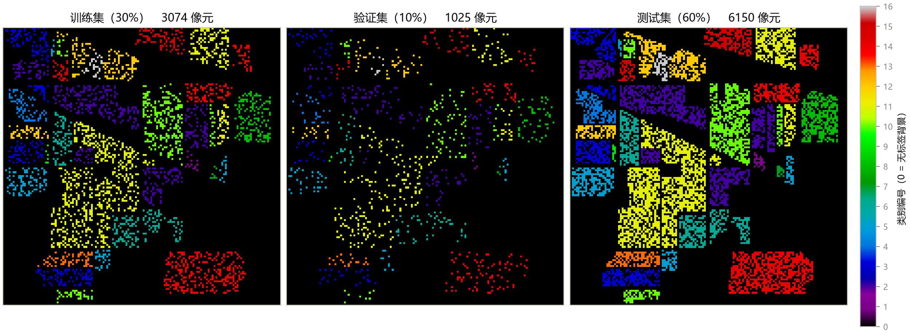
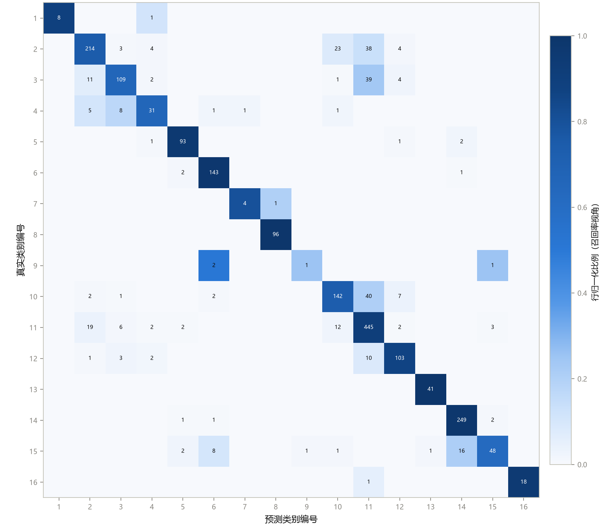

# 第 2 章 数据集、划分与评价指标

> 当前课堂演示按[使用指南](../../docs/teaching/classroom-guide.md)走。章内历史配置与数字保留原协议；Notebook02已重建为协议E，旧版在archive中，不混作同协议成绩。
> **Datasets, Splits & Metrics**

状态：✅ 已完成

---

## 本章定位

前置章节：第 1 章。在训练任何模型之前，必须先搞清楚"实验怎么做才可信"——否则后面跑出的所有精度数字都无法比较。本章建立**全课程统一的实验协议**：数据怎么划分、指标怎么算、有哪些容易踩的坑。本章的所有示例数字都来自真实运行（协议与 `notebooks/02`、`scripts/train_hybridsn.py` 完全一致，可复现脚本见配套实操），之后每个模型的章节都会沿用这套协议。

## 学习目标 / Learning Objectives

- 理解 Ground Truth 中非零标签像素构成样本总体，以及类别不均衡对划分的影响
- 掌握**分层采样（stratified sampling）**的 train/val/test 三分法，理解本仓库两条真实协议（传统 ML 的 80/20 与深度学习的 30/10/60）各自的语义与适用场景
- 熟练计算与解读 **OA（总体精度）/ AA（平均精度）/ Kappa 系数**，以及 per-class recall 与混淆矩阵
- 理解常见实验陷阱：空间自相关导致的评估乐观、val/test 混用、稀有类别、指标口径不一致

---

## 2.1 样本总体与类别分布

有监督像元级分类的任务设定：**样本总体** = Ground Truth 中所有非零标签的像元（Indian Pines 共 10249 个）；每个样本的输入是一条 200 维光谱向量（第 4 章起升级为空间 patch），输出是类别标签 1–16。标签 0 的背景像元（10776 个）不是样本——它们没有监督信号，也不参与任何指标计算（第 1 章自测题 3）。

表 2-1 给出 16 类的样本量（与第 1 章图 1-4 同源）。两个数字决定了本章的一切设计：**最大的 Soybean-mintill 有 2455 个样本，最小的 Oats 只有 20 个**，相差 123 倍。

**表 2-1**　Indian Pines 类别统计与 30/10/60 协议下的划分明细（random_state=100，与 `scripts/generate_ch02_figures.py` 输出一致）

| id | 类别 | 总数 | 训练 (30%) | 验证 (10%) | 测试 (60%) |
|---:|---|---:|---:|---:|---:|
| 1 | Alfalfa | 46 | 14 | 5 | 27 |
| 2 | Corn-notill | 1428 | 428 | 143 | 857 |
| 3 | Corn-mintill | 830 | 249 | 83 | 498 |
| 4 | Corn | 237 | 71 | 24 | 142 |
| 5 | Grass-pasture | 483 | 145 | 48 | 290 |
| 6 | Grass-trees | 730 | 219 | 73 | 438 |
| 7 | Grass-pasture-mowed | 28 | 8 | 3 | 17 |
| 8 | Hay-windrowed | 478 | 143 | 48 | 287 |
| 9 | Oats | 20 | 6 | 2 | 12 |
| 10 | Soybean-notill | 972 | 292 | 97 | 583 |
| 11 | Soybean-mintill | 2455 | 736 | 245 | 1474 |
| 12 | Soybean-clean | 593 | 178 | 59 | 356 |
| 13 | Wheat | 205 | 62 | 20 | 123 |
| 14 | Woods | 1265 | 379 | 127 | 759 |
| 15 | Buildings-Grass-Trees-Drives | 386 | 116 | 39 | 231 |
| 16 | Stone-Steel-Towers | 93 | 28 | 9 | 56 |
| — | **合计** | **10249** | **3074** | **1025** | **6150** |

不均衡带来两个独立的问题，对应两套独立的对策——这是本章的主线：

1. **评测问题**：总体精度（OA）会被大类主导，小类的失败在 OA 里几乎不可见 → 用 AA / Kappa / 混淆矩阵补位（2.3–2.4 节）；
2. **学习问题**：随机划分可能让小类分到过少的训练样本（Oats 的 30% 只有 6 个）→ 划分策略必须显式处理类别比例（2.2 节）。

## 2.2 划分策略

### 三份数据的角色

- **训练集（train）**：模型拟合参数（神经网络权重、SVM 支持向量）；
- **验证集（val）**：模型选择——调超参、早停、挑选最优 checkpoint；
- **测试集（test）**：最终成绩单，只评一次。

类比：练习册 / 模拟考 / 高考。模拟考的题（val）与高考（test）绝不重合；在 test 上反复调参，等于拿高考真题当练习册——分数会好看，但那不是成绩（见 2.5 节陷阱 2）。

### 两条真实协议

本仓库实际使用两条协议，对应两类方法的特点：

| 协议 | 用在哪 | 语义 |
|---|---|---|
| **80/20 两分** | `notebooks/02`（传统 ML） | `train_test_split(test_size=0.20, stratify=y, random_state=11)`。SVM 一次拟合、没有训练轮次，不需要 val 做模型选择，两分即可 |
| **30/10/60 三分** | `scripts/train_hybridsn.py`（深度学习） | 先按 30% 分出 train，再在剩余 70% 中按比例分出 val（占总体的 10%）与 test（60%）。深度模型有 epoch 循环，需要 val 选 checkpoint（`engine.py` 的 `best_val_acc`） |

深度学习文献里还常见 **10% train 小样本协议**（训练数据更少、更能考验模型），第 12 章设计对比实验时会专门讨论协议选择——现在先记住：**协议一旦选定，所有对比实验都必须沿用同一条**。

### 分层采样与两步划分

如果完全随机划分，一个 20 样本的小类可能一个训练样本都分不到。**分层采样（stratified sampling）**按类别比例分配：每个类别独立地按 30% 抽训练、10% 抽验证——表 2-1 里每一行的比例都严格成立，这正是它的定义性质。

两步划分的实现在 `src/hsi_learning/data.py` 的 `sample_ground_truth` / `split_ground_truth`，核心四步：

```python
indices = np.nonzero(gt)                      # 1. 拿到所有标注像元的 (行, 列)
locations = list(zip(*indices))
labels = gt[indices].ravel()                  # 2. 以及对应标签

train_indices, test_indices = train_test_split(
    locations,
    train_size=train_rate,                    # 3. 按比例分层切分索引
    stratify=labels,
    random_state=random_state,                #    固定种子 => 划分可复现
)
train_gt[train_rows, train_cols] = gt[train_rows, train_cols]  # 4. 写回两幅"标签图"
```

两个设计选择值得注意：

- **划分结果表示成标签图**（`train_gt` / `val_gt` / `test_gt` 三幅与原图同尺寸的稀疏矩阵），而不是索引表。好处是可视化零成本（图 2-1）、且第 4 章的 patch 提取可以直接复用同一套 `np.nonzero` 逻辑；
- **`random_state` 是划分可复现性的第一层**。深度学习的 seed（`train_hybridsn.py` 的 `--seed`）同时控制划分、网络初始化与 dropout——同一实验跑两次结果一致的前提是这三处全部固定（第 12 章展开）。



**图 2-1**　课程标准协议（train 30% / val 10% / test 60%，`random_state=100`）的划分可视化。三幅图的颜色编码与 Ground Truth 相同（`nipy_spectral`，颜色条为类别编号）：每个划分都是全场景在空间上打散、在类别上保比例的抽样——对比三幅图可以直观验证"分层"的含义。

## 2.3 指标定义与直觉

三个指标的公式都建立在**混淆矩阵（confusion matrix）**上：一个 C×C 的表，第 (i, j) 格是"真实为第 i 类、被预测为第 j 类"的样本数。对角线是预测正确的部分。

先看逐类**召回率（recall，每类的"查全率"）**：

$$\mathrm{Recall}_k = \frac{\text{对角元素}_{kk}}{\text{第 } k \text{ 行之和}} \qquad \text{（该类样本里被正确找出来的比例）}$$

与之对偶的是**精确率（precision）**：列归一化，"预测为 k 的里面真的是 k 的比例"。高光谱论文的 AA 用的是 recall。

### 三个指标

**OA（Overall Accuracy，总体精度）**——所有样本的平均正确率：

$$\mathrm{OA} = \frac{\text{对角线元素之和}}{\text{总样本数}}$$

**AA（Average Accuracy，平均精度）**——逐类召回率的宏平均，**每类权重一律 1/C**：

$$\mathrm{AA} = \frac{1}{C} \sum_{k=1}^{C} \mathrm{Recall}_k$$

**Kappa 系数**——从 OA 中扣除"瞎猜蒙对"的成分。记 $p_o$ = OA（观测一致率），$p_e$ = 期望一致率（把真实与预测的边缘分布当独立随机变量，随机猜能蒙对的概率，由混淆矩阵的行列边缘概率算出）：

$$\kappa = \frac{p_o - p_e}{1 - p_e}$$

$p_e$ 越大（类别越偏、瞎猜越容易蒙对），Kappa 相对 OA 打的折扣越多。类别数多且均衡时（16 类、$p_e$ 很小），Kappa 与 OA 接近；极端偏斜时两者拉开巨大差距。

### 一个能记住一辈子的例子

设一个 3 类数据集：A 类 900 个样本，B 类 90 个，C 类 10 个。一个"只说 A"的模型：

| 指标 | 数值 | 解读 |
|---|---:|---|
| OA | **90%** | 看起来很好——但它是靠 A 类撑起来的 |
| AA | **33.3%** | (100% + 0% + 0%) / 3——B、C 两类全军覆没立刻现形 |
| Kappa | **0** | 真实 A 类占 90%，预测 A 类占 100%，故 $p_e=0.9\times1=0.9$；$\kappa=(0.9-0.9)/(1-0.9)=0$ |

现在回到真实数据。我们用 `notebooks/02` 的协议（80/20 分层划分，`random_state=11`）训练一个 RBF 核 SVM（`C=100`，第 3 章的主角，这里只借它当"第一个真实分类器"），在 2050 个测试样本上得到：

$$\mathrm{OA} = 85.12\%, \qquad \mathrm{AA} = 81.25\%, \qquad \kappa = 0.8292$$

OA 与 AA 之间 4 个百分点的差距全部来自小类：**Oats 的 4 个测试样本只对了 1 个（recall = 25%）**，Corn-mintill（65.7%）、Corn（66.0%）、Buildings-Grass-Trees-Drives（62.3%）也不佳；而 Hay-windrowed 和 Wheat 拿到了满分。OA 只说"平均很好"，AA 和混淆矩阵才告诉你"差在哪"。

**表 2-2**　指标速查

| 指标 | 一句话定义 | 擅长 | 盲点 |
|---|---|---|---|
| OA | 全样本正确率 | 大类主导场景的整体水平 | 小类失败被稀释 |
| AA | 逐类 recall 的宏平均 | 暴露小类失败（每类权重 1/C） | 单看不知道错成了谁 |
| Kappa | 扣除随机一致的相对正确率 | 修正类别偏斜下的虚高 | 不指向具体类别 |
| 混淆矩阵 | 全部 C² 个 (真, 预) 组合计数 | 一张表看全所有错误流向 | 不适合写进表格汇报总成绩 |

**实践规则：三者一起报告**（论文主表的标准三件套），再用混淆矩阵做错误分析。

## 2.4 混淆矩阵与分类报告



**图 2-2**　RBF-SVM（`notebooks/02` 协议：80/20 分层，`random_state=11`，`C=100`）在 2050 个测试样本上的混淆矩阵。颜色为行归一化比例（每行加和为 1，即召回率视角），格内数字为样本数。行 = 真实类别，列 = 预测类别，编号见表 2-1。

从图 2-2 能读出三件事，这也是今后每次分析自己模型的标准动作：

1. **对角线整体明亮**（OA 85%），但亮度并不均匀——woods、hay、wheat 等光谱特征独特的类别接近满分；
2. **玉米族与大豆族内部出现"块状互混"**：Corn-notill → Soybean-mintill 38 个、Soybean-notill → Soybean-mintill 40 个、Corn-mintill → Corn-notill 11 个。这不是偶然——回看第 1 章图 1-2，几类作物的光谱曲线本就形状接近，而它们的田块又在空间上相邻。这个混淆结构在第 4 章引入空间 patch、第 8 章 HybridSN 等模型中会被逐步压缩，是观察"模型进步"的最佳窗口；
3. **小类的行几乎空白**：Oats 一行只有 4 个格非零（2 个错成 Grass-trees、1 个错成 Stone-Steel-Towers、1 个正确）。AA 把这类行直接拉低，OA 则几乎无感。

对应的 sklearn 代码（与 `src/hsi_learning/evaluation.py` 的 `compute_classification_metrics` 一致）：

```python
from sklearn.metrics import (accuracy_score, classification_report,
                             cohen_kappa_score, recall_score)

labels = list(range(1, 17))          # 显式指定 1–16，缺席类别也占位
oa = accuracy_score(test_true, test_pred)
aa = recall_score(test_true, test_pred, labels=labels, average="macro", zero_division=0)
kappa = cohen_kappa_score(test_true, test_pred, labels=labels)
report = classification_report(test_true, test_pred, labels=labels,
                               target_names=class_names, digits=4, zero_division=0)
```

三个易错细节：

- **`labels=` 必须显式给**：否则 sklearn 只按"出现过的类别"计算，某类恰好全错（或缺席）时列数不一致，AA 口径就变了；
- **`average="macro"` 才是 AA**：`"weighted"` 会退回 OA 的口径；
- **`zero_division=0`**：某类一个都没预测对时，sklearn 默认报警并把该类 recall 记 0——这正是我们想要的语义（表 2-2 中"暴露小类失败"）。

`classification_report` 的输出（per-class precision/recall + 三行汇总）配合 `build_sample_report`（`src/hsi_learning/data.py`，生成表 2-1 那样的划分明细）构成本仓库的标准报告格式。

## 2.5 常见陷阱与规范

**陷阱 1：空间自相关与 patch 重叠泄漏。** 相邻像元的地物几乎总是相同（同一块田），而第 4 章的 25×25 patch 意味着相邻两个样本共享 96% 的像素内容。随机划分会让"几乎相同的 patch"同时出现在训练与测试两侧，模型可能记住邻居而非学会判别，指标因此偏乐观。学界的两种立场：**主流基准协议保留随机划分**（数字可与几十年文献横向比较），**空间不相交划分**（spatially disjoint / 按地块划分）用于估计真实部署性能（数字通常明显更低）。本课程沿用主流协议并在每个实验里写明——**知道自己的数字属于哪种口径，比数字本身重要**。严格的评估策略可参考 Roberts et al. 2017（延伸阅读）。

**陷阱 2：val/test 混用。** 所有模型选择（超参、epoch 数、checkpoint）只能依赖 val；test 只在整个实验结束、要写最终报告时碰一次。本仓库的 `engine.py` 严格执行这一点：`fit()` 只看 `val_acc` 存 best checkpoint，test 评估发生在训练完全结束、加载 best checkpoint 之后。

**陷阱 3：稀有类别边界情况。** Oats 全部 20 个样本按 30/10/60 分成 6/2/12，尚能运转；但若再降训练率，分层划分会要求每类至少留出一个样本——`split_ground_truth` 在无法满足时会抛出带提示的 `ValueError`（"Try increasing val_rate or train_rate for rare classes"）。遇到它不要绕过验证，先想清楚这类实验是否还有意义。

**陷阱 4：指标口径不一致的横向比较。** 常见的暗坑：OA 算在 test 上还是整图上、AA 是否剔除缺席类别、划分比例与种子是否公开。复现别人论文时先核对这四项（第 11 章的复现 checklist 会把它制度化）。

**本课程实验规范（从第 3 章起强制执行）：**

1. 固定 seed，同时控制划分、初始化与 dropout；
2. 分层两步划分（`split_ground_truth`），协议写进每个实验记录；
3. val 选模型，test 只评一次；
4. 报告 OA + AA + Kappa 三件套，附混淆矩阵做错误分析；
5. 报告协议参数：train_rate / val_rate / patch 大小 / seed / 数据版本。

---

## 配套实操 / Hands-on

- `notebooks/02_svm_baseline.ipynb` —— 本章与第 3 章的公共实操：
  - **数据准备**（cell 2–7）：`loadmat` 读入 X 与 y、展平为样本表；
  - **划分与 SVM**（cell 8–11）：80/20 分层划分（`random_state=11`）、`SVC(C=100, kernel='rbf')`、整图像元逐条预测生成分类图；
  - **结果展示**（cell 12+）：分类图与指标；后半段的 PCA 对比部分属于第 3 章内容；
  - 建议改两个数重跑：把 `test_size` 改成 0.9（只剩 10% 训练样本）、把 `random_state` 改成别的数——观察 OA/AA 的波动幅度，直观感受"划分也是随机变量"。
- `src/hsi_learning/data.py` —— `sample_ground_truth` / `split_ground_truth` / `build_sample_report` 对照 2.2 节逐行精读；
- `scripts/generate_ch02_figures.py` —— 一条命令复现本章两张图并打印：30/10/60 划分明细（表 2-1）、SVM 的 OA/AA/Kappa 与逐类 recall（2.3 节数字）。改 `two_step_split` 的 `random_state` 看划分如何变化。

## 本章要点 / Key Takeaways

- 中文：实验可信度在跑模型之前就决定了——分层两步划分保证每类都有代表且可复现（固定 seed）；val 只用于选模型，test 只碰一次；OA 会被大类主导，必须搭配 AA 与 Kappa（以及混淆矩阵）才能暴露小类失败；随机划分下相邻像素的泄漏让数字偏乐观，要清楚自己的口径。本章 85.12% / 81.25% / 0.829 这组真实数字与 Oats 类 25% 的 recall，就是"三件套一起看"的全部理由。
- English: Experimental credibility is decided before any model runs — stratified two-step splits with fixed seeds make class representation and reproducibility structural; validation selects models and the test set is touched exactly once; OA hides minority-class failure, so report OA + AA + Kappa (plus the confusion matrix) together; random splits leak spatial autocorrelation, so know which regime your numbers belong to. The real numbers of this chapter (85.12% / 81.25% / 0.829, with Oats recall at 25%) are the whole argument for reading the three metrics together.

## 自测题 / Self-check

1. `train_rate=0.3, val_rate=0.1` 的两步划分中，val 和 test 各占样本总体的比例是多少？
2. OA 很高但某一类 AA（该类 recall）极低，可能是什么原因？用本章的模型举一个真实例子。
3. Kappa 为什么能修正"偶然一致"？$p_e$ 是什么、怎么算？
4. 25×25 patch + 随机划分为什么会"泄漏"？严格做法叫什么、代价是什么？

<details>
<summary><strong>参考答案（先自己回答再看）</strong></summary>

1. 第一步分出 train 30%；第二步在剩余 70% 中按 `val_rate / (1 - train_rate) = 0.1/0.7` 切分，因此 val = 0.7 × (1/7) = 总体的 **10%**，test = 总体的 **60%**（对应表 2-1 的 1025 / 6150）。`val_rate` 的语义是"占总体比例"而非"占剩余比例"。
2. 大类主导 + 小类学不动。真实例子：本章 SVM 的 OA 85.12% 看着体面，但 Oats 的 4 个测试样本只对 1 个（recall 25%）、Corn-mintill 只有 65.7%——OA 对此几乎无感，因为这几类合计的样本占比太小。这正是必须同时看 AA / 混淆矩阵的原因。
3. $p_e$ 是"随机猜也能达到的一致率"：把混淆矩阵真实行的边缘分布与预测列的边缘分布当独立分布，$p_e = \sum_k (\text{行}_k/N)\cdot(\text{列}_k/N)$。Kappa $= (p_o - p_e)/(1 - p_e)$ 把"超出瞎猜水平的部分"作为分子，所以类别越偏、$p_e$ 越大、折扣越狠。极端例子：真实 A 类占 90%、全部预测为 A 时，$p_e=0.9$，OA 为 90%，Kappa 为 0。
4. 相邻像元属于同一地块，其 patch 内容重叠 96%——随机划分会把几乎相同的 patch 放进训练与测试两侧，模型可以"背邻居"而不是学判别，指标偏乐观。严格做法是**空间不相交划分**（spatially disjoint split，按空间块/地块切分训练与测试），代价是训练可用区域受限、数字显著变低、且与主流文献协议不可比——所以要做两套并报告口径。
</details>

## 延伸阅读 / Further Reading

- Congalton, R. G., "A review of assessing the accuracy of classifications of remotely sensed data," *Remote Sensing of Environment*, 1991.——遥感精度评估（误差矩阵传统）的奠基综述，OA 与 error matrix 的源头。
- Cohen, J., "A coefficient of agreement for nominal scales," *Educational and Psychological Measurement*, 1960.——Kappa 系数的原始出处。
- Roberts, D. R., et al., "Cross-validation strategies for data with temporal, group, hierarchical, or spatial structure," *Ecography*, 2017.——空间自相关下的划分策略（spatial block CV），陷阱 1 的严格版本。
- Audebert, N., Le Saux, B., Lefèvre, S., "Deep learning for classification of hyperspectral data: A comparative review," *IEEE Geoscience and Remote Sensing Magazine*, 2019.——高光谱深度模型对比综述，其实验协议章节与本章高度互补。
- scikit-learn 文档：Model evaluation（`classification_report` / `cohen_kappa_score` 的参数语义）。
