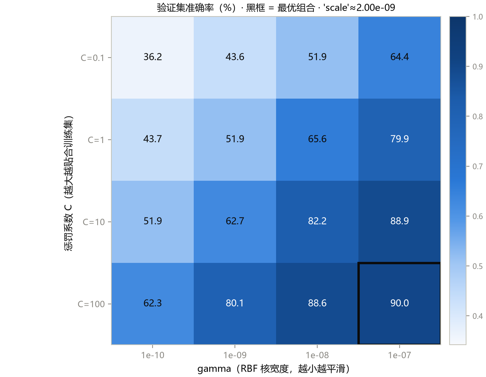
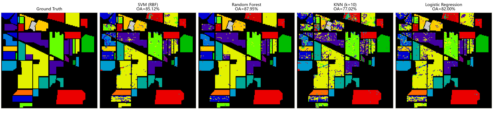
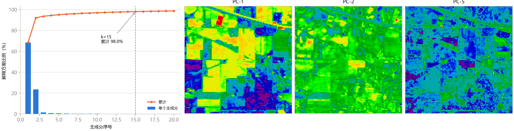

# 第 3 章 传统机器学习基线

> **Classical ML Baselines**

状态：✅ 已完成

---

## 本章定位

前置章节：第 1、2 章。在进入深度学习之前，先用传统机器学习建立第一条可复现的 baseline 线。此后课程里每一个深度学习模型，都要回答同一个问题——"比这条线好多少、好在哪里、付出了什么代价"。本章的全部数字由 `scripts/generate_ch03_figures.py` 在 `notebooks/02` 协议下真实复现，并汇入课程记分板（`docs/benchmark.md`），后续章节逐行追加。

## 学习目标 / Learning Objectives

- 理解像素级分类的输入形态：把每个像元的光谱向量当作一个特征样本
- 会用 `scikit-learn` 搭建 SVM（RBF 核）、Random Forest、KNN、Logistic Regression 四条基线，理解各自的机制与失效方式
- 掌握 RBF 核 SVM 的 `C` / `gamma` 调参：网格设计必须匹配特征尺度
- 掌握 PCA 降维在传统流程中的角色（方差解释、Hughes 现象、对 SVM 的实际增益），了解波段选择的三条路线
- 会解读基线结果：传统方法"强在哪、弱在哪"（有光谱判别力、缺空间上下文）

---

## 3.1 像素级光谱特征与样本表

第 1 章说过，数据立方体可以看作"一束光谱"：`(H, W, B)` 展平成 `(H·W, B)` 后，每个像元就是一个 B 维特征向量。Indian Pines 即 `(145·145, 200)` 的样本矩阵，其中 10249 个有标签。传统机器学习的全部工作都在这个视角上进行——**每个样本独立，没有任何空间结构信息**（这句话是 3.5 节所有结论的伏笔）。

仓库提供了展平脚本 `scripts/build_indian_pines_csv.py`，核心三行：

```python
flat_data = data.reshape(-1, data.shape[2])          # (21025, 200) 全部像元
df = pd.DataFrame(flat_data)
df.columns = [f"band{i}" for i in range(1, 201)] + ["class"]   # 拼上标签列
```

注意两个细节：**背景像元（class=0）也被写进了 CSV**（保持与图像一一对应，便于可视化回贴），训练前必须过滤；CSV 只是传统 ML 的便利格式，深度学习流程（第 4 章起）直接操作立方体，不走这条路。

还有一个常被忽略的问题：**特征尺度**。DN 值范围约 955–9604，量级远大于 1。它对不同模型的影响完全不同——这是理解本章多个现象的钥匙：

- **KNN** 依赖欧氏距离，但各波段共享同一尺度，相对距离关系不变，尚可工作；
- **SVM (RBF)** 的 `gamma='scale'` 会按 `1/(n_features · Var(X))` 自适应尺度（本数据算出 `≈2.0e-9`），但**手工调 gamma 时必须按这个量级设网格**（3.2 节的翻车现场）；
- **Logistic Regression** 基于梯度优化，在未标准化的 DN 上收敛很慢——本章它跑满 2000 次迭代仍未收敛（sklearn 发出 ConvergenceWarning），数字按实际结果报告。

## 3.2 SVM 基线

SVM 在高维小样本问题上的地位由来已久（Melgani & Bruzzone, 2004）。直觉上有两个原因：**边际最大化**天然适合"类别之间间隔很小"的高维光谱空间；**核技巧**让决策边界可以弯曲而不爆参数。RBF 核的定义：

$$K(x, x') = \exp(-\gamma \lVert x - x' \rVert^2)$$

两个超参数的语义（图 3-2 的坐标轴）：

- **gamma**：核宽度，控制"单个训练点的影响半径"。gamma 越大 → 影响半径越小 → 边界越碎、越贴训练集（过拟合方向）；gamma 越小 → 边界越平滑（欠拟合方向）；
- **C**：对误分类的惩罚。C 越大 → 越贴合训练集；C 越小 → 边际越宽、越容忍错误。

### 一次真实的调参

调参协议：把 80% 训练集再切成 75/25（train₂ 6149 / val 2050，同 seed），网格搜索只看 **val 准确率**，test 全程不碰（第 2 章规范 3）。

先看一次**翻车**：如果把网格按教科书默认（标准化特征的惯例）设在 `gamma ∈ [1e-4, 1e-1]`，在原始 DN 上**整张 16 格网格的验证准确率全部是 24.0%**——恰好等于多数类 Soybean-mintill 的占比，即每个格子里 SVM 都退化成了"只报大类"的常数预测器。原因就藏在 RBF 公式里：DN 量级下 $\lVert x - x' \rVert^2$ 高达 $10^8$，$\exp(-10^{-4} \times 10^8)$ 直接下溢为 0，核矩阵变成单位阵。`'scale'` gamma ≈ 2.0e-9 比网格下限还小 5 个数量级。**gamma 网格必须与特征尺度匹配**——这不是数学细节，是会把你整个调参实验悄悄清零的实操陷阱。

把网格移到 DN 适用的区间（`gamma ∈ [1e-10, 1e-7]`）后，图 3-2 呈现教科书式的结构：



**图 3-2**　RBF-SVM 在 train₂/val 上的验证准确率（%），黑框为最优组合。整个曲面沿"左上 → 右下"单调抬升：gamma 与 C 的作用方向清晰可辨。最优格 C=100、gamma=1e-7 达到 **90.05%**——但它压在网格边缘，说明最优解可能还在更外面，**网格应该扩边重跑**（`gamma='scale'`≈2.0e-9 落在中间列附近，对应 C=100 行约 84–85% 的验证水平，与它在测试集上的 85.12% 一致）。

三个可直接迁移的调参习惯：网格在对数尺度上取点；先粗后细；**最优解压边 = 网格没取够**。

## 3.3 其余基线速览

四条基线在**完全相同**的划分与测试集上运行（表 3-1、图 3-1）：

**表 3-1**　传统基线对比（Indian Pines，`random_state=11`，指标口径见第 2 章；加粗为同列最优）

| 模型 | 关键配置 | OA | AA | Kappa |
|---|---|---:|---:|---:|
| **协议 A：80% 训练（8199） / 20% 测试（2050）** | | | | |
| SVM (RBF) | C=100, gamma='scale' | 85.12 | 81.25 | 0.8292 |
| Random Forest | n_estimators=200 | **87.95** | 81.93 | **0.8618** |
| KNN | k=10 | 77.02 | 72.25 | 0.7365 |
| Logistic Regression | max_iter=2000（未收敛） | 82.00 | 80.17 | 0.7934 |
| SVM + PCA-15 | whiten=True，同划分 | 85.41 | **82.79** | 0.8333 |
| **协议 A′：10% 训练（1024） / 90% 测试（9225）** | | | | |
| SVM (RBF) | 同上 | 72.08 | 64.84 | 0.6748 |
| Random Forest | 同上 | **76.55** | 61.69 | **0.7290** |
| KNN | 同上 | 66.29 | 55.00 | 0.6113 |
| Logistic Regression | 同上 | 75.89 | **70.00** | 0.7238 |

**表 3-1 最重要的不是任何一行，而是两张子表之间的排名变化**：富样本协议 A 下 RF 全面领先；小样本协议 A′ 下 OA 名次依旧（RF > LR > SVM > KNN），但**按 AA 看完全翻转**——LR（70.00）> SVM（64.84）> RF（61.69）。RF 的 AA 掉得最狠（81.93 → 61.69），说明树模型在小样本下最先牺牲的恰恰是小类。结论："哪个基线最强"没有协议无关的答案——这正是第 2 章要求 OA/AA/Kappa 三件套、第 12 章要求固定协议的原因。

各模型机制速览（知道"为什么它这样错"比记数字重要）：

- **Random Forest**：自助采样 + 特征随机子集上训练大量决策树后投票。分裂只看单个特征，天然抗无关波段、原生支持多分类、几乎零调参；但树边界是轴对齐的阶梯状，小类样本少时投票容易被大类淹没（A′ 的 AA 崩塌）。
- **KNN**：懒惰学习，预测时找 k 个最近邻投票。没有训练阶段，但预测成本随训练集增长；在 200 维空间里距离集中效应使"近邻"不再有把握，图 3-1 里它的预测图碎片化最严重。它定义了光谱空间的**局部平滑下限**。
- **Logistic Regression**：线性 softmax。在未标准化的 DN 上优化困难（本章未收敛），但小样本下退化最平缓（A′ 的 AA 最佳）；线性可分性有限使其天花板不高，是很好的"理性下限"参照。



**图 3-1**　四条基线对整幅图的预测（掩掉背景，颜色编码同 Ground Truth）。重点看同质田块**内部**的椒盐状斑点：所有像素级方法都把相邻的同类像元判成不同类别——因为它们只看光谱、完全不知道"相邻像元大概率同类"。KNN（77.02%）最碎，RF/SVM 相对干净但也远非整块。这种**空间一致性缺失**是像素级范式的天花板，也是第 4 章引入 patch 的直接动机。

## 3.4 降维

200 个相邻波段高度相关（相邻波段相关系数普遍 >0.9），直接带来三个问题：冗余计算、噪声波段稀释距离度量、以及传统 ML 中的 **Hughes 现象**——训练样本固定时，维度升高精度先升后降（1968 年提出，至今是特征选择课的开场故事）。降维因此是传统流程的标准组件，两条路线：

### PCA（主成分分析）

把数据投影到方差最大的正交方向上，取前 k 个主成分。三个必须知道的实务要点：

1. **PCA 是无监督的**——它只看方差，不知道标签。本仓库的 `apply_pca_cube` 在**整幅立方体（含 10776 个未标注像元）**上拟合：隐含假设是"整幅图的方差结构与标注区域一致"。这是领域惯例，但要意识到它在用未标注数据。
2. **方差解释率（EVR）决定 k 的取法**。图 3-3 左：Indian Pines 的 PC-1 独占 68.5%、PC-2 占 23.5%（两者都是亮度/整体幅面变化），前 5 个主成分累计 95.0%，**k=15 累计 98.0%**——这就是"PCA 15 分量"成为本课程（乃至大量文献）标准配置的来历。
3. **EVR 高 ≠ 判别信息全**。被丢掉的 2% 方差可能恰好是某些窄吸收特征——它们方差小，但可能正是区分两类作物的关键。所以 k 的最终取值应该用验证集上的下游精度来定（本章末的自测题 4）。



**图 3-3**　左：前 20 个主成分的单独与累计解释方差比例，k=15 处累计 98.0%；右：PC-1 / PC-2 / PC-5 的空间分布（`nipy_spectral`，同 `notebooks/02` 的展示方式）。PC-1 主要是整体亮度结构，PC-2 开始分离不同田块，PC-5 已明显带噪声——方差排序不等于判别力排序。

**PCA 对 SVM 的实际收益**（表 3-1 最后一行）：同样的 80/20 划分下，SVM 在 PCA-15 特征上 OA 85.41% / AA 82.79% / Kappa 0.8333——比原始 200 维略好（OA +0.29、AA +1.54）且维度缩到 1/13。**降维在这里同时买到计算和精度**，这在高光谱上是常态而非巧合：扔掉的尾部方向多为噪声。

### 波段选择（导览）

与 PCA 的"变换 + 丢弃"不同，波段选择**保留原始物理波段**，可解释性好（选中的波段有明确波长含义）。三大族方法，名字知道即可：**Filter**（按单波段统计量排序：方差、信息量、与标签的相关性）、**Wrapper**（以最终分类精度为目标搜索波段子集，代价高）、**Embedded**（训练过程中自动完成选择，如带稀疏正则的模型）。本课程主路线用 PCA，波段选择在第 12 章"波段选择"任务拓展时再展开。

## 3.5 结果解读与基线思维

把本章结论收拢成三句话，每句都直接服务后续章节：

1. **传统基线不可省略。** SVM/RF 用几行 sklearn、几秒钟训练就拿到 85–88% 的 OA——任何深度模型若连这条线都超不过，创新性无从谈起；反之，DL 论文的价值必须表述为"在同等协议下比这条线好多少"。审稿人问的第一个实验问题永远是它。
2. **像素级范式的天花板是空间信息。** 图 3-1 的椒盐噪声与图 2-2 的玉米/大豆族内混淆指向同一个缺口：光谱不够、空间来凑。第 4 章的 patch 数据工程、第 5–10 章的所有深度模型，本质上都在回答"怎么把空间上下文喂给模型"。
3. **基线结论依附于协议。** 表 3-1 两张子表的排名变化（RF vs SVM vs LR，OA vs AA）说明：脱离协议谈"最强基线"没有意义。课程记分板（`docs/benchmark.md`）因此按协议分块记录，每章追加、永不混块。

## 配套实操 / Hands-on

- `notebooks/02_svm_baseline.ipynb` —— 协议 A 的完整实现：数据准备 → 80/20 分层划分 + `SVC(C=100, kernel='rbf')` → 整图逐像元预测生成分类图 → 结果展示；后半段的 PCA 部分对应 3.4 节。
- `scripts/build_indian_pines_csv.py` —— 生成像素级样本表 CSV（含背景 class=0，训练前需过滤）。
- `scripts/generate_ch03_figures.py` —— 一条命令复现本章全部数字与三张图：四模型两协议指标（表 3-1）、SVM 网格（图 3-2）、PCA 统计与主成分图（图 3-3）。建议改动重跑：把协议 A′ 的训练率改成 30%，观察 RF 的 AA 是否恢复；把网格扩到 `gamma=1e-6`，验证"压边"猜想。
- `docs/benchmark.md` —— 课程记分板：本章数字已录入协议 A / A′，深度学习协议 B 的空白等待第 5 章起填充。

## 本章要点 / Key Takeaways

- 中文：像素级光谱特征 + sklearn 四件套就是全部传统基线——80% 训练时 RF（OA 87.95%）领先、SVM 紧随且加 PCA-15 后 AA 最高；10% 小样本时按 AA 排名翻转，说明基线结论依附协议；RBF gamma 必须匹配特征尺度（DN 下 ~1e-9，教科书网格会整表塌成多数类）；PCA-15（98% 方差）是计算与精度的双赢家，但"方差大"不等于"判别力强"；像素级方法的空间椒盐噪声是它们共同的天花板，正是后续深度模型的出发点。
- English: Pixel-wise spectra plus four sklearn models is the entire classical baseline suite — RF leads OA (87.95%) with 80% training, SVM follows and tops AA once PCA-15 (98% variance) is applied; under 10% training the AA ranking flips, proving baseline conclusions are protocol-bound. RBF gamma must match feature scale (≈1e-9 on raw DN — textbook grids collapse to the majority class), high variance does not mean high discriminative power, and the salt-and-pepper spatial inconsistency visible in every predicted map is the ceiling that Chapters 4–10 set out to break.

## 自测题 / Self-check

1. 为什么 RBF-SVM 的 gamma 网格在原始 DN 特征上要设在 1e-9 量级？如果照搬教科书在 1e-2 附近取网格会发生什么、为什么？
2. 表 3-1 中 RF 在协议 A 下 OA 最高，为什么写论文时仍然必须同时报告 SVM 基线？
3. PCA 为什么在整幅立方体（含未标注像元）上拟合？这个做法隐含了什么假设、有什么好处？
4. PCA-15 保留了 98% 的方差，为什么剩下 2% 对分类反而可能恰恰重要？

<details>
<summary><strong>参考答案（先自己回答再看）</strong></summary>

1. RBF 核是 $\exp(-\gamma \lVert x-x'\rVert^2)$。DN 量级下样本间平方距离达 $10^8$ 量级，gamma 必须与之相乘后落在"既不全 0（核失效）也不全 1（核退化）"的区间，因此量级约 $1/d^2 \sim 10^{-9}$——`'scale'` 启发式（$1/(d \cdot \mathrm{Var}(X))$ ≈ 2.0e-9）正是自动做这件事。照搬 1e-2 网格：每格的核矩阵下溢成单位阵，SVM 退化为多数类预测器（本章实测 16 格全部 24.0%）。调参前先想特征尺度，或先标准化再取常规网格。
2. 三层理由：(a) 论文审稿的标准对照物——"比 SVM 好多少"是 DL 方法价值的第一把尺子；(b) 本章协议 A′ 表明 RF 的优势是小样本下不稳固的（AA 从 81.9 崩到 61.7，被 SVM、LR 反超），单点冠军不可靠；(c) SVM + PCA-15 的 AA（82.79）是全场最高——最强单项基线未必是 OA 最高的那个。
3. PCA 是无监督方法，只依赖数据的方差结构；标注像元只占 48.7%，把全部像元用上能得到更稳定的方差估计。隐含假设：未标注区域的（协）方差结构与标注区域一致（整幅图是"同一个分布"）。好处：更稳的主成分方向 + 天然利用了免费数据；风险：若标注区域是全图的非代表子集，投影方向会偏。
4. PCA 按方差排序丢弃尾部方向，但方差小 ≠ 信息量小。窄而深的吸收谷（如植被水分吸收）在整幅图上方差贡献很小，却可能是区分两类生理状态相近作物的唯一证据；而方差最大的方向可能只是整体亮度变化。因此 k 的取值应最终由验证集上的下游分类精度决定，而不是只看累计 EVR 阈值——这也是"无监督降维 + 有监督评估"必须配套的原因。
</details>

## 延伸阅读 / Further Reading

- Melgani, F., Bruzzone, L., "Classification of hyperspectral remote sensing images with support vector machines," *IEEE TGRS*, 2004.——SVM 用于高光谱分类的奠基工作。
- Breiman, L., "Random forests," *Machine Learning*, 2001.——随机森林原始论文。
- Cover, T., Hart, P., "Nearest neighbor pattern classification," *IEEE Transactions on Information Theory*, 1967.——最近邻分类的经典分析。
- Hughes, G. F., "On the mean accuracy of statistical pattern recognizers," *IEEE Transactions on Information Theory*, 1968.——Hughes 现象（维度-精度峰值效应）的原始出处。
- scikit-learn 文档：SVC（`gamma='scale'` 启发式）、`Pipeline` 与 `StandardScaler`（标准化流程的工程写法）。
