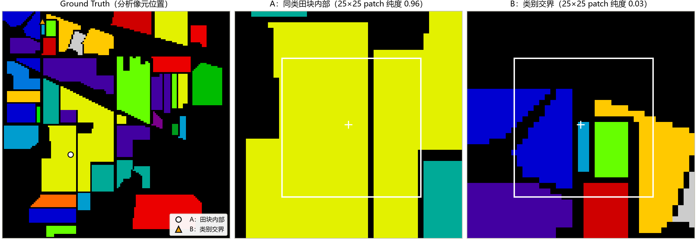
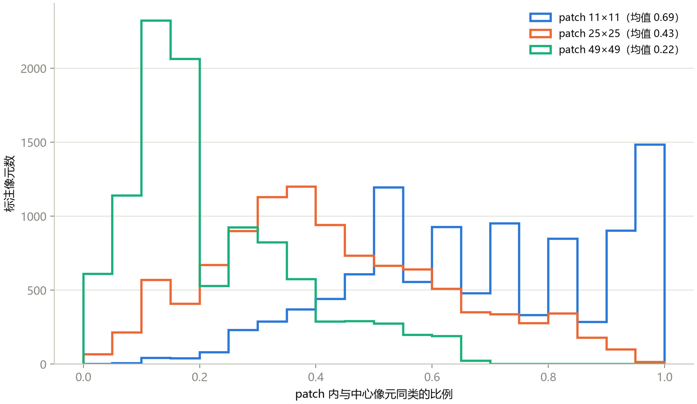
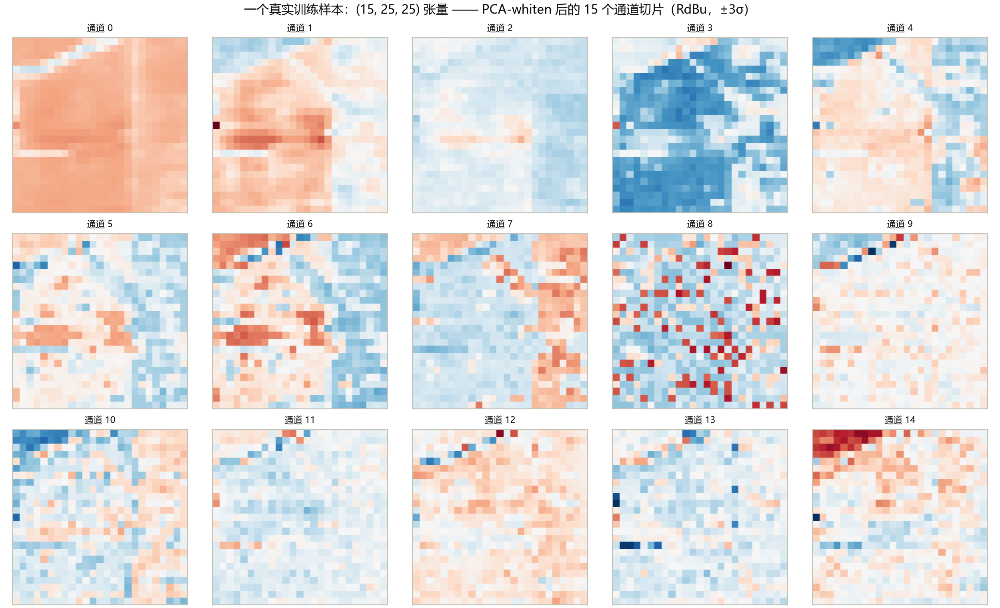

# 第 4 章 从像素到 Patch：深度学习数据工程

> **From Pixels to Patches: Data Engineering for Deep Learning**

状态：✅ 已完成

---

## 本章定位

基础篇收官，从传统方法进入深度学习的桥梁。第 3 章结尾我们把结论压成了一句话：像素级方法的天花板是空间信息。本章给出那条提升曲线的第一步、也是所有主流深度模型的共同前提——**patch 范式**，并把本仓库 `src/hsi_learning/data.py` 的每一块设计逐行讲透。学完本章，你就能为课程里任何一个模型准备数据；第 5–10 章只管换模型，数据管线不再变。

## 学习目标 / Learning Objectives

- 理解为什么深度学习用 patch 而不是单像素：patch 的真实角色是"以目标像元为中心的上下文快照"
- 掌握 PCA 预处理的标准做法：15 分量惯例、`whiten` 的作用、整图拟合的协议争议
- 掌握 patch 提取的工程细节：零填充、奇数 patch size 与中心对齐
- 能逐行读懂 `PatchDataset`：索引表、`(B, H, W) → (C, H, W)` 转置、标签偏移、预测模式
- 熟悉 `Dataset` / `DataLoader` 封装要点：训练 shuffle 与整图推理不 shuffle 的原因

---

## 4.1 patch 范式：空间上下文为什么关键

第 3 章图 3-1 的椒盐噪声来自一个范式设定：每个像元只凭自己的 200 维光谱独立判决。而同 类地物在空间上连片（同一块田），**相邻像元大概率同类**——这个未被利用的信息就是空间上下文（spatial context）。

**patch 范式**的答案：判别一个像元时，把以它为中心的一小块空间邻域（连同全部光谱波段）一起喂给模型，让模型自己学习"中心像元的光谱 + 邻域的空间结构"如何联合支撑判决。以 patch size = 25 为例，一个样本从 1×200 的光谱向量变成 **15×25×25 的三维立方**（为什么是 15 见 4.2 节）。

先看两个真实样本长什么样（图 4-1）：同一片 Soybean-mintill 大田内部的像元，其 25×25 邻域几乎全是同类（纯度 0.96）；而落在细窄条带里的像元，邻域被七八个类别瓜分（纯度 0.03）。图 4-2 把这种直觉变成全数据集的统计——**patch size 的三难取舍**从此有数可依：



**图 4-1**　左：Ground Truth 与两个分析像元的位置；中：田块内部像元 A 的 41×41 邻域（白框为 25×25 patch，十字为中心），同类占比 0.96；右：细窄条带像元 B 的邻域，同类占比仅 0.03。



**图 4-2**　全部 10249 个标注像元的"patch 内同类占比"分布（零填充口径，与真实训练输入一致）。三种 patch size：11×11 均值 0.69、25×25 均值 0.43、49×49 均值 0.22。

**图 4-2 最重要的信息是：25×25 patch 的平均同类占比只有 0.43。** patch 不是"同质窗口"——在 20 m 分辨率下，25×25 对应 500 m×500 m 的地面范围，远大于一般田块。所以 patch 范式的正确理解是：

1. patch 提供的是**上下文快照**，模型学的不是"邻域是什么类"，而是"中心像元在它的邻域结构中处于什么位置"——大田中心、田块边缘、细条带，各有各的空间签名；
2. patch size 小（11）：邻域纯度高、但上下文少，退回接近像素级；patch size 大（49）：上下文多、但混合重、计算大、边界信息淹没中心信息。**25×25 是 Indian Pines 上被长期验证的折中**（本课程所有深度模型统一用 25，与 `train_hybridsn.py` 默认一致）；
3. 纯度最低的那批像元（图 4-2 右侧尾部）就是天然的难样本——它们同时解释了混淆矩阵里小类的低召回（第 2 章）和边界处的预测碎片（第 3 章）。

> 补充一句路线区分：patch 分类范式之外还有"整图一次前向"的全卷积分割路线（U-Net 类，输出逐像元图）。它是另一套协议与文献脉络，本课程主线走 patch 范式，第 12 章任务拓展时会回头对比。

## 4.2 PCA 预处理

patch 把每个样本放大了 625 倍（1 → 625 个像元），若保留全部 200 个波段，一个训练样本是 625×200 = 12.5 万个数。标准做法：**先对整幅立方体的光谱维做 PCA，再提 patch**——第 3 章已经证明 PCA-15（98% 方差）几乎不损失 SVM 的精度，这里它继续当数据管线的第一站。

仓库实现是 `apply_pca_cube`，五行讲完：

```python
def apply_pca_cube(cube, n_components):
    flat_cube = np.reshape(cube, (-1, cube.shape[2]))   # (H·W, 200)
    pca = PCA(n_components=n_components, whiten=True)   # sklearn, whiten 打开
    reduced = pca.fit_transform(flat_cube)              # (H·W, 15)
    return np.reshape(reduced, (H, W, 15)), pca         # 回到立方体形状
```

三个要点：

1. **为什么取 15**：图 3-3 的累计方差曲线（k=15 → 98.0%）+ 大量文献的经验值。文献中也有取 30 的（如 HybridSN 原论文，第 8 章详述），本质都是"EVR 与算力的折中"，不是魔法数。
2. **`whiten=True` 的作用**：把各主成分除以自身的标准差，输出每个通道均值 0、方差 1。没有它，PC-1 的数值幅度会是 PC-15 的几十倍，卷积网络的初始化与学习率都得为"通道间尺度失衡"买单；whiten 后输入各通道天然等权，模型收敛更稳。图 4-3 里 ±3σ 的动态范围正是 whitened 数据的样子。
3. **协议灰色地带（重要）**：`apply_pca_cube` 在**整幅立方体（含测试像元与未标注像元）上拟合**。这是领域主流惯例——PCA 无监督、只用方差结构，通常被视为可接受的 transductive 设定；但更严格的协议是只在训练像元上 `fit`、对测试像元 `transform`。两种做法的数字不可直接混比，写论文时必须写明（第 12 章协议清单里有一行专门留给它）。

> 记住一个不变量：**推理时必须复用训练时拟合的同一个 PCA 对象做 `transform`，绝不能重新 `fit`**。本仓库靠把 `pca` 对象与模型一起传递来保证这一点。

## 4.3 patch 提取与边界处理

有了 PCA 后的 `(145, 145, 15)` 立方，提 patch 还剩一个问题：**边缘像元的 25×25 邻域会伸出图像外**。标准解法是先给立方体"镶边"：

```python
padding = patch_size // 2                         # 25 → 12
self.data = np.pad(cube, ((padding, padding), (padding, padding), (0, 0)),
                   mode="constant")               # (169, 169, 15)
self.label = np.pad(gt, (padding, padding))       # 标签图同步镶边
```

设计取舍三条：

- **patch size 取奇数**（25 = 2×12 + 1）：存在唯一的中心像元，`indices + padding` 后切片正好关于中心对称。若取偶数，"中心"落在四格之间，实现上要么偏移、要么不对称——徒增麻烦，全领域因此默认奇数；
- **零填充（constant）vs 镜像填充（reflect）**：零填充实现最简单、与多数论文一致，代价是边缘像元的 patch 带一圈"伪 0 波段值"，模型需要学会忽略；镜像填充更符合物理直觉但稍繁琐。本课程用零填充，知道取舍即可；
- **标签图同步镶边**：镶边区域标签为 0，天然不属于任何样本（`np.nonzero` 只认非零）。

## 4.4 `PatchDataset` 逐行精读

数据管线的心脏在 `src/hsi_learning/data.py` 的 `PatchDataset`（约 40 行），拆成三段：

**构造：索引表而非复制 patch。** 每个样本由"中心像元坐标"唯一确定，所以只存一张索引表，patch 在 `__getitem__` 时现切——内存里永远只有一份镶边立方：

```python
rows, cols = np.nonzero(gt)                   # 训练模式：只有标注像元
rows, cols = rows + padding, cols + padding   # 平移到镶边坐标系
self.indices = np.asarray(list(zip(rows, cols)), dtype=np.int64)
if not is_pred:
    np.random.shuffle(self.indices)           # 打乱样本顺序（train 用）
```

注意 `np.random.shuffle` 用的是 numpy 全局随机状态——`train_hybridsn.py` 开头的 `set_seed(args.seed)` 之所以能锁住整个实验，就是因为划分（sklearn）、索引 shuffle（numpy）、网络初始化（torch）全部挂在同一棵种子树上。

**取用：现切 + CHW 转置 + 标签偏移。**

```python
patch = self.data[row_start:row_end, col_start:col_end]  # (25, 25, 15) HWC
patch = np.asarray(patch, dtype=np.float32).transpose((2, 0, 1))  # → (15, 25, 25) CHW
label = int(self.label[row, col]) - 1        # 类别 1–16 → 0–15
return patch_tensor, torch.tensor(label, dtype=torch.long)
```

三件事值得逐个嚼碎：

1. **`(2, 0, 1)` 转置**：numpy 的图像惯例是 HWC（高、宽、通道），PyTorch 卷积的惯例是 CHW。这一行 transpose 就是两个惯例之间唯一的翻译步骤，漏掉它是初学者最高频的报错来源；
2. **标签 −1**：`nn.CrossEntropyLoss` 要求类别从 0 开始编号，而 GT 用 1–16、0 表背景。训练侧 −1，推理侧预测结果 +1 还原（第 2 章 `predict_full_image` 里的 `+1` 就是它）——一对镜像操作，错一处全部标签错位；
3. **图 4-3** 展示了一个真实训练样本转置后的完整张量：通道 0 仍保留田块整体结构，通道号越高越接近噪声纹理——"方差排序 ≠ 判别力排序"（第 3 章）在样本级的样子。



**图 4-3**　田块内部像元 A 的真实训练样本：PCA-whiten 后的 15 个 25×25 通道切片（RdBu 配色，±3σ，每通道单位方差）。这就是模型实际吃进的东西。

**预测模式：全图都是样本。** 构造函数里一行开关：

```python
if is_pred:
    gt = np.ones_like(gt)        # 把整幅图"标成"全 1
```

整幅图每个像元（含背景）都进入 `indices`，`__getitem__` 只返回 patch 不返回标签。这是推理用的数据集——它把"逐像元预测"变成了普通的批处理循环。

## 4.5 `DataLoader`：训练与推理的最后一层差异

`create_dataloaders` 用三份标签图构造三个数据集，再包三个 loader，全部差异浓缩在一列里：

| loader | 数据集 | shuffle | 用途 |
|---|---|---|---|
| `train_loader` | `train_gt` 的标注像元 | **True** | 每个 epoch 打乱顺序，喂给 `engine.fit` |
| `val_loader` | `val_gt` 的标注像元 | False | 验证精度（顺序无关紧要，但要稳定） |
| `pred_loader` | 全图像元 | False | 整图推理 |

**`pred_loader` 为什么绝不能 shuffle**：预测模式下 `indices` 就是 `np.nonzero(gt)` 的行优先顺序，loader 按序吐 patch，模型输出拼接后 `np.hstack` 再 `reshape(image_shape)`（`evaluation.py` 的 `predict_full_image`）即可还原成 `(145, 145)` 的预测图——**顺序即坐标**。一旦 shuffle，预测图整体错位、且不可察觉。这也是第 2 章协议里"test 只评一次"能自动化落地的原因：整条链路上没有任何人工干预点。

其余两个实务项：`batch_size=256`（`train_hybridsn.py` 默认，深度模型章节沿用）；`num_workers` 默认 0——Windows 下多进程 loader 走 spawn、需要 `if __name__ == "__main__"` 保护，教学管线保持 0 最省心，工程提速时再打开（第 12 章）。

至此，数据侧的五个部件——加载、PCA、划分（第 2 章）、patch 提取、loader——全部就位，且彼此只通过 numpy 数组衔接。下一章开始，我们只需要往 `create_dataloaders` 的输出上接不同的模型。

---

## 配套实操 / Hands-on

- `notebooks/03_hybridsn_baseline.ipynb` 前半部分（PCA → patch 构造 → Dataset）—— 与 4.2–4.4 节逐段对应；后半部分的模型与训练属于第 8 章提前露面；
- `src/hsi_learning/data.py` —— `apply_pca_cube` / `PatchDataset` / `create_dataloaders` 对照本章逐行精读；
- `scripts/generate_ch04_figures.py` —— 复现本章三张图并打印三种 patch size 的纯度统计。建议改动重跑：把 `WINDOW` 与 patch size 换成 13/31，观察纯度分布如何整体平移；
- 小练习（验证你真的懂了索引坐标系）：在 notebook 里取 `train_dataset[0]`，用它的 `indices` 反算出**原图坐标系**的中心坐标，把该位置画在 GT 图上，确认类别与样本标签一致。

## 本章要点 / Key Takeaways

- 中文：patch 范式把"1×200 的光谱向量"升级为"15×25×25 的上下文快照"——注意 25×25 patch 的平均同类占比只有 0.43，它提供的是邻域结构而非同质窗口；管线固定为"整幅 PCA-whiten（15 分量）→ 零填充镶边 → 按索引表现切 patch → CHW 张量 + 标签 −1"；预测模式把整图当样本、pred loader 严禁 shuffle（顺序即坐标）；训练/划分/shuffle 三处随机性同挂一棵种子树。从此数据管线定型，第 5–10 章只换模型。
- English: The patch paradigm upgrades each sample from a 1×200 spectrum to a 15×25×25 context snapshot — with mean same-class purity of only 0.43 at 25×25, patches provide neighborhood structure, not homogeneous windows. The pipeline is fixed: whole-cube PCA-whitening (15 components) → zero-padding → on-the-fly patch slicing via an index table → CHW tensors with labels shifted by −1; prediction mode treats the whole image as samples and the pred loader must never shuffle (order is coordinates). From here on, models change but the data pipeline does not.

## 自测题 / Self-check

1. patch size 为什么必须取奇数？取 24 会发生什么？
2. 25×25 patch 的平均同类占比只有 0.43——既然 patch 大部分是"别的东西"，为什么这个范式仍然有效？
3. `PatchDataset` 里标签为什么 −1？推理时哪里把它加回来？如果忘了会发生什么？
4. `apply_pca_cube` 在整幅立方体上拟合 PCA，这在协议上有什么争议？严格的做法怎么做？

<details>
<summary><strong>参考答案（先自己回答再看）</strong></summary>

1. 奇数保证存在唯一中心像元：25 = 12 + 1 + 12，切片以中心对称，索引只需 `± patch_size // 2`。取 24 时"中心"落在 4 个像元的交界，要么把切片错位半格（坐标平移不一致），要么让 patch 与标签对应关系左右/上下不对称——实现复杂、边界行为怪，全领域因此默认奇数。
2. 因为 patch 的作用不是"给邻域投票"，而是提供**空间结构线索**：模型学习的是"中心像元的光谱 + 它在邻域中的位置模式"——大田中心（图 4-1A）、田边、细条带（图 4-1B）各有可学习的签名。纯度 0.43 恰恰说明 patch 里既有上下文又不至于淹没中心信息；若纯度趋近 1，patch 反而退化成"邻域共识"，判别力主要来自中心的像元自身。大小选择的本质就是在"上下文量"与"中心权重"之间权衡（图 4-2 的三种 size 就是这条权衡线的三个点）。
3. GT 用 1–16 编号（0 = 背景），而 `CrossEntropyLoss` 要求 0–15 的连续类别索引，所以训练样本标签 −1。推理还原时 `predict_full_image` 对模型输出 +1（对应第 2 章代码）。若忘了：所有指标在"错一格"的类别上计算——比如把 Woods 的预测全算成 Woods 的邻居类，混淆矩阵整体错位一格，OA/AA 神秘偏低且极难排查。
4. 争议：在整幅立方体（含测试与未标注像元）上拟合 PCA，等于让预处理"看见"了测试数据——虽然 PCA 无监督、只提取方差结构，学界普遍接受（transductive 设定），但严格地说它引入了少量信息泄漏，且与"训练集 fit / 测试集 transform"的协议数字不可直接比较。严格做法：只在训练像元上 `fit`，其余像元一律 `transform`；第 12 章的协议清单会把"PCA 拟合范围"列为必报项。
</details>

## 延伸阅读 / Further Reading

- Hu, W., Huang, Y., Wei, L., Zhang, F., Li, H., "Deep convolutional neural networks for hyperspectral image classification," *IEEE JSTARS*, 2015.——patch + 深度网络的早期代表，确立"邻域立方体作为样本"的输入形态。
- Li, S., Song, W., Fang, L., Chen, Y., Ghamisi, P., Benediktsson, J. A., "Deep learning for hyperspectral image classification: An overview," *IEEE TGRS*, 2019.——对 patch 范式、各模型输入形态的系统梳理。
- PyTorch 文档：`Dataset` 与 `DataLoader`（`shuffle` / `num_workers` 语义）、`torch.from_numpy` 与张量内存共享注意事项。
- Roy, S. K., et al., "HybridSN: Exploring 3-D–2-D CNN feature hierarchy for hyperspectral image classification," *IEEE GRSL*, 2020.——本章数据管线的第一个"用户"（PCA 取 30 分量的变体见第 8 章）。
