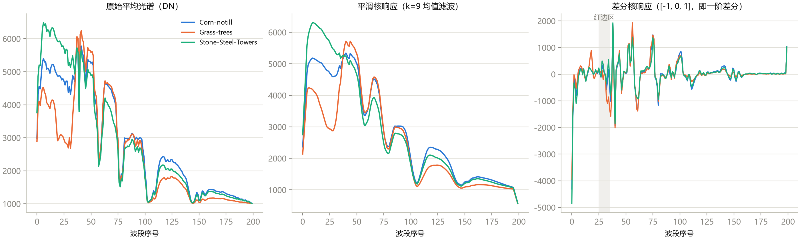
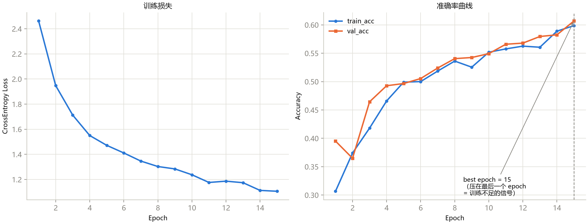
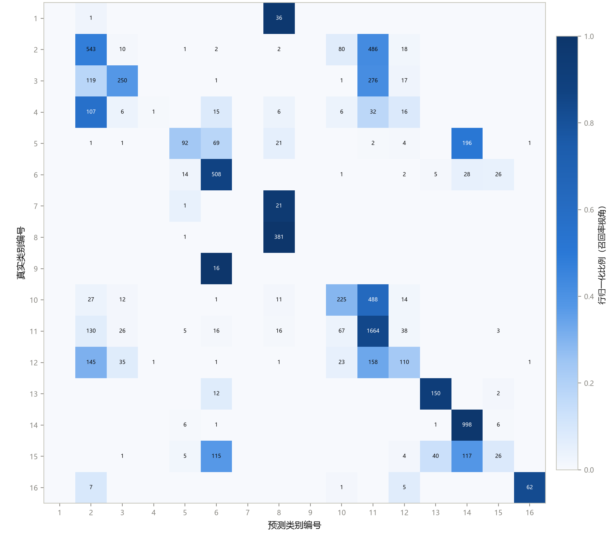
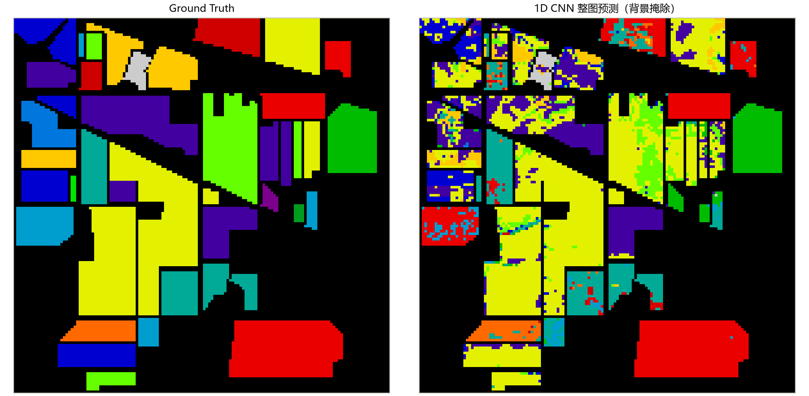

# 第 5 章 1D CNN：光谱序列建模

> **1D CNN: Modeling the Spectrum as a Signal**

状态：✅ 已完成

---

## 本章定位

模型篇第一章，也是第一个 PyTorch 模型。它只看光谱曲线、不看空间邻域，因此与第 3 章的 SVM 是最"同构"的对比对象——**相同的输入信息，不同的函数族**。通过它建立卷积、通道、感受野、参数量与训练诊断的基本功；后续所有 CNN 变体（第 6–10 章）都从这里生长出来。本章数字由 `scripts/train_1d_cnn.py` 在 notebook 04 协议（协议 C）下真实复现，并记入课程记分板。

## 学习目标 / Learning Objectives

- 理解卷积的两大思想：局部连接与参数共享，以及它们为什么匹配光谱信号
- 掌握 `nn.Conv1d` 的形状与参数计算（`(N, C_in, L)` 约定、感受野的叠加）
- 会解读一个典型 1D CNN（Conv-BN-ReLU-Pool 栈 + 自适应池化 + 全连接头）的每个设计选择
- 能独立完成一次训练并做出基本诊断：训练不足、过拟合、与基线的差距归因
- 建立"协议 C"（10/10/80 小样本协议）下与 SVM 锚点的对比习惯

---

## 5.1 从全连接到 1D 卷积

把 200 维光谱喂给全连接网络的第一层（512 个隐单元），需要 200×512 ≈ 10 万个参数——而且这层网络把光谱当作**无结构的数字集合**：打乱波段顺序，全连接照样工作。但第 1、3 章已经确立了两件关于光谱的事实：

1. **光谱是连续有序的信号**——相邻波段相关系数普遍 > 0.9，PCA 之所以有效正因为这个；
2. **判别性特征是局部的**——红边是一个约 10 nm 尺度的陡坡，水吸收是窄吸收谷，它们都只占 200 个波段中的一小段。

卷积的两大思想恰好对着这两条事实：

- **局部连接（local connectivity）**：每个输出只由一个 k 长度的窗口计算——先验假设"特征是局部的"，与红边/吸收谷的尺度匹配；
- **参数共享（weight sharing）**：同一个滤波器（k 个权重）滑过整条光谱——假设"特征与位置无关"，红边出现在哪个波段位置都能被同一个检测器抓住。

形式上，一维卷积就是**滑动加权和**：

$$y[l] = \sum_{i=0}^{k-1} w[i] \cdot x[l+i] + b$$

图 5-1 用真实数据演示了这件事：三个类别的平均光谱，分别经过一个 9 点均值滤波器（平滑）和一个 `[-1, 0, 1]` 差分滤波器（一阶差分）。看差分响应：**红边区（灰色竖带）出现明显尖峰**——一个只有 3 个参数的滤波器就把"植被 vs 非植被"的最强判据变成了一个显式特征。一个 `Conv1d` 层就是一排这样的滤波器；与手工核的区别只有一个：**训练让网络自己学出有用的滤波器组合**。

**图 5-1**　真实平均光谱（Corn-notill / Grass-trees / Stone-Steel-Towers）与两个手工核的响应。左：原始 DN；中：k=9 平滑核（低通，压噪声）；右：差分核（响应即光谱斜率，红边区出现尖峰）。为物理可读性，本图用原始 DN；网络实际吃进的是标准化后的光谱。

## 5.2 Conv1d 形状手册

PyTorch 的 `nn.Conv1d` 约定输入形状 `(N, C_in, L)`——批大小、通道数、长度。**把光谱当作单通道一维信号**，输入即 `(N, 1, 200)`；本章模型的完整形状流见表 5-1。

三个公式覆盖全部形状计算：

- 参数量：$\text{params} = C_{out} \times (C_{in} \times k + 1)$（+1 是偏置）；
- 输出长度（stride=1）：$L_{out} = L + 2p - k + 1$；
- **感受野（receptive field）叠加**：第 m 层卷积的感受野 = 前一层感受野 + $(k_m - 1) \times \prod_{j<m} s_j$（$s_j$ 为其间池化步幅）。

**表 5-1**　本章模型（SpectralCNN1D）的逐层形状与参数量（`scripts/train_1d_cnn.py` 实测，总参数 76,880）

| 层 | 类型 | 输出形状 | 参数量 |
|---|---|---|---:|
| features.0 | Conv1d(1→16, k=7, p=3) | (1, 16, 200) | 128 |
| features.1 | BatchNorm1d(16) | (1, 16, 200) | 32 |
| features.3 | MaxPool1d(2) | (1, 16, 100) | 0 |
| features.4 | Conv1d(16→32, k=5, p=2) | (1, 32, 100) | 2,592 |
| features.5 | BatchNorm1d(32) | (1, 32, 100) | 64 |
| features.7 | MaxPool1d(2) | (1, 32, 50) | 0 |
| features.8 | Conv1d(32→64, k=3, p=1) | (1, 64, 50) | 6,208 |
| features.9 | BatchNorm1d(64) | (1, 64, 50) | 128 |
| features.11 | AdaptiveAvgPool1d(8) | (1, 64, 8) | 0 |
| classifier.1 | Linear(512→128) | (1, 128) | 65,664 |
| classifier.4 | Linear(128→16) | (1, 16) | 2,064 |

用感受野公式算一个具体数：三层卷积后（两层 stride=2 的池化），每个输出位置能看到原始光谱上 $7 + (5-1)\times 2 + (3-1)\times 4 = 23$ 个波段——约 230 nm 的光谱窗口。**网络"看得见"整条红边**，这不是巧合而是设计出来的尺度匹配。

## 5.3 网络设计范式：SpectralCNN1D 逐块解读

本章模型与 `notebooks/04` 的 `SpectralCNN1D` 完全一致（`scripts/train_1d_cnn.py` 同步实现）。它的骨架是深度学习最经典的**三段式**：

1. **卷积栈**：三个 Conv-BN-ReLU-Pool 块。通道数 16→32→64 逐层加深（空间/谱位置信息压缩成更多"特征种类"），卷积核 7→5→3 逐层变细（浅层抓宽带形状、深层抓局部细节）——这是 CNN 的通用语法，第 6–8 章的 2D/3D 网络会原样复用；
2. **AdaptiveAvgPool1d(8)**：把任意长度压成固定 8 个位置再平均。`Adaptive` 的价值是**与输入长度解耦**——换一个 103 波段的数据集（PaviaU），网络一行都不用改；
3. **分类头**：Flatten → Linear(512→128) → ReLU → Dropout(0.3) → Linear(128→16)。Dropout 在 10% 小样本协议下是第一道防过拟合闸门。

两个配套的数据侧选择（都在 `train_1d_cnn.py` 里，与 notebook 一致）：

- **StandardScaler 标准化，且只在训练集上 fit**——第 4 章 4.2 节讨论过 PCA 整图拟合的灰色地带；notebook 04 在这件事上选择了**严格侧**（train-fit、transform 其余）。1D 输入不需要 PCA：没有 patch 放大，200 维本来就轻；
- **训练循环直接复用 `hsi_learning.engine.fit`**——与第 2 章讲的 best-checkpoint 机制、第 8 章的 HybridSN 管线共用同一份代码。"同一引擎驱动所有模型"正是 `src/` 工程化的意义。

## 5.4 训练与诊断：协议 C 首秀

### 协议 C：小样本协议

从本章起，深度模型使用与 `notebooks/04` 一致的**协议 C**：**10% 训练 / 10% 验证 / 80% 测试**（分层两步划分，`random_state=42`）。为什么深度学习要用比 SVM（协议 A：80% 训练）小得多的训练集？两个原因：文献惯例——小样本协议对模型容量更敏感、区分度更高；以及公平——深度模型参数多，富样本协议下谁都能到 90%+，看不出设计差异。**协议 A/A′/C 各自独立记分，永不混排**（记分板规则）。

同一划分、同一标准化下，我们跑了三行结果（表 5-2）：

**表 5-2**　协议 C（10/10/80，seed 42）首个记分板（Indian Pines，测试集 8200 样本）

| 模型 | 训练量 | OA | AA | Kappa |
|---|---|---:|---:|---:|
| SVM (RBF, C=100) 锚点 | 一次性 | **80.70** | **77.73** | **0.7795** |
| 1D CNN（notebook 默认） | 15 epochs | 61.10 | 44.64 | 0.5424 |
| 1D CNN（延长训练） | 60 epochs | 75.27 | 60.15 | 0.7147 |

**图 5-2**　15 epochs 默认配置的训练曲线。损失仍在下降、val_acc 仍在上升、**best epoch = 15/15 压在最后一个 epoch**——三条证据指向同一个诊断：不是过拟合（train/val 两条曲线贴合），而是**训练不足**。

**诊断的闭环**是本章最重要的基本功训练。图 5-2 的读法：

- `best epoch` 压在最后一个 epoch → **没练够**，先加 epochs；
- train_acc 高、val_acc 岔开下降 → 过拟合，上 Dropout / weight decay / 数据增强；
- loss 不降 → 学习率或初始化问题（试试 `--lr 1e-2`，你会看到发散——这是配套实操的练习之一）。

照诊断执行：把 epochs 从 15 提到 60，**OA 61.10% → 75.27%（+14.2 个百分点）**，AA 从 44.64% → 60.15%——同一个模型、同一份数据，什么都没改，只是把训练做完整。best epoch 55/60 仍略压边，说明还有余量。

**图 5-3**　15 epochs 版本的混淆矩阵（行归一化配色 + 计数标注，读法见第 2 章）。三个典型模式：**Alfalfa 37 个测试样本里 36 个被判成 Hay-windrowed**；**Oats 16 个全部被判成 Grass-trees**；玉米/大豆族内部大片互混（Corn-notill←Corn-mintill 119、←Corn 107）。注意这些是"块状、方向性"的错误——预测系统性地流向少数大类，与第 2 章图 2-2 中 SVM"细而分散"的混淆结构不同：训练不足的神经网络会先用容量记住大类，小类最后才被学会。

### 与基线的差距怎么归因

即使训练充分（75.27%），1D CNN 仍比同协议 SVM 锚点（80.70%）低 5.4 个百分点。这个诚实的负结果值得写进你的科研直觉：**深度模型不自动更强**。1024 个训练样本喂 76,880 个参数的非凸模型，输给 80 年代就成熟的凸优化方法，一点也不丢人——它说明瓶颈不在"模型表达力"，而在别处（下一节）。

## 5.5 天花板：空间信息完全缺失

**图 5-4**　1D CNN 的整图预测（15 epochs 版本，背景掩除）。椒盐噪声依旧，且多了"成片错误"——顶部 Wheat 田整块被判成别的类，与图 5-3 的块状混淆一一对应。

1D CNN 的输入是 1×200 向量——**它看到的每个像元，与第 3 章 SVM 看到的信息一字不差**。它输给 SVM 的原因不是"神经网络不行"，而是：在这个信息量下（纯光谱、千级样本），SVM 的凸优化解就是当前信息下的高效解；神经网络的表达力优势无处发挥。**瓶颈在输入信息，不在函数族。**第 3 章图 3-1 的椒盐噪声、本章图 5-4 的成片错误，指向同一个缺口——空间上下文。第 6 章开始，我们把它喂进去。

---

## 配套实操 / Hands-on

- `notebooks/04_1d_cnn_teaching.ipynb` —— 本章的完整教学版：数据 → 划分 → 标准化 → TensorDataset → SpectralCNN1D → 训练 → 指标 → 整图预测；
- `scripts/train_1d_cnn.py` —— 工程版复现入口（与 notebook 协议一致，复用 `hsi_learning` 的划分/引擎/工具），产物写入 `results/1d_cnn/IP/`；改动重跑建议：
  - `--epochs 60` → 复现表 5-2 第三行（75.27%）；
  - `--lr 1e-2` → 观察发散：学习率诊断的第一课；
  - `--epochs 60 --weight-decay 1e-3` → 加强正则后 train/val 曲线怎么变；
- `scripts/generate_ch05_figures.py` —— 复现本章四张图并打印协议 C 的 SVM 锚点（先跑上面的训练脚本）。

## 本章要点 / Key Takeaways

- 中文：Conv1d = 局部连接 + 参数共享的滑动滤波器，天然匹配"光谱特征局部且位置无关"；三层卷积后感受野约 23 波段（~230 nm），与红边尺度匹配；训练诊断看三处——best epoch 压边（训练不足）、train/val 岔开（过拟合）、loss 不降（学习率）；本章 61.10% → 75.27% 的提升全部来自"把训练做完整"，但训练充分后仍输同协议 SVM 5.4 个点——深度模型不自动更强，瓶颈在输入信息而非函数族；空间上下文是下一步。
- English: Conv1d is a sliding filter with local connectivity and weight sharing — a natural fit for spectra whose features are local and location-independent; three stacked convs reach a ~23-band receptive field, matching the red-edge scale. Read training curves for three signals: best epoch pinned at the end (undertrained), train/val divergence (overfitting), flat loss (learning rate). Our 61.10% → 75.27% gain came purely from finishing the training — yet the model still trails the same-protocol SVM by 5.4 points: deep models are not automatically better, and the bottleneck is input information, not the function family. Spatial context is next.

## 自测题 / Self-check

1. 光谱为什么要排成 `(N, 1, 200)` 而不是 `(N, 200, 1)`？排错了会发生什么？
2. 表 5-1 的三层卷积叠加后，每个输出位置能看到原始光谱上多少个波段？写出推导。
3. 训练 15 epochs 后 best epoch 压在最后一个 epoch——这说明什么、下一步怎么做？
4. 1D CNN 与 SVM 的输入完全相同，为什么训练充分后仍输 5 个百分点？这对你后续读论文时判断"深度方法是否必要"有什么提示？

<strong>参考答案（先自己回答再看）</strong>

1. `Conv1d` 沿最后一维 L 做滑动窗口。`(N, 1, 200)`：1 个通道、200 个光谱位置，核沿波段滑——正确。`(N, 200, 1)`：200 个"通道"、长度 1，核没有可滑动的空间（k>1 的核直接无处安放），网络退化成逐通道的全连接——最常见的初学者形状错位。判别方法：**卷积核滑动的轴 = 你希望提取局部特征的轴**。
2. 感受野 = 7 + (5−1)×2 + (3−1)×4 = 23。逐层：第一层 k=7 → 7；一次 MaxPool(2) 后，第二层 k=5 在减半序列上等效跨 10 → 感受野 7 + 4×2 = 15；再一次池化后第三层 k=3 等效跨 12 → 15 + 2×4 = 23。约 230 nm 窗口，恰好覆盖红边（~700 nm 处约 30–50 nm 宽的陡坡）加两侧基线。
3. 三条证据（loss 仍在降、val_acc 仍在升、best=最后 epoch）指向**训练不足**而非过拟合（train/val 贴合）。下一步：加大 epochs 重跑（本章 15→60，OA +14.2）；若加到 60 后 best 仍压边（55/60 略压边），继续加或提高学习率；同时观察 train/val 是否开始岔开——一旦岔开就转入过拟合对策（Dropout、weight decay、早停）。
4. 1024 个样本、76,880 参数的非凸优化 vs 1024 样本上近凸的核方法：小数据 + 纯光谱信息下，SVM 的解更接近该信息量下的上限；神经网络的表达力优势需要更多信息（空间上下文）才有用武之地。读论文时的提示：当一篇 DL 论文在"输入与基线相同信息、样本量小"的设定下只赢零点几个点，要怀疑增益来自调参而非范式；真正有说服力的对比是把新信息源（空间/时序）加入后的增益分解（这正是第 12 章消融实验的思维方式）。

## 延伸阅读 / Further Reading

- Hu, W., Huang, Y., Wei, L., Zhang, F., Li, H., "Deep convolutional neural networks for hyperspectral image classification," *IEEE JSTARS*, 2015.——高光谱 1D CNN 的奠基工作，本章输入形态的出处。
- Goodfellow, I., Bengio, Y., Courville, A., *Deep Learning*, MIT Press, 2016, 第 9 章（Convolutions）——卷积三要素（局部连接/参数共享/等变表示）的系统论述。
- PyTorch 文档：`nn.Conv1d`（形状与参数公式）、`nn.AdaptiveAvgPool1d`、`TensorDataset`。
- 本仓库 `notebooks/04_1d_cnn_teaching.ipynb`（协议 C 的教学实现）与 `scripts/train_1d_cnn.py`（工程复现版）。
