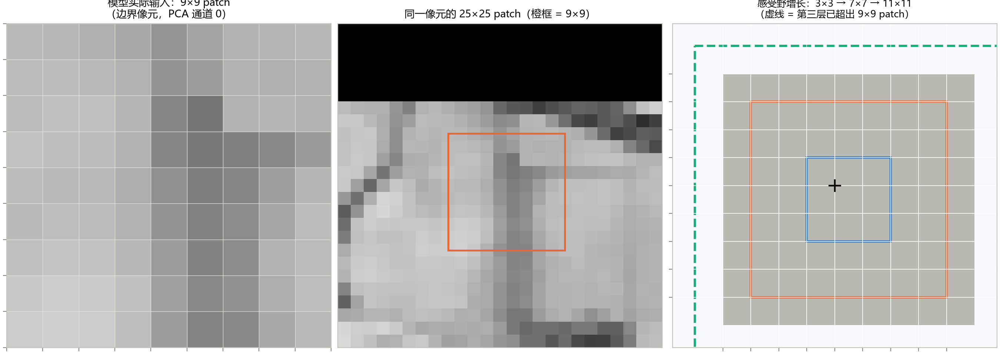
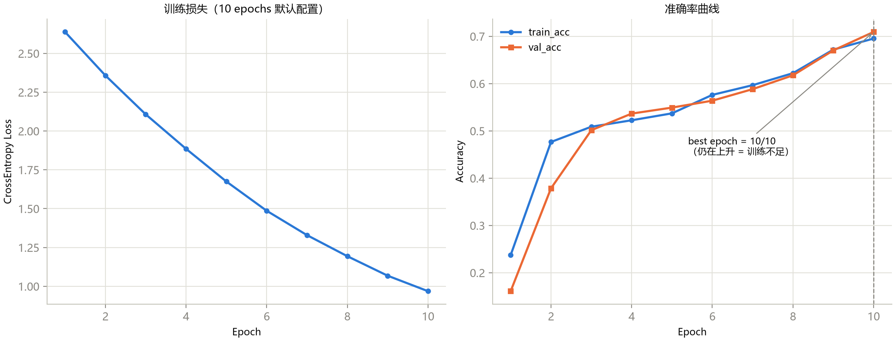
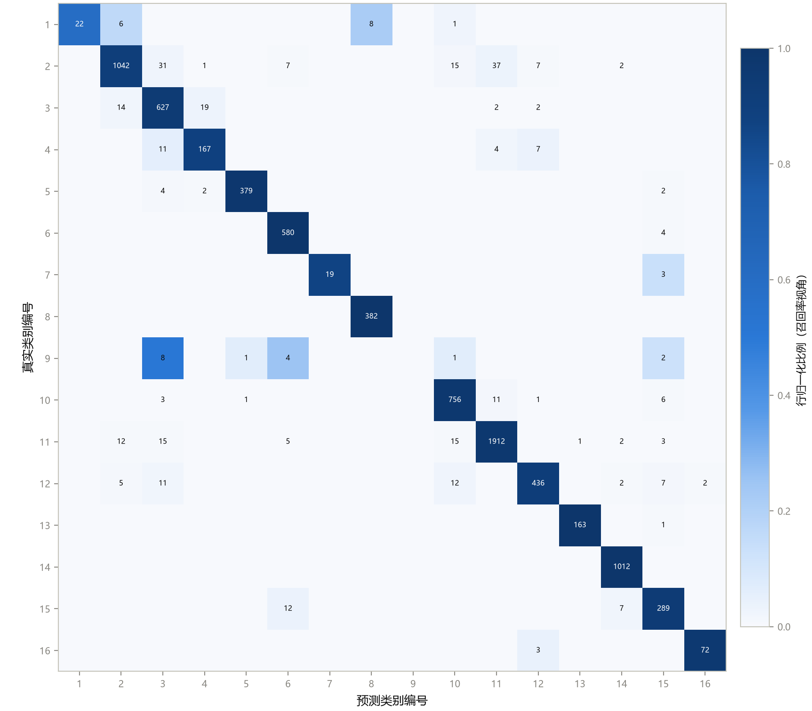
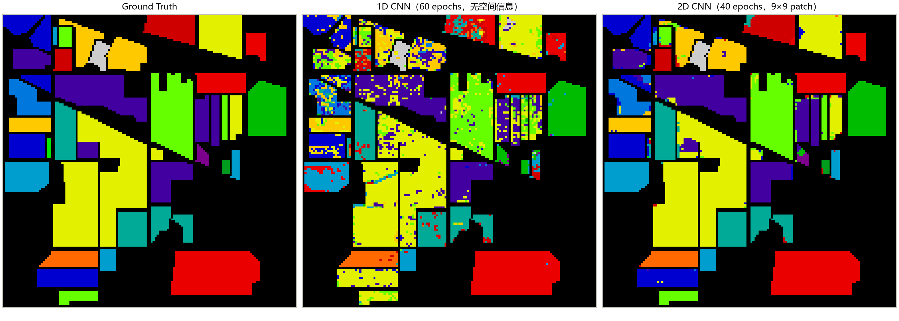

# 第 6 章 2D CNN：空间建模

> **2D CNN: Modeling Spatial Context**

状态：✅ 已完成

---

## 本章定位

与第 5 章互为镜像：1D CNN 只看光谱，2D CNN 主要看空间。它接收第 4 章准备好的 patch，把"光谱维压缩成通道数"，用标准图像卷积提取空间结构。本章还有第二个任务：**诚实地解读一个爆表的成绩**——2D CNN 在协议 C 下拿到 95.83% 的 OA，比 SVM 锚点高 15 个百分点，但其中混着第 2 章预警过的 patch 重叠泄漏。学会拆解这种数字，是从"跑模型"到"做科研"的关键一步。

## 学习目标 / Learning Objectives

- 掌握 `nn.Conv2d` 的形状与参数计算，理解感受野随深度叠加的增长方式
- 理解"PCA 降维 → 2D 卷积"这一经典范式，以及高光谱 2D 模型的输入成本核算
- 会搭一个典型 2D CNN（Conv-BN-ReLU-Pool 栈 + 自适应池化）并追踪逐层形状
- 能做 1D / 2D 对照实验：精度差距归因于空间上下文，且能识别随机划分下的泄漏水分

---

## 6.1 图像卷积与感受野

`nn.Conv2d` 的输入约定是 `(N, C_in, H, W)`。对高光谱 patch 而言：**H、W 是空间维（卷积核滑动的轴），C 是光谱维（卷积核聚 合的轴）**——PCA 压缩后的每个主成分通道被当作一幅"图像"处理，这正是"把光谱维变成通道数"的含义。

参数量与形状公式是 5.2 节的直接二维化：

- 参数量：$C_{out} \times (C_{in} \times k_h \times k_w + 1)$——注意与 1D 的差别在 $k_h k_w$：同样 k=3，2D 核一次看 9 个位置；
- 输出尺寸：$H_{out} = H + 2p - k + 1$（每维独立）；
- 感受野叠加：与 5.2 节同一条公式，二维独立地作用于 H、W 两轴。

本章实际结构是 Conv3 → Pool2(stride2) → Conv3 → Conv3。按 `r'=r+(k-1)j, j'=j*s` 计算，各阶段感受野为 **3→4→8→12**，第三层卷积后为12×12，而非漏掉池化核后的11×11。9×9输入的部分理论覆盖会落在padding区域；覆盖超过输入不代表所有位置都获得相同有效信息，也不意味着继续堆层只会空转。自适应池化选择如何汇总特征，是另一个结构决策。

**图 6-1**　左：本章模型实际输入——边界像元的 9×9 patch（PCA 通道 0；whiten 后各通道均值 0 方差 1，对比度天然偏低）；中：同一像元的 25×25 patch（第 4 章的尺寸，橙框为 9×9 的位置）——顶部黑色为 zero-padding 区；右：感受野 3→7→11 的增长，虚线框已越出 patch 边界。

**patch size 的重新定价**：第 4 章说 25×25 是"折中惯例"，本章 notebook 却用 9×9。两个尺寸各服务一种成本结构：25×25×15 = 9,375 值/样本（第 8 章 HybridSN 的输入），9×9×12 = 972 值/样本（本章）。2D CNN 的通道数随卷积层暴涨（32→64→128），patch 越大，显存与计算按平方上涨——**教学管线用 9×9 换取轻快，论文级模型常用 13–27**。尺寸选择没有免费午餐，只有成本核算。

## 6.2 范式：PCA 先行

"PCA 降维 → 2D 卷积"是高光谱 2D 模型的标准开胃菜，原因在第 4 章已埋好：patch 把样本放大了 81 倍（9×9），若保留原始 200 波段，输入是 81×200 = 16,200 维——第一层卷积哪怕只出 32 个通道，也要 32×(200×9+1) ≈ 5.8 万参数全花在"通道聚合"上。PCA 把光谱维压到 12，让卷积的参数预算全部花在空间结构上。

本章管线（与 `notebooks/05` 一致）在预处理上做了一次"混合约定"的示范，值得专门指出：

1. **PCA(12, whiten=True) 在整幅立方体上拟合**——与第 4 章 `apply_pca_cube` 相同的 transductive 惯例；
2. **StandardScaler 在降维后的训练像元上拟合**、transform 其余——与第 5 章 notebook 04 相同的严格侧选择。

也就是说，**同一个 notebook 里两种约定并存**：无监督的 PCA 用了整图，有量纲敏感性的标准化守住了 train-fit。这不是不一致，而是社区的真实现状——不同预处理环节的泄漏容忍度没有统一标准。第 12 章的协议清单会要求你**逐项写明每个预处理的拟合范围**，而不是笼统一句"按惯例"。

## 6.3 形状追踪实战

**表 6-1**　SpectralSpatialCNN2D 逐层形状与参数量（`scripts/train_2d_cnn.py` 实测，总参数 105,584）

| 层 | 类型 | 输出形状 | 参数量 |
|---|---|---|---:|
| features.0 | Conv2d(12→32, k=3, p=1) | (1, 32, 9, 9) | 3,488 |
| features.1 | BatchNorm2d(32) | (1, 32, 9, 9) | 64 |
| features.3 | MaxPool2d(2) | (1, 32, 4, 4) | 0 |
| features.4 | Conv2d(32→64, k=3, p=1) | (1, 64, 4, 4) | 18,496 |
| features.5 | BatchNorm2d(64) | (1, 64, 4, 4) | 128 |
| features.7 | Conv2d(64→128, k=3, p=1) | (1, 128, 4, 4) | 73,856 |
| features.8 | BatchNorm2d(128) | (1, 128, 4, 4) | 256 |
| features.10 | AdaptiveAvgPool2d((1,1)) | (1, 128, 1, 1) | 0 |
| classifier.1 | Linear(128→64) | (1, 64) | 8,256 |
| classifier.4 | Linear(64→16) | (1, 16) | 1,040 |

三个观察：**MaxPool 把 9×9 砍到 4×4 后不再降采样**——9×9 太小，两次池化就只剩 2×2，所以后续卷积全部保持分辨率，只靠 AdaptiveAvgPool 收尾；**参数大头在第三层卷积（73,856，占 70%）**——通道数最多的层永远是参数大户，这解释了为什么轻量化论文总在"深层卷积"上做文章（第 14 章候选选题之一）；对比第 5 章的 76,880 参数，2D 模型只多了 37%，却多买到了一整个空间维。

## 6.4 与 1D CNN 的对照实验

### 记分板

**表 6-2**　协议 C（10/10/80，seed 42）累计记分板（Indian Pines，测试集 8200 样本；加粗为同列最优）

| 模型 | 训练配置 | OA | AA | Kappa |
|---|---|---:|---:|---:|
| SVM (RBF) 锚点 | 一次性 | 80.70 | 77.73 | 0.7795 |
| **2D CNN（本章）** | **40 epochs** | **95.83** | **87.04** | **0.9525** |
| 2D CNN | 10 epochs（notebook 默认） | 70.01 | 49.18 | 0.6469 |
| 1D CNN（第 5 章） | 60 epochs | 75.27 | 60.15 | 0.7147 |
| 1D CNN | 15 epochs（notebook 默认） | 61.10 | 44.64 | 0.5424 |

**图 6-2**　默认 10 epochs 配置的曲线——第 5 章的诊断再次应验：best epoch = 10/10 压边、两条曲线贴合，训练不足。延长到 40 epochs 后 OA 70.01% → 95.83%（+25.8），best epoch 仍压在 40/40，说明还有余量。

### 空间上下文的真实增益

先看训练充分后的逐类召回（1D 60ep → 2D 40ep）：Corn-mintill **0.495 → 0.944**、Corn **0.492 → 0.884**、Soybean-clean **0.495 → 0.918**、Buildings-Grass-Trees-Drives **0.321 → 0.938**、Grass-pasture-mowed **0.000 → 0.864**——第 2、3 章反复出现的"玉米/大豆族互混"和"小类崩塌"几乎被空间上下文整体修复。图 6-3 的混淆矩阵对角线干净得多，图 6-4 的整图预测几乎复刻 Ground Truth：田块内部成片一致、边界锐利——这就是"空间上下文"四个字的视觉定义。

**图 6-3**　2D CNN（40 epochs）测试集混淆矩阵。对照第 5 章图 5-3：块状的大类吸引基本消失，残余错误集中在光谱相近的作物边界。

**图 6-4**　整图预测对比：无空间信息的 1D CNN（60ep，左）椒盐噪声遍布；加入 9×9 邻域的 2D CNN（40ep，右）几乎复刻 Ground Truth。

### 但这个 95.83% 含多少水分？

冷静下来算一笔账（第 2 章陷阱 1 的兑现时刻）：9×9 patch 有 81 个像元，10% 随机划分下**平均每个测试 patch 里混着约 8 个训练像元**；与中心相距 (1,1) 的训练邻居，其 patch 与测试 patch 重叠 8×8 = 64/81 ≈ 79%，最近的邻居重叠高达 9×8 = 72/81 ≈ 89%。换句话说，**每个测试样本在训练集里都有几个"近似孪生"**——模型可以靠记住邻域外观而非学会判别来答题。val 集同样混着训练邻居，所以 96.9% 的 val_acc 也一样乐观。

如何拆解 95.83% 里"真实空间建模"与"协议水分"的比例？在随机划分内部**无法干净分离**——这正是第 2 章说"知道口径比数字本身重要"的原因。严格的做法是**空间不相交划分**（训练与测试 patch 无任何像元重叠），数字通常会显著回落；本课程主线沿用主流随机协议保证与文献可比，把口径写在明处，空间不相交实验留作配套实操的进阶练习。

还有一个漏网之鱼值得点名：**Oats 的召回 0.000 → 0.000**。20 个样本的小类，10% 训练只剩 10 个样本——空间上下文再强，也变不出没见过的光谱-空间组合。泄漏能抬高大类，救不了"训练样本本身不存在"的小类；AA（87.04%）因此仍比 OA 低 8.8 个百分点。**OA 爆表时更要看 AA 和混淆矩阵**——第 2 章的规则在这里完成最后一次闭环。

### 2D 视角的代价

对照实验的另一半是 2D CNN 丢了什么：PCA-12 减少的是光谱表示的维数，不是“丢掉88%的方差”；保留方差比例必须从拟合对象的 `explained_variance_ratio_` 计算。patch 内所有位置对卷积**一视同仁**——中心像元（判别目标）与边缘像元（纯上下文）没有地位差别，中心信息可能被邻域稀释。这两个缺口分别指向后续两章：光谱维的精细建模（第 7 章 3D 卷积把光谱留进核里）与"目标-上下文"的地位不对称（第 8 章起混合结构的动机之一）。

---

## 配套实操 / Hands-on

- `notebooks/05_2d_cnn_teaching.ipynb` —— 本章教学版：PCA-12 → StandardScaler → `PatchDataset2D` → SpectralSpatialCNN2D → 训练 → 整图预测；
- `scripts/train_2d_cnn.py` —— 工程版（协议 C，产物入 `results/2d_cnn/IP/`）。改动重跑建议：
  - `--epochs 40` → 复现表 6-2 第二行（95.83%）；
  - `--patch-size 25` → 观察显存/时间上涨与精度变化，亲手验证 6.1 节的成本核算；
  - `--pca-components 30` → 光谱信息加码后哪些类涨了（对照 6.4 节"2D 的代价"）；
- 进阶练习（空间不相交划分）：把 `split_ground_truth` 换成按空间块（如 145×145 分成 4 个象限，训练用 3 个、测试用 1 个）重跑 2D CNN，观察 OA 从 95% 量级回落多少——这就是泄漏的定量 measurement。注意先检查测试象限里是否缺类（Oats 可能整个消失），缺类的象限方案要换。

## 本章要点 / Key Takeaways

- 中文：普通2D卷积在空间滑动并聚合全部输入通道；本实现含一次池化，第三层卷积后理论感受野为12×12。PCA维数和保留方差比例不同。随机同场景patch存在观测重叠，指标适用域要写清；单次逐类改善或失败不能只归因于空间上下文、patch大小或某个模型家族。
- English: A standard 2D convolution mixes all input channels while sliding over space. Including the pooling kernel gives a 12×12 theoretical receptive field after the third convolution. PCA dimensionality is not retained variance. Same-scene random patch experiments share observations; their results do not isolate the causal effect of spatial context or architecture.

## 自测题 / Self-check

1. `Conv2d(12→32, kernel_size=3)` 的参数量是多少？为什么同样的 k=3，2D 核比 1D 核"贵"？
2. 为什么 2D 模型的输入几乎都要先过 PCA，而 1D 模型（本章对照的管线）可以直接吃 200 个波段？
3. 三层 3×3 卷积（中间夹一层 stride-2 池化）的总感受野是多少？在 9×9 patch 上这意味着什么？
4. 95.83% 的 OA 里混着泄漏。用本章的账本估计：一个测试 patch 与它最近的 4 个训练邻居 patch 的内容重叠率大约在什么区间？要定量分离泄漏，实验设计该怎么改？

<strong>参考答案（先自己回答再看）</strong>

1. $32 \times (12 \times 3 \times 3 + 1) = 3{,}488$。核的权重张量是 $C_{out} \times C_{in} \times k_h \times k_w$：1D 核每次聚合 $k$ 个光谱位置（7 个），2D 核每次聚合 $k_h \times k_w = 9$ 个空间位置再乘上全部输入通道——"贵"在卷积核同时跨越通道与二维空间。
2. 成本结构不同。2D 的输入是 $k^2$ 倍放大的 patch：原始 200 波段下 9×9 patch 是 16,200 维，第一层卷积就要为"光谱聚合"付出 32×(200×9)≈5.8 万参数，且计算按 $C_{in}$ 线性放大；1D 没有空间放大，200 维本身就是完整输入。本质上：**patch 范式放大了光谱维的成本，PCA 是把这份成本打回原形的手段**。
3. 每轴感受野按Conv3→Pool2→Conv3→Conv3得到3→4→8→12；第三卷积位置理论覆盖为12×12。其超出9×9输入的部分对应padding，边界与中心的有效观测范围不同。不能仅凭理论RF超过patch就断定深层无用：非线性、通道组合和优化也影响表达。
4. 相邻9×9窗口的共享比例可按位移手算，例如横移1像元为72/81、对角位移(2,2)为49/81；这不是所有测试点的平均重叠率。空间划分应增加按patch半径设计的缓冲区并检查类别覆盖。随机与空间划分同时改变分布、样本数和任务难度，所以精度差不能直接称“净泄漏贡献”。

## 延伸阅读 / Further Reading

- Makantasis, K., Karantzalos, K., Doulamis, A., Doulamis, N., "Deep supervised learning for hyperspectral image classification," *IGARSS*, 2015.——PCA + 2D CNN 范式的代表工作。
- Hu, W., et al., 2015（第 5 章已引）——其 2D 对照实验与本章互补。
- PyTorch 文档：`nn.Conv2d`、`nn.AdaptiveAvgPool2d`。
- 关于空间自相关与划分策略的定量讨论：Roberts, D. R., et al., *Ecography*, 2017（第 2 章已引）——本章"进阶练习"的方法论依据。
