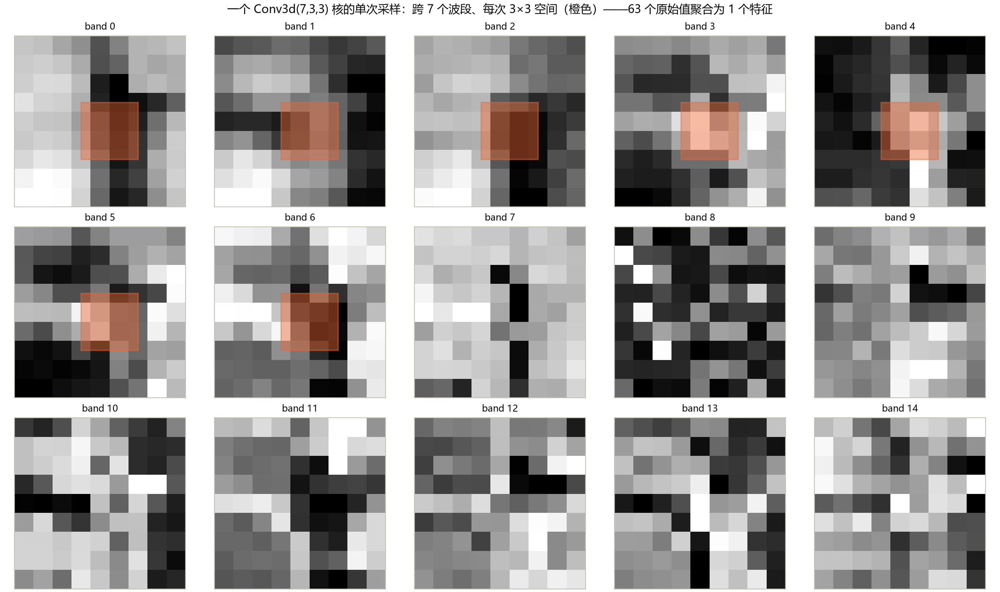
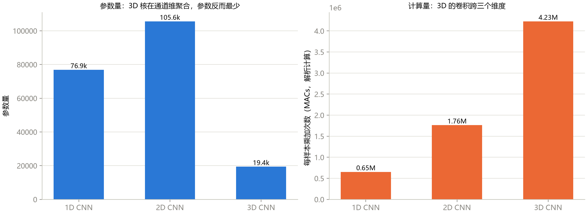
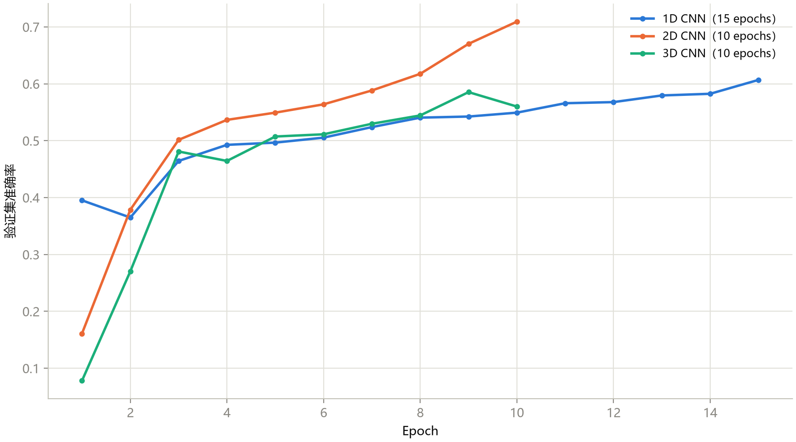
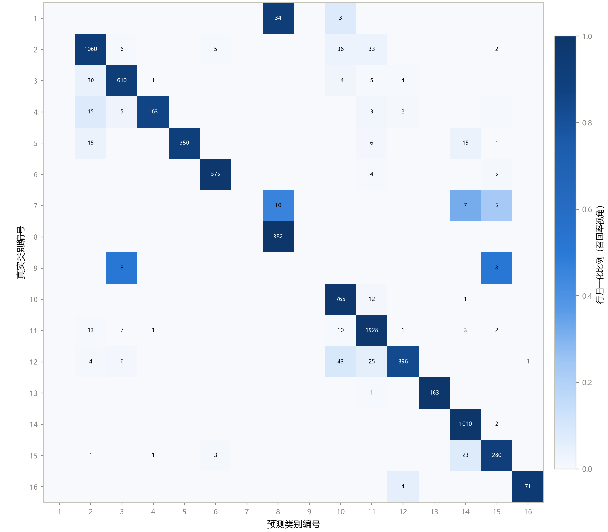

# 第 7 章 3D CNN：谱空联合建模

> **3D CNN: Joint Spectral-Spatial Modeling**

状态：✅ 已完成

---

## 本章定位

模型篇第一次把光谱与空间放进**同一个卷积运算**：3D 卷积核在 `(光谱, 高, 宽)` 三个维度上同时滑动。这是理解第 8 章 HybridSN 的必要前置——HybridSN 的全部动机（3D 贵）与全部巧思（3D→2D 堆叠）都建立在本章的成本分析之上。本章同时带来课程第一个"反直觉"事实：**3D 模型参数最少、计算最贵**，以及第三个诚实的诊断故事：谱空联合核学得最慢。

## 学习目标 / Learning Objectives

- 掌握 `nn.Conv3d` 的语义与形状计算，理解核在光谱维的跨度意味着什么
- 建立"谱空联合核"的设计直觉：为什么核常取 `(7,3,3)`、`(5,3,3)`、`(3,3,3)` 这类"光谱大、空间小"的形状
- 会用解析法核算计算量（MACs），理解"参数少 ≠ 计算便宜"
- 能解读 3D CNN 的训练动态：起步慢、后劲足，以及与 2D 对照时的精度/代价权衡

---

## 7.1 从 2D 到 3D 卷积

第 6 章的 2D CNN 有一个妥协：PCA 把光谱压成 12 个通道后，卷积**一次只看一个通道内的一小块空间**，通道之间的光谱关系要靠堆叠层数间接建立。3D 卷积直接把这个关系写进核里：输入是五维张量 `(N, C_in, D, H, W)`（D = 光谱深度），核是 `(k_d, k_h, k_w)`，**在 D、H、W 三个轴上同时滑动**。

图 7-1 用真实数据展示一个 `Conv3d(7,3,3)` 核的单次采样：跨 7 个波段、每次 3×3 空间——**63 个原始值聚合为 1 个特征**。对比第 6 章：2D 的 3×3 核一次只看 9 个值（单通道），光谱维完全不在核内。

**图 7-1**　边界像元的 9×9 patch（PCA-15 后），前 7 个波段的橙色 3×3 方块是一个 `(7,3,3)` 核的完整覆盖范围。每个切片独立拉伸显示。注意波段 3–4 的暗色竖条与波段 0 的亮区——3D 核"看到"的正是这种**跨波段的联合模式**。

本章实现（`notebooks/06` 与 `scripts/train_3d_cnn.py`）的数据形态是个容易踩坑的点：patch 是 `(15, 9, 9)`，喂给 `Conv3d` 前要 `unsqueeze(0)` 变成 **`(1, 15, 9, 9)`**——最前面的 1 是 `Conv3d` 的输入通道数（整个 patch 被当作一个单通道三维体，D 轴 = 光谱）。这与 2D 的 `(12, 9, 9)`（12 个通道）形成鲜明对照：**同一个 patch，2D 把光谱当通道、3D 把光谱当深度**。

## 7.2 谱空联合核的设计直觉

本章模型的三层核分别是 `(7,3,3)`、`(5,3,3)`、`(3,3,3)`——**光谱维大核、空间维小核**。这不是随意的超参，而是对两类信息尺度的匹配：

- **光谱特征是长程的**：一个吸收谷横跨几十个波段，红边宽度约 30–50 nm（3–5 个波段），要"看出"谷的完整形状，核必须在光谱维跨足够宽；
- **空间特征是局部的**：20 m 分辨率下田块边界在 2–3 个像元内完成过渡，3×3 空间核已经足够刻画"这边是田、那边是路"。

形状流见表 7-1。注意 `padding=(0,1,1)`：**光谱维不补零**（补零等于造出"假波段"，会污染光谱特征），因此 D 维逐层收缩 15→9→5→3，三层之后每个输出位置的**光谱感受野 = 7 + 4 + 2 = 13**（近 130 nm），**空间感受野 = 3 + 2 + 2 = 7**——光谱看得比空间远，这正是设计意图。

**表 7-1**　SpectralSpatialCNN3D 逐层形状与参数量（`scripts/train_3d_cnn.py` 实测，总参数 19,416）

| 层 | 类型 | 输出形状 (N, C, D, H, W) | 参数量 |
|---|---|---|---:|
| features.0 | Conv3d(1→8, k=(7,3,3), p=(0,1,1)) | (1, 8, 9, 9, 9) | 512 |
| features.1 | BatchNorm3d(8) | (1, 8, 9, 9, 9) | 16 |
| features.3 | Conv3d(8→16, k=(5,3,3), p=(0,1,1)) | (1, 16, 5, 9, 9) | 5,776 |
| features.4 | BatchNorm3d(16) | (1, 16, 5, 9, 9) | 32 |
| features.6 | Conv3d(16→24, k=(3,3,3), p=(0,0,0)) | (1, 24, 3, 7, 7) | 10,392 |
| features.7 | BatchNorm3d(24) | (1, 24, 3, 7, 7) | 48 |
| features.9 | AdaptiveAvgPool3d((1,1,1)) | (1, 24, 1, 1, 1) | 0 |
| classifier.1 | Linear(24→64) | (1, 64) | 1,600 |
| classifier.4 | Linear(64→16) | (1, 16) | 1,040 |

## 7.3 形状与代价分析：参数最少，计算最贵

图 7-2 把三个教学模型放在同一张图的两把尺子上，呈现本课程第一个"反直觉"结果：

**图 7-2**　左：参数量——3D CNN（19.4k）反而最少，不到 2D（105.6k）的五分之一；右：每样本乘加次数（MACs，解析计算）——3D（4.23M）是 2D（1.76M）的 **2.4 倍**、1D（0.65M）的 **6.5 倍**。

两个方向都值得解释：

- **参数为什么少**：一个 3D 核无论输出体积多大都只有 `C_in × k_d × k_h × k_w` 个权重，且跨通道聚合天然发生——模型用"更宽的核"替代了"更多的核"。输出通道因此可以很小（8→16→24，对比 2D 的 32→64→128）；
- **计算为什么贵**：MACs = 输出元素数 × 每元素聚合的输入数。3D 核在每个输出位置聚合 `1×63`（第一层）、`8×45`（第二层）、`16×27`（第三层）个值——**聚合广度按核体积暴涨**，而输出体积只收缩得很慢（9×9×9 的中间特征体仍然很大）。此外 5D 张量的内存布局对缓存不友好，实际训练时间的差距通常比 MACs 之比还要明显。

这就是第 8 章 HybridSN 出场的全部理由：**3D 的谱空联合是稀缺能力，但全额 3D 的代价按 2.4 倍起步**——于是"少数几层 3D 抓联合特征 + 一层便宜的 2D 精炼空间"成为经典的折中设计。

## 7.4 实验解读

### 记分板

**表 7-2**　协议 C（10/10/80，seed 42）累计记分板（Indian Pines，测试集 8200 样本；加粗为同列最优）

| 模型 | 训练配置 | OA | AA | Kappa |
|---|---|---:|---:|---:|
| SVM (RBF) 锚点 | 一次性 | 80.70 | 77.73 | 0.7795 |
| 2D CNN（第 6 章） | 40 epochs | **95.83** | **87.04** | **0.9525** |
| **3D CNN（本章）** | **40 epochs** | 94.55 | 76.53 | 0.9377 |
| 1D CNN（第 5 章） | 60 epochs | 75.27 | 60.15 | 0.7147 |
| 2D CNN | 10 epochs（默认） | 70.01 | 49.18 | 0.6469 |
| 1D CNN | 15 epochs（默认） | 61.10 | 44.64 | 0.5424 |
| 3D CNN | 10 epochs（默认） | 59.82 | 31.90 | 0.5170 |

**图 7-3**　默认配置下三个模型的 val_acc 曲线（协议 C）。2D 上升最快；**3D 起步最慢**（epoch 1 仅 7.9%）——谱空联合核要在三个维度上同时组织特征，前期最难"上手"；10 epochs 时它垫底（59.82%），40 epochs 后追平 2D 的量级（94.55%）。

**"起点慢"不等于"模型差"**——这是本章的诊断新知识点：同协议比较深度模型时，必须确认每个模型都训练到平台期（best epoch 不压边），否则比的不是模型而是训练预算。3D 的 40ep 仍压边（39/40），说明它的"完全体"还没到，这里的 94.55% 是保守值。

### 与 2D 对照：赢在哪、输在哪

训练充分后（2D 40ep vs 3D 40ep），逐类召回的对比很有信息量：

- **3D 赢在大类作物的精细判别**：Corn-notill 0.912→0.928、Soybean-notill 0.972→0.983、Soybean-mintill 0.973→0.981——光谱维的显式建模确实帮助了"光谱相近、需要谷形细节"的类别（呼应第 1 章图 1-2 的作物光谱差异）；
- **3D 输在稀有类**：Alfalfa **0.595 → 0.000**、Grass-pasture-mowed **0.864 → 0.000**，Oats 两个模型都是 0.000。图 7-4 的混淆矩阵里，Oats 的 16 个测试样本 8 个被判成 Corn-mintill、8 个判成 Stone-Steel-Towers，Alfalfa 的 37 个里 34 个流向 Hay-windrowed。AA 因此掉到 76.53%（比 2D 低 10.5 个点）。
- 一个必须交代的科学细节：稀有类在**单次运行**下的波动极大（Alfalfa 在 2D 里 0.595、在 3D 里 0.000，未必是结构差异，可能只是这颗种子下的优化轨迹不同）。这正是第 12 章要求"多种子均值 ± 标准差"的原因——**单点数字不能支撑稀有类结论**。

**图 7-4**　3D CNN（40 epochs）测试集混淆矩阵。对角线整体强健，剩余错误集中在玉米/大豆族与稀有类行。

### 本章结论与下一步

3D CNN 用 **18% 的参数**达到 2D 的 OA 量级，且在大类作物上有光谱精细化的迹象，代价是 2.4 倍计算、更慢的收敛和更不稳的稀有类。两条线索指向第 8 章：3D 太贵 → 用少量 3D + 2D 混合（HybridSN）；稀有类不稳 → 更强的结构与正则（SSRN 的残差思想）。课程主线也将在第 8 章回到"工程化"——把 notebook 原型升级成 `src/` + `scripts/` 的完整可复现管线。

---

## 配套实操 / Hands-on

- `notebooks/06_3d_cnn_teaching.ipynb` —— 本章教学版：PCA-15 → PatchDataset3D（`unsqueeze(0)` 的深度语义）→ SpectralSpatialCNN3D → 训练 → 整图预测；
- `scripts/train_3d_cnn.py` —— 工程版（协议 C，产物入 `results/3d_cnn/IP/`）。改动重跑建议：
  - `--epochs 40` → 复现表 7-2 第三行（94.55%）；`--epochs 80` → 观察 best epoch 是否仍压边；
  - `--pca-components 30` → 光谱维更深后，光谱感受野与精度的变化；
  - 把第一层核改成 `(3,3,3)` → 光谱感受野缩水后哪些类先掉（对照 7.2 节的设计直觉）；
- `scripts/generate_ch07_figures.py` —— 复现本章四张图（含三个模型的 MACs 解析核算，两次运行结果完全一致）。

## 本章要点 / Key Takeaways

- 中文：3D 卷积把光谱当深度轴，核 (7,3,3)/(5,3,3)/(3,3,3) 匹配"光谱长程、空间局部"的尺度差，三层后光谱感受野 13、空间感受野 7；它参数最少（19.4k，核跨通道聚合替代通道数膨胀）但计算最贵（4.23M MACs，2.4× 于 2D）；训练动态是"起步慢、后劲足"——同协议比较必须等平台期；40 epochs 后 OA 94.55% 逼近 2D，但稀有类（Alfalfa/Grass-mowed 归零）在单次运行下极不稳定，AA 低 10.5 点——多种子均值是稀有类结论的前提；3D 的贵正是 HybridSN 混合设计的出发点。
- English: 3-D convolutions treat the spectrum as the depth axis; kernels (7,3,3)/(5,3,3)/(3,3,3) match long-range spectral vs local spatial scales, reaching a spectral receptive field of 13 and spatial of 7. The model has the fewest parameters (19.4k — kernel volume replaces channel inflation) yet the highest compute (4.23M MACs, 2.4× the 2D). Training starts slow and finishes strong — protocol-fair comparisons must wait for the plateau. At 40 epochs OA (94.55%) approaches the 2D's, but rare classes are wildly unstable in single runs (Alfalfa and Grass-mowed at 0), dragging AA 10.5 points below — multi-seed reporting is a prerequisite for rare-class claims. The cost of full 3D is exactly why HybridSN mixes 3D with 2D.

## 自测题 / Self-check

1. `Conv3d(1, 8, kernel_size=(7,3,3), padding=(0,1,1))` 作用在 `(N, 1, 15, 9, 9)` 上，输出形状是什么？光谱维为什么收缩而空间维不变？
2. 为什么 3D CNN 的参数最少但计算最贵？用"核数 vs 每核聚合量"的语言解释。
3. 3D CNN 在 10 epochs 时是三个模型里最差的，40 epochs 后追平 2D——这个现象对你日后读论文比较模型时有什么警示？
4. 3D 的 AA（76.53%）比 2D（87.04%）低 10.5 个点，Alfalfa 从 0.595 掉到 0.000。你能在这一章的数据里证实"3D 结构不如 2D"吗？要下这个结论还缺什么证据？

<strong>参考答案（先自己回答再看）</strong>

1. 输出 `(N, 8, 9, 9, 9)`：D 维 15−7+1=9（padding 的光谱分量为 0，不补零），H/W 维 9+2−3+1=9（padding 1）。光谱收缩是有意设计——不补零即不造"假波段"；空间补零只是边界处理。
2. 参数：一个 3D 核的权重是 `C_in × k_d × k_h × k_w`，但**一个核就产出整个 (D′, H′, W′) 特征体**，跨通道聚合在核内完成，因此输出通道数可以压得很小（8/16/24）；2D 模型要靠"更多核"（32/64/128）弥补"每核只看单通道"的信息不足。计算：MACs = 输出元素数 × 每元素聚合量，3D 核的聚合体积（63、360、432）远大于 2D（9、288、576 摊在每个空间位置但通道聚合要靠层间），且中间特征体 (9×9×9) 仍然很大——聚合广度 × 输出体积的乘积反超。
3. 三个警示：(a) 深度模型的学习动态差异很大，联合核（跨更多维度的依赖）前期最慢；(b) 公平比较的前提是每个模型都到达平台期——表 7-2 若只看默认 10 epochs，会得出"3D 全面垫底"的错误结论；(c) 反过来，"追平"也不等于上限相同——3D 的 40ep 仍压边（39/40），比较时要么都训练到收敛，要么报告等训练预算（等 epoch / 等墙钟）两种口径。
4. 不能。单次运行、单颗种子下，稀有类的召回波动极大（Alfalfa 在 2D 里也只有 0.595，37 个测试样本意味着 ±几个样本就是 ±10 个百分点的召回）；3D 与 2D 的 AA 差可能大部分来自稀有类轨迹而非结构。要下结论需要：≥3 个种子的均值 ± 标准差（第 12 章）、稀有类的过采样/加权训练对照、以及 Oats 这类"样本本身不存在"类别的单独说明。本章的表述必须停留在"3D 在该单次运行下稀有类不稳定"。

## 延伸阅读 / Further Reading

- Chen, Y., Jiang, H., Li, C., Jia, X., Ghamisi, P., "Deep feature extraction and classification of hyperspectral images based on convolutional neural networks," *IEEE TGRS*, 2016.——高光谱 3D CNN 的代表工作。
- Ji, S., Xu, W., Yang, M., Yu, K., "3D convolutional neural networks for human action recognition," *IEEE TPAMI*, 2013.——3D 卷积在深度学习中的经典出处（动作识别），核跨时间/空间维的思想同源。
- PyTorch 文档：`nn.Conv3d`（五维张量约定与 padding 语义）、`nn.AdaptiveAvgPool3d`。
- Roy, S. K., et al., *IEEE GRSL*, 2020（第 8 章精读）——HybridSN：本章"3D 太贵"结论的工程回应。
