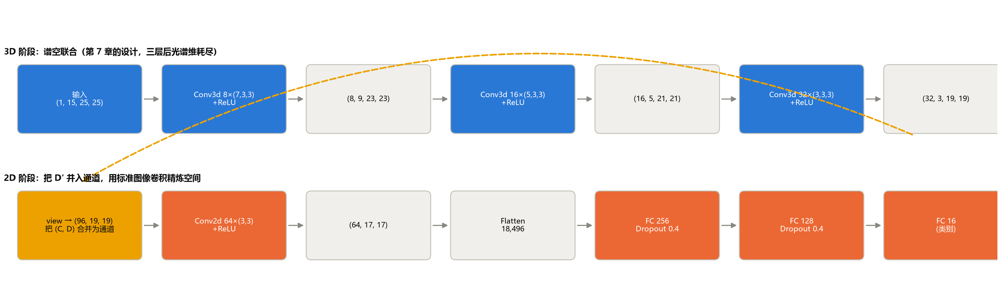
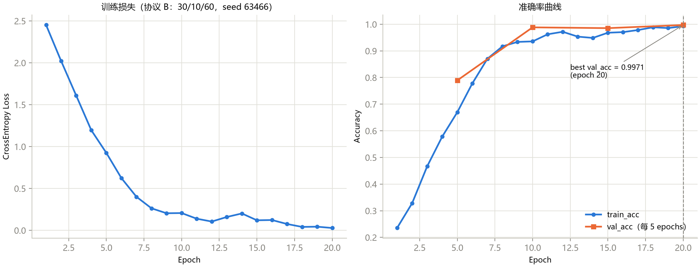
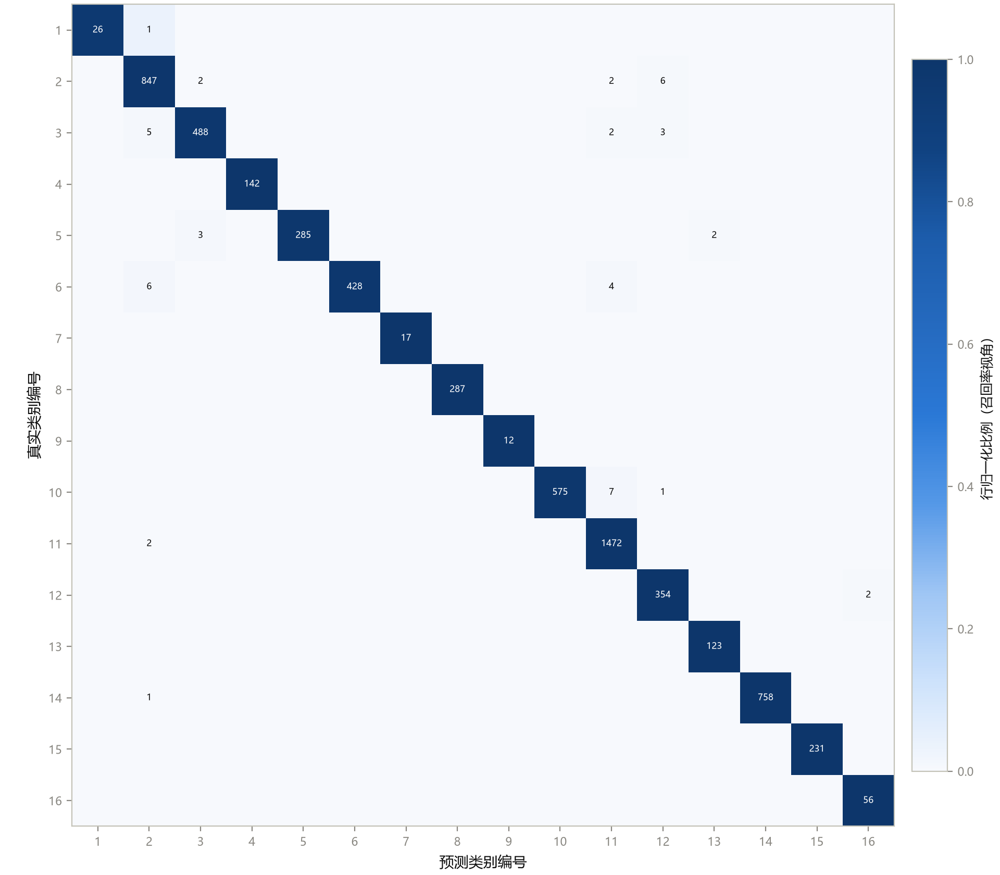
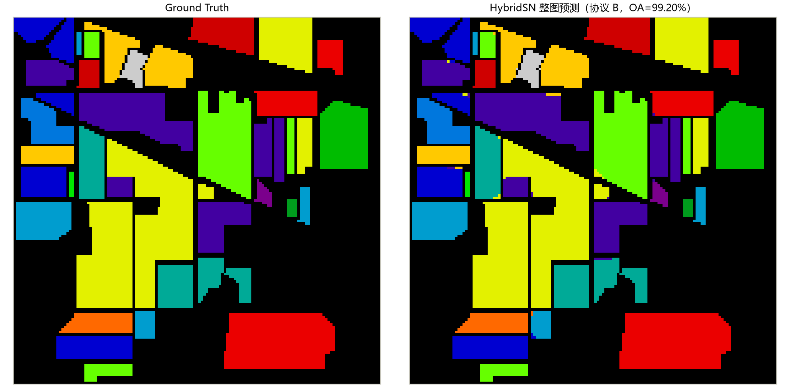

# 第 8 章 HybridSN：3D-2D 混合结构

> **HybridSN: Exploring 3-D–2-D CNN Feature Hierarchy**

状态：✅ 已完成

---

## 本章定位

模型篇第一个"组合式创新"案例，也是全课程工程化主线的核心章。第 6、7 章各持一半信息、各付一半代价：2D 丢光谱细节，3D 贵且收敛慢。HybridSN（Roy et al., *IEEE GRSL* 2020）的答案简洁漂亮：**三层 3D 卷积负责谱空联合特征，一层 2D 卷积负责空间精炼**——"先联合、后精炼"。本章同时完成一件事：从 notebook 原型（`03`、`09`）到 `src/hsi_learning/` 模块与 `scripts/train_hybridsn.py` 管线，完整走一遍"论文 → 代码 → 工程"的落地路径，为第 12 章的可复现实验和第 14 章 Capstone 打样。

## 学习目标 / Learning Objectives

- 理解 HybridSN 的设计动机：为什么"少量 3D + 一层 2D"是谱空建模的合理折中
- 逐层读懂 `HybridSN` 实现：三层 3D 核、`view` 重排的衔接语义、动态形状探测
- 会用 `scripts/train_hybridsn.py` 从命令行复现完整实验（PCA → 划分 → 训练 → 整图推理 → 指标导出）
- 掌握工程化输出约定：checkpoint、`run_config.json`、`training_history.json`、`metrics.json`、预测图
- 理解"同一个模型、不同协议"的数字为何不可横比（变体实验）

---

## 8.1 论文导读：3D-2D 特征层级

回到第 6、7 章留下的两个缺口：

- **2D CNN**（第 6 章）：PCA 后卷积只看单通道空间邻域，光谱维的判别细节（吸收谷形状、红边位置）被压进通道数里，层间才能间接组合；
- **3D CNN**（第 7 章）：光谱-空间联合建模能力强，但计算贵（2.4×）、收敛慢（10 epochs 时垫底）、参数预算被"宽核"吃掉。

HybridSN 的观察是：这两者的强弱**恰好互补**。光谱-空间的联合特征在浅层就能抓到（少量 3D 层足够），而深层需要的更多是"更大范围的空间精炼"——这恰是廉价 2D 卷积的强项。于是网络设计成**两段式**：

1. **3D 阶段**：三层 Conv3d（8→16→32 通道，核 `(7,3,3)`、`(5,3,3)`、`(3,3,3)`），第 7 章的同款设计；三层之后光谱维耗尽（15→9→5→3），联合特征已就位；
2. **重排**：把 `(32, 3, 19, 19)` 的 3D 特征体 `view` 成 `(96, 19, 19)` 的 2D 特征图——**D′ 个"光谱子特征图"并入通道维**；
3. **2D 阶段**：一层 Conv2d(64, 3×3) 在合并后的多通道图上精炼空间，再接 FC 头（256→128→16，Dropout 0.4）。

一句话概括设计哲学：**用 3D 解决"信息在哪"（谱空联合），用 2D 解决"算得便宜"（空间精炼）**。论文对 IP/SA/PU 三个数据集系统报告了该设计对纯 2D、纯 3D 的优势（此处不引具体数字——不同协议下数字差异很大，这正是第 12 章要训练的敏感性）。

预处理设置也有一段值得注意的历史：原论文对 IP 使用 PCA 降维到 30 个主成分（本仓库 `notebooks/09` 即按此设置复刻），而更广泛流传的复现（含本仓库 `notebooks/03` 与 `train_hybridsn.py`）取 15——两种设置在文献中都很常见，**读论文时必须把"PCA 维数"当作协议的一部分来核对**。

## 8.2 逐层拆解

本仓库的 `HybridSN` 定义在 `src/hsi_learning/models/hybridsn.py`（`notebooks/03` 的工程化版本），逐层形状与参数量见表 8-1。

**表 8-1**　HybridSN 逐层形状与参数量（`scripts/generate_ch08_figures.py` 实测，输入 `(1, 15, 25, 25)`，总参数 4,845,696，MACs/样本 50.82M）

| 层 | 类型 | 输出形状 (N, C, D, H, W) / (N, C, H, W) | 参数量 |
|---|---|---|---:|
| conv1.0 | Conv3d(1→8, k=(7,3,3)) + ReLU | (1, 8, 9, 23, 23) | 512 |
| conv2.0 | Conv3d(8→16, k=(5,3,3)) + ReLU | (1, 16, 5, 21, 21) | 5,776 |
| conv3.0 | Conv3d(16→32, k=(3,3,3)) + ReLU | (1, 32, 3, 19, 19) | 13,856 |
| conv4.0 | Conv2d(96→64, k=3) + ReLU | (1, 64, 17, 17) | 55,360 |
| dense1.0 | Linear(18,496→256) + ReLU + Dropout(0.4) | (1, 256) | 4,735,232 |
| dense2.0 | Linear(256→128) + ReLU + Dropout(0.4) | (1, 128) | 32,896 |
| dense3 | Linear(128→16) | (1, 16) | 2,064 |

四个值得停下来嚼碎的点：

1. **空间维在悄悄收缩**：三层 Conv3d 与一层 Conv2d 都无空间 padding，空间尺寸 25→23→21→19→17。第 7 章 3D 管线（patch 9）光谱维不补零是"不造假波段"；这里连空间也不补——每层边界丢一圈，配合大 patch 无伤大雅，但**手算形状时极易在这里翻车**（8.3 节有本作者的现场翻车实录）；
2. **`view` 是全网络的枢纽**：`(32, 3, 19, 19) → (96, 19, 19)` 把 D′ 个光谱子特征图当作并列通道。数值上没有丢失、没有混合（纯重索引），语义上是"联合特征已经拿到，现在把它当作 96 通道的普通多通道图像"；
3. **没有 BatchNorm**：与第 6、7 章的教学模型不同，HybridSN 忠实于 2020 年前后的论文原设计（ReLU + Dropout，无 BN）。复现老论文时这是常态——**结构与超参都要按原文，即使你知道更好的做法**，否则就不是"复现"了（第 11 章复现 checklist 的第一条）；
4. **参数大户是 FC 而不是卷积**：dense1 一层占 4.74M（全模型 97.7%）。原因是 Flatten 喂给它的输入有 18,496 维。对比第 7 章"卷积占大头"的结论——**哪层是参数大户取决于 flatten 时的宽度**，这也是后续轻量化论文最爱动刀的位置（全局平均池化替代 flatten 即可砍掉 4.7M，留作第 14 章候选选题）。计算量方面，50.82M MACs/样本中卷积占大头——与参数分布正好相反。



**图 8-1**　HybridSN 数据流（真实形状）。上排 3D 阶段（蓝）：谱空联合，光谱维 15→9→5→3 耗尽；黄色高亮处为枢纽重排 `view → (96, 19, 19)`；下排 2D 阶段（橙）：标准图像卷积精炼空间 + FC 头。

## 8.3 形状追踪技巧：dummy forward 替代手算

`HybridSN` 的实现里有两组有趣的方法：

```python
def _shape_after_3dconv(self):
    sample = torch.zeros((1, 1, self.input_channels, self.patch_size, self.patch_size))
    with torch.no_grad():
        sample = self.conv1(sample); sample = self.conv2(sample); sample = self.conv3(sample)
    return sample.shape          # (1, 32, 3, 19, 19)

def _shape_after_2dconv(self, conv3d_shape) -> int:
    ...
    return int(sample.shape[1] * sample.shape[2] * sample.shape[3])   # flatten 宽度
```

用**一次 dummy forward** 代替链式手算公式，让 PyTorch 自己算形状——好处在改变 `input_channels` / `patch_size` 时网络依然自洽（换成 PCA-30 或 patch 13，代码零修改）。这个模式在本课程已经三度复用：`train_chNN.py` 的 `layer_param_table`、记分板的 MACs 核算、以及 notebook 03 里的 `torchinfo.summary`（同一思想的现成工具）。

一个坦白：**本章写作时作者就手算错过一次**——第一版图 8-1 把空间维写成 25→25→25→25（忘了 Conv3d 无空间 padding），直到 dummy forward 实测输出 `(8, 9, 23, 23)` 才纠正。链式形状（光谱收缩 × 空间收缩 × 无 padding）叠加三层，心算出错率极高。**让框架算，你核对**——这是工程课，不是数学课。

## 8.4 脚本化训练管线精读

### 从 notebook 到脚本

`notebooks/03_hybridsn_baseline.ipynb` 是这条管线的源头，其超参与 `train_hybridsn.py` 默认值完全一致：seed 63466、30/10/60 划分、PCA-15、patch 25、batch 256、20 epochs、每 5 epochs 验证、Adam(lr=1e-3, wd=1e-6)。工程化时脚本做了三处改进，每处都是可迁移的工程判断：

1. **随机源统一**：notebook 03 的划分用 `random_state=100`、全局种子用 63466——两棵种子树；脚本把划分也挂到主 seed（`create_dataloaders(random_state=args.seed)`）。**一个实验一棵种子树**，复现时只需一个数；
2. **输出目录规范**：`results/hybridsn/<dataset>/`，所有产物有固定名字（下表）；
3. **证据存档**：`run_config.json` 除了记录全部参数，还存了 PCA 的 `explained_variance_ratio_`——连"降维保留了哪些信息"都可追溯。

**表 8-2**　`train_hybridsn.py` 的输出约定（`results/hybridsn/IP/`）

| 文件 | 内容 | 消费者 |
|---|---|---|
| `run_config.json` | 全部参数 + 数据形状 + PCA 方差解释率 | 人 / 第 12 章实验记录 |
| `sample_report.txt` | 逐类划分明细（第 2 章 `build_sample_report`） | 人 |
| `epoch_XXX_valacc_YYYY.pth` | 验证 checkpoint（只保留最优） | `engine.fit` 管理 |
| `training_history.json` / `training_curves.png` | 训练历史与曲线 | 图 / 人 |
| `prediction.npy` / `prediction_masked.npy` / `.jpg` | 整图预测（原始/掩除/预览） | 图 / 第 9 章 |
| `classification_report.txt` / `metrics.json` | OA/AA/Kappa 与逐类报告 | 记分板 / 人 |

### 协议 B 首秀：数字饱和的样子

`python scripts/train_hybridsn.py --dataset IP --epochs 20` 的真实结果（测试集 6150 样本）：**OA 99.20% / AA 99.18% / Kappa 0.9909**（best val_acc 99.71%，epoch 20）。



**图 8-2**　协议 B（30/10/60，seed 63466）训练曲线。train_acc 与 val_acc 双双逼近 99%——注意这与第 5–7 章"训练不足"的曲线形态完全不同：30% 训练率 + 大模型 + 泄漏口径，协议 B 是一个**饱和协议**。



**图 8-3**　协议 B 混淆矩阵（从保存的整图预测重建）：对角线近乎完美，**Oats 12/12、Grass-pasture-mowed 17/17、Alfalfa 26/27**——前几章反复出现的稀有类问题"消失"了。请保持警惕：这不是模型解决了小样本问题，而是 30% 训练率让每个稀有类有了足够样本、25×25 patch 的重叠泄漏让测试邻域近乎被"背"了下来（第 6 章 6.4 节的账本在 30% 训练率下更甚：平均 ~22 个训练邻居）。**当混淆矩阵开始"全对"，它作为诊断工具的信息量反而趋近于零**——这是协议饱和的信号。



**图 8-4**　HybridSN 整图预测（协议 B）：与 Ground Truth 几乎无法区分。

## 8.5 变体实验与"同一个模型"的陷阱

`notebooks/09_hybridsn_exploring_3d_2d_teaching.ipynb` 用独立实现（`HybridSNExploring`）复刻了**结构完全相同**的网络，但协议不同：**PCA-30**（对齐原论文）、24/6/70 划分、batch 64、12 epochs、lr 1e-3、wd 1e-4、seed 345。把它与 `notebooks/03`（PCA-15、30/10/60、20 epochs）并排放着，你会得到两个"不一样准"的 HybridSN——**都正确，且不可互相比较**。

这引出本章最重要的科研纪律（也是第 12 章的开场白）：**模型的身份 = 结构 + 协议 + 预处理 + 训练预算**。只说"HybridSN 比 2D CNN 好 0.83 个点"而不给协议，等于什么都没说。本章为课程记分板贡献两条可比较的行：

**表 8-3**　HybridSN 的两条记分板行（完整记分板见 `docs/benchmark.md`）

| 协议 | 训练配置 | OA | AA | Kappa |
|---|---|---:|---:|---:|
| B（30/10/60，seed 63466，PCA-15，patch 25） | 20 epochs（脚本默认） | 99.20 | 99.18 | 0.9909 |
| C（10/10/80，seed 42，PCA-15，patch 25） | 40 epochs | 96.66 | 93.28 | 0.9619 |

在协议 C 内部，四个深度模型的演化线就此闭合：

$$\text{OA: } \underbrace{75.27}_{\text{1D}} \to \underbrace{94.55}_{\text{3D}} \to \underbrace{95.83}_{\text{2D}} \to \underbrace{96.66}_{\text{HybridSN}} \qquad \text{AA: } \underbrace{60.15}_{\text{1D}} \to \underbrace{76.53}_{\text{3D}} \to \underbrace{87.04}_{\text{2D}} \to \underbrace{93.28}_{\text{HybridSN}}$$

HybridSN 在 OA 与 AA 上同时居首——**3D 抓联合 + 2D 精炼的组合确实兑现了论文的承诺**。逐类看（协议 C）：**Oats 召回 1.000**（本课程首次！）、Grass-pasture-mowed 0.818、Alfalfa 0.730——大 patch（25 vs 9）+ 谱空联合让稀有类有了空间锚点；最弱的是 Stone-Steel-Towers（0.800，仅 28 个训练样本）。当然，95%+ 区间的所有数字仍含协议 C 的泄漏水分——口径警告一如既往地适用。

---

## 配套实操 / Hands-on

- `notebooks/03_hybridsn_baseline.ipynb` —— 管线源头：与 `train_hybridsn.py` 参数一致，含 `torchinfo.summary` 的形状核对；
- `notebooks/09_hybridsn_exploring_3d_2d_teaching.ipynb` —— 变体：同结构、PCA-30、24/6/70 协议；独立实现的对照读法；
- `src/hsi_learning/models/hybridsn.py` + `scripts/train_hybridsn.py` —— 本章精读主体；产物在 `results/hybridsn/IP/`；
- `scripts/generate_ch08_figures.py` —— 复现本章四张图 + 表 8-1 逐层表 + MACs 核算（协议 B 混淆矩阵从整图预测重建，验证 `split_ground_truth` 的可复现性）；
- 改动重跑建议：
  - `--epochs 60`（协议 B）→ 观察 99%+ 之后还有什么可学的（多半没有——饱和协议的边际收益趋零）；
  - `--pca-components 30` → 对齐 notebook 09 的预处理，观察 AA 变化；
  - 消融雏形：删掉 `conv4`（3D 输出直接 flatten）重训练——"2D 精炼层到底值多少"就是你的第一个消融实验（第 12 章的正题）。

## 本章要点 / Key Takeaways

- 中文：HybridSN = 三层 3D 谱空联合 + view 重排（D′ 并入通道）+ 一层 2D 空间精炼，"先联合、后精炼"化解了第 6/7 章的互补缺口；无 padding 使空间维 25→17、手算形状极易翻车——dummy forward 让框架算形状；dense1 占 97.7% 参数（flatten 宽度决定参数大户）；工程化三改进——种子树统一、输出目录规范、证据存档（含 PCA 方差解释率）；协议 B 饱和（99.20%，混淆矩阵全对即失去诊断力），协议 C 演化线闭合（1D 75.27 → 3D 94.55 → 2D 95.83 → HybridSN 96.66，AA 60.15 → 93.28），Oats 召回首次达 1.000；模型身份 = 结构 + 协议 + 预处理 + 预算，缺一项的比较都是空话。
- English: HybridSN stacks three 3-D conv layers for joint spectral-spatial features, reshapes D′ into channels, and refines space with one 2-D layer — "joint first, refine later" resolving Chapters 6–7's complementary gaps. No padding shrinks space 25→17 and hand-computed shapes are error-prone — let a dummy forward do the math; dense1 holds 97.7% of parameters (flatten width decides the parameter hog). Engineering distills the notebook with three upgrades: one seed tree, canonical outputs, archived evidence (including PCA variance ratios). Protocol B saturates (99.20%, a near-perfect confusion matrix has no diagnostic power left), while protocol C closes the evolution line (75.27 → 94.55 → 95.83 → 96.66 OA; AA up to 93.28, Oats recall 1.000 for the first time). A model's identity is structure + protocol + preprocessing + budget — comparisons missing any term are empty.

## 自测题 / Self-check

1. `view` 把 `(32, 3, 19, 19)` 重排为 `(96, 19, 19)` 而不是 `(3, 32, 19, 19)`——两种排布在信息上等价吗？网络结果会不同吗？论文为什么选前者？
2. 表 8-1 中 dense1 一层占全模型 97.7% 的参数。为什么？如果要把这部分砍掉一个数量级，你会改哪里？
3. `train_hybridsn.py` 里 seed 63466 实际控制了哪几处随机性？列出所有你能找到的位置。
4. 协议 B 的 99.20% 与协议 C 的 96.66% 之间差 2.5 个点。这个差里哪些成分来自训练率（30% vs 10%）、哪些来自泄漏差异？设计实验把它们分开。

<details>
<summary><strong>参考答案（先自己回答再看）</strong></summary>

1. 信息等价：两种排布都只是重索引同一批数值，没有丢失。结果可能不同——通道的排列顺序改变了 Conv2d 核与各子特征图的对应初始化与学习路径，但在随机初始化下网络对"哪种通道排序"没有先验偏好，训练充分后精度差异应在随机波动范围内。论文选 `(C, D)` 顺序更多是实现直觉（"32 个特征图、每个有 3 个光谱片"），并非精巧设计——复现时保持一致即可。
2. Flatten 后的宽度是 18,496（= 64 × 17 × 17），Linear(18,496→256) 一层就是 473 万参数。三个收缩中的空间维和被并入的 D′ 全部变成了 FC 的输入宽度。砍法（任一）：在 flatten 前加 `AdaptiveAvgPool2d(1)`（宽度 18,496 → 64，dense1 缩到 1.6 万参数）；或用 1×1 Conv2d 先把 64 通道压到 16。代价是空间位置信息的压缩方式从"展开"变成"平均"——需要消融验证精度损失（第 12 章）。
3. (a) `set_seed(63466)`：Python `random`、NumPy、PyTorch（含 CUDA）三个全局状态；(b) 划分——`create_dataloaders(random_state=args.seed)` 传入 sklearn 的两步分层划分；(c) `PatchDataset` 里 `np.random.shuffle(indices)` 的训练索引打乱；(d) 网络权重初始化（torch 全局状态）；(e) Dropout 的掩码采样（训练期 torch 随机流）。一个数管五处，这就是"一棵种子树"。
4. 成分无法从这两个数字直接分离——但可以设计：固定协议 B 的划分与 30% 训练率，把 patch 重叠切断（空间不相交划分）→ 得到"30% + 无泄漏"的 OA；再在协议 C（10%）上同样做空间不相交 → "10% + 无泄漏"。两组对比给出训练率的净贡献；与原数字的差值给出泄漏的净贡献。另一个更快的粗估：把协议 C 的训练率提到 30%（其余不动，`--train-rate 0.3 --val-rate 0.1 --seed 42`），它与 99.20% 的差距主要是划分种子与 val/test 构成不同，可作为敏感性检查。完整方法论就是第 12 章的正题。
</details>

## 延伸阅读 / Further Reading

- Roy, S. K., Krishna, G., Dubey, S. R., Chaudhuri, B. B., "HybridSN: Exploring 3-D–2-D CNN feature hierarchy for hyperspectral image classification," *IEEE GRSL*, 2020.——本章主角；精读练习的最佳第一篇（结构小、设置全、与本章代码逐行对应）。
- 本仓库 `docs/codebase-overview.md` —— `src/hsi_learning/` 各模块与输出约定的总览。
- `torchinfo` 文档 —— `Model.summary()`：dummy forward 思想的现成工具（`notebooks/03` 用法）。
- PyTorch 文档：`Tensor.view` 与 `contiguous`（重排的内存语义——`view` 报错时的第一排查点）。
