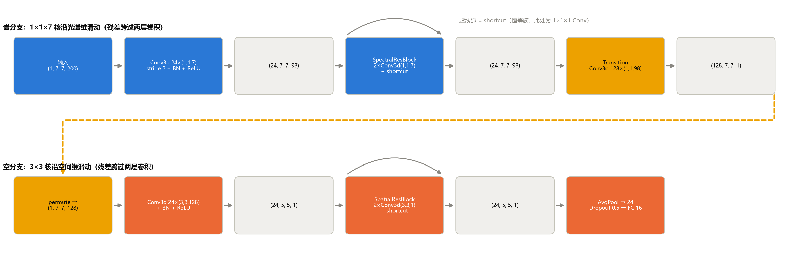
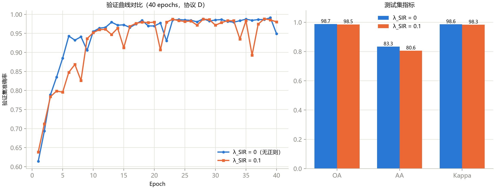

# 第 9 章 SSRN：残差谱空网络

> **SSRN: Spectral–Spatial Residual Network**

状态：✅ 已完成

---

## 本章定位

模型篇引入残差思想的一章。SSRN（Zhong et al., *IEEE TGRS* 2018）把"通用深度学习组件（ResNet）迁移到高光谱"的套路走了一遍：**谱域残差块**专攻光谱轴、**空间残差块**专攻空间轴，中间用过渡卷积衔接。本章还有两个"超出 notebook"的任务：其一是补上论文提出但 notebook 未实现的光谱不变性正则（SIR）并做**消融实验**——结果是一个负结果，而学会处理负结果正是本章最值钱的部分；其二是把 SSRN 放进协议 C 的演化线，观察"OA 冠军"与"全面冠军"的区别。

## 学习目标 / Learning Objectives

- 复习残差学习：`y = F(x) + x` 为什么让深层网络可训练
- 会拆解教学版 SSRN 的双分支结构：谱残差块（1×1×7 核）→ 过渡卷积 → 空残差块（3×3×1 核）
- 理解光谱不变性正则化的原理与本课程实现，并能解释"消融未复现收益"的可能原因
- 能对比 SSRN 与 HybridSN 的谱空处理策略，理解 patch 尺寸对稀有类的决定性影响

---

## 9.1 残差学习速览

深层网络有一个反直觉的困境：**加更多层，训练误差反而可能上升**——不是过拟合，而是优化本身就失败了（退化问题，He et al. 2016 的出发点）。残差学习的解法只有一行：

$$y = \mathcal{F}(x) + x$$

让每层学习**残差** $\mathcal{F}(x) = y - x$（相对恒等映射的偏移量）而不是目标映射本身。两个机制让这行公式威力巨大：

1. **梯度高速公路**：反向传播时 $\partial y/\partial x = \partial \mathcal{F}/\partial x + 1$——那个 "+1" 保证梯度可以无衰减地直达浅层，深层网络的梯度消失问题被结构性绕开；
2. **无害的深度**：如果某层没用，$\mathcal{F} \to 0$，网络退化为恒等映射——加深至少不会更差。"学零比学恒等容易"（把权重推向零比推成特定矩阵容易），这就是残差的先验优势。

**shortcut 家族**：$x$ 与 $\mathcal{F}(x)$ 形状一致时可直接相加（identity）；不一致时用 1×1 卷积投影对齐。本章的残差块里 shortcut 是一个 1×1×1 Conv3d——通道数其实相同，本可用纯 identity，多出的 600 参数是"保险写法"（万一 BN/实现改变通道也能接上）。

## 9.2 SSRN 总体结构：显式分轴的残差双分支

第 7 章 3D CNN 的核 `(7,3,3)` 是**联合核**——一次聚合三个轴。SSRN 的思路相反：**把轴拆开，每个残差块只负责一根轴**，串行衔接：

- **谱分支**：`(1, 1, 7)` 核——只在光谱维滑动（带 stride 2，200→97），残差块由两层这样的卷积加 shortcut 组成；
- **过渡**：`Conv3d 128×(1,1,98)` 把光谱维坍缩为 1，得到 128 通道的"光谱汇总特征图"，再 permute 把 128 变成深度轴；
- **空分支**：`(3, 3, 1)` 核——只在空间维滑动，同样是两层 + shortcut 的残差块；
- **分类头**：AvgPool → 24 维 → Dropout(0.5) → FC。

**图 9-1**　教学版 SSRN 的双分支结构（真实形状）。蓝色为谱分支（残差跨过两层 1×1×7 卷积），橙色为空分支（残差跨过两层 3×3×1 卷积），黄色为过渡与重排。灰色虚线弧为 shortcut。

**来源更正**：notebook 08是教学实现，并未逐层核对为原论文复现。旧版关于原文核大小及“SIR是原论文贡献”的描述缺乏已核验证据，现撤回。9.4节的空间方差惩罚是本课程自定义扩展实验，不应称为“补上论文正则”，也不能用其负结果判断原论文是否有效。原文核对状态见 `docs/teaching/source-audit.md`。

另一个值得注意的输入选择：**无 PCA**——原始 200 波段直接作 Conv3d 深度轴。这与第 6 章（PCA-12 作通道）形成对照：当核专门沿深度轴滑动时，深度可以很长（200），因为 (1,1,7) 核的参数只随深度方向核宽增长，不随深度总长增长。预处理上 notebook 08 的 StandardScaler 在**整幅立方体**上拟合（又一个约定样本——第 4 章 4.2 节的三种约定此处集齐了）。

## 9.3 逐层拆解

**表 9-1**　SSRN 逐层形状与参数量（`scripts/train_ssrn.py` 实测，输入 `(1, 7, 7, 200)`，总参数 346,392，MACs/样本 57.43M）

| 层 | 类型 | 输出形状 (N, C, H, W, D) | 参数量 |
|---|---|---|---:|
| spectral_conv1 | Conv3d(1→24, (1,1,7), stride 2) + BN + ReLU | (1, 24, 7, 7, 97) | 240 |
| spectral_res | SpectralResBlock（2×Conv3d(1,1,7) + shortcut） | (1, 24, 7, 7, 97) | 8,808 |
| spectral_bn + ReLU | BatchNorm3d(24) | (1, 24, 7, 7, 97) | 48 |
| transition_conv | Conv3d(24→128, (1,1,97)) | (1, 128, 7, 7, 1) | 298,112 |
| spatial_conv1 | Conv3d(1→24, (3,3,128)) + BN + ReLU | (1, 24, 5, 5, 1) | 27,720 |
| spatial_res | SpatialResBlock（2×Conv3d(3,3,1) + shortcut） | (1, 24, 5, 5, 1) | 11,064 |
| spatial_bn + ReLU | BatchNorm3d(24) | (1, 24, 5, 5, 1) | 48 |
| avg_pool + dropout + fc | AvgPool3d(5,5,1) → Linear(24→16) | (1, 16) | 400 |

三个观察：**过渡卷积一层占全模型 86% 的参数**（24×98→128 的核要"记住"整条光谱的汇总方式）——又一次验证"参数大户取决于设计选择"（第 8 章是 FC，这里是过渡卷积）；**空间感受野在 conv1 后就覆盖 5×5**（3×3 核 + 后续 3×3 残差 = 5×5，patch 才 7×7）——空间上下文极其有限；**MACs 57.43M 超过 HybridSN 的 50.82M**（patch 7 vs 25 的对比要小心：两者输入尺寸不同，此处只作量级参考）。

协议说明：notebook 08 自带一套**每类 20/10/70** 的手工划分（seed 1334，每类至少 1 个样本）——本课程记为**协议 D**。它与协议 C（10/10/80，sklearn 分层）不可混比，记分板分块记录。

## 9.4 光谱不变性正则化：原理、实现与一个诚实的负结果

### 原理

下面是**课程自定义的空间特征方差惩罚**（旧脚本沿用 `--lambda-sir` 参数名，不代表原论文归属）：假设patch内不同位置的谱特征应相近。这个假设在混合类别边界可能不成立，需要单独验证。

$$\mathcal{L}_{SIR} = \frac{1}{NCD}\sum_{n,c,h,w,d}\left(s_{n,c,h,w,d} - \bar{s}_{n,c,d}\right)^2, \qquad \bar{s}_{n,c,d} = \frac{1}{HW}\sum_{h,w} s_{n,c,h,w,d}$$

即谱残差块输出 $s$ 在空间位置上的方差（对空间位置取均值后逐元素求差）。直觉：**小样本下，数据不够教会模型"patch 内光谱一致"，就把这条先验直接写进损失**。总损失 $\mathcal{L} = \mathcal{L}_{CE} + \lambda \cdot \mathcal{L}_{SIR}$。

### 实现

notebook 08 并未实现 SIR。`scripts/train_ssrn.py` 补上了它：模型的 `forward` 把谱残差块输出存到 `self.last_spectral`，训练循环按上式计算 `sir` 并以 `--lambda-sir` 加权加入总损失（本课程实现，非论文原码）。因为损失不再是纯 CE，训练循环没有复用 `engine.fit`——这是"自定义损失需要自定义循环"的工程常识。

### 消融：两次实验，两次负结果

**表 9-2**　SIR 消融（协议 D，40 epochs，λ=0.1，单种子 1334）

| 训练率 | 配置 | OA | AA | Kappa |
|---|---|---:|---:|---:|
| 20% | 无 SIR | **98.73** | **83.33** | **0.9856** |
| 20% | + SIR | 98.52 | 80.57 | 0.9832 |
| 5% | 无 SIR | **92.81** | **71.10** | **0.9178** |
| 5% | + SIR | 90.68 | 65.59 | 0.8936 |

**图 9-2**　左：两种配置的验证曲线（20% 训练率）；右：测试集指标对比。SIR 未带来收益，在两个训练率下均为小幅负效应。

**预期是正收益，实际两次都是负的**——这个负结果怎么处理？第一步是归因清单：

1. **协议饱和**：20% 训练 + 7×7 patch 重叠泄漏下，模型已经 98%+，正则没有发挥空间；5% 下虽然更"饥饿"，但泄漏依然存在（相对量更大）——SSRN 的训练动态可能已被泄漏主导；
2. **λ 未调**：0.1 是拍脑袋值，λ=0.01 或 1.0 可能完全不同——单点 λ 的消融只说明"这个 λ 没用"；
3. **实现差异**：本课程的 SIR 是按论文思想重写的（作用于谱残差块输出），与原文的作用位置/归一化方式可能有出入；
4. **单种子波动**：AA 差 2.8 个点（20% 时）在稀有类主导的 AA 上完全可能在种子间翻转（第 7 章 Alfalfa 0.595→0.000 的教训）。

其中只有 (4) 能靠重复实验排除；(1)–(3) 需要受控协议下的系统消融——**这正是第 12 章的全部内容**。论文的主张在其自身协议内是否成立，要按其协议复现才能判断；**"论文说有效"与"我在我的设置下测出有效"之间隔着整个实验设计学科**。把一次负结果原原本本记下来（而不是悄悄删掉），是科研诚信的最小单元——本章的记分板行会如实记录 SIR = −0.21 OA。

## 9.5 与 HybridSN 对照：OA 冠军 ≠ 全面冠军

协议 C 的记分板凑齐了五个深度模型（表 9-3，均训练至平台期附近）：

**表 9-3**　协议 C（10/10/80，seed 42）模型演化线（完整记分板见 `docs/benchmark.md`）

| 模型 | 关键差异 | OA | AA | Kappa |
|---|---|---:|---:|---:|
| 1D CNN | 无空间信息，patch 无 | 75.27 | 60.15 | 0.7147 |
| 3D CNN | 联合核 (7,3,3)，patch 9 | 94.55 | 76.53 | 0.9377 |
| 2D CNN | PCA-12 通道，patch 9 | 95.83 | 87.04 | 0.9525 |
| HybridSN | 3D+2D 混合，patch 25 | 96.66 | 93.28 | 0.9619 |
| **SSRN（本章）** | **分轴残差，patch 7，无 PCA** | **97.87** | 79.84 | 0.9756 |

SSRN 拿下协议 C 的 **OA 与 Kappa 双冠**（97.87%），但 **AA 只有 79.84%**——逐类召回揭示原因：大类近乎完美（Corn-notill 0.988、Wheat/Woods/Grass-trees 1.000），而 **Alfalfa、Grass-pasture-mowed、Oats 三个稀有类全部 0.000**。对照 HybridSN（AA 93.28，Oats 1.000）——最大的结构差异不在残差，而在 **patch 尺寸：7 vs 25**。第 4 章图 4-1 的边界像元在 7×7 里几乎没有同类邻居可依赖，稀有类的小田块在 patch 7 下失去全部空间锚点。

这一局的结论要写进你的科研直觉：**OA 最高的模型不一定是最好的模型**——在类别不均衡的基准上，OA 冠军完全可能靠牺牲稀有类换来。报告 OA+AA+Kappa 三件套（第 2 章）并在 AA 掉链子时回头查混淆矩阵，这套流程到此已经救过我们三次（第 6 章的 95.83%、本章的 97.87%）。至于残差本身的贡献——本章没有做"去残差"的消融，它和 SIR 一起留给第 12 章的规范化消融练习。

---

## 配套实操 / Hands-on

- `notebooks/08_ssrn_teaching.ipynb` —— 教学版 SSRN（无 SIR）：数据 → 每类划分 → patch 7 → 双分支残差网络 → 训练 → 整图预测；
- `scripts/train_ssrn.py` —— 工程版，新增 `--lambda-sir`（论文正则）与 `--mode sklearn`（协议 C）；产物入 `results/ssrn/IP/`；
- `scripts/generate_ch09_figures.py` —— 复现本章三张图与表 9-1；
- 改动重跑建议：
  - `--train-rate 0.02` → 每类 1–2 个样本的极端小样本场景，重测 SIR（论文的主场设定）；
  - `--lambda-sir 0.01 / 1.0` → λ 敏感性；
  - 消融雏形：删掉两个 shortcut（残差改顺序堆叠），对比训练曲线的前 10 个 epoch——直接观察"梯度高速公路"的差别。

## 本章要点 / Key Takeaways

- 中文：残差学习让网络学"相对恒等的偏移"（梯度直通 + 深度无害），SSRN 把轴拆开——谱残差块 (1,1,7) 与空残差块 (3,3,1) 串行，过渡卷积占 86% 参数；SIR 把"patch 内光谱一致"的先验写进损失，但本课程两次消融（20% 与 5% 训练率）均未复现收益——归因清单（协议饱和、λ 未调、实现差异、单种子）里只有最后一项能靠重复排除，负结果如实入板；协议 C 内 SSRN 拿下 OA/Kappa 双冠（97.87%）但三个稀有类召回全零（AA 79.84，patch 7 之祸）——OA 冠军 ≠ 全面冠军，三件套 + 混淆矩阵第三次救场。
- English: Residual learning fits offsets from identity (gradient highway + harmless depth); SSRN splits the axes — a spectral residual block (1,1,7) and a spatial one (3,3,1) in series, with the transition conv holding 86% of parameters. SIR encodes "spectra are spatially consistent within a patch" into the loss, but our two ablations (20% and 5% training) both failed to reproduce the gain — of the blame list (saturated protocol, untuned λ, implementation gap, single seed), only the last is fixable by repetition, and the negative result goes on the board as-is. In protocol C SSRN wins OA/Kappa (97.87%) yet all three rare classes sit at zero recall (AA 79.84 — the patch-7 tax): the OA champion is not the overall champion, and the metrics trio plus confusion matrix has now saved us three times.

## 自测题 / Self-check

1. 残差连接解决的是什么问题？如果某个残差块里 $\mathcal{F}$ 的权重全部学到 0，这个块输出什么？网络会崩吗？
2. SSRN 的谱分支核是 `(1,1,7)`、空分支是 `(3,3,1)`，而第 7 章 3D CNN 用 `(7,3,3)` 联合核。用"因式分解"的语言解释两者的关系与各自的代价。
3. SIR 消融得到两次负结果。列出至少三个可能原因，并指出哪一个可以通过"多种子重复实验"排除、哪一个必须靠 λ 扫描排除。
4. SSRN 在协议 C 下 OA 最高但 AA 只有 79.84%（三个稀有类全零）。如果你在论文里要声称"SSRN 优于 HybridSN"，审稿人最可能用哪个数字反驳你？你会如何补实验？

<strong>参考答案（先自己回答再看）</strong>

1. 解决**退化问题**：纯堆叠的深层网络训练误差不降反升（优化失败，非过拟合）。若 $\mathcal{F} \to 0$，块输出 = shortcut(x) ≈ x（恒等映射）——信息原样通过，网络至少不比浅层差。"加深无害"正是残差的结构保证。
2. 联合核 `(7,3,3)` 一次聚合"7 光谱 × 3×3 空间"，是三个轴的联合张量积；分轴设计 `(1,1,7)` → `(3,3,1)` 是把联合聚合**因式分解**成两次单轴聚合（先谱后空）。代价对比：分轴的参数与计算更省（聚合量 7 与 9 vs 联合的 63）、且各轴可用不同深度（谱核大、空核小），但两轴的**交互**要等到过渡卷积/后续层才发生——联合核在第一层就建模谱空交互。SSRN 赌的是"先各自提炼、再交互"更高效。
3. 可能原因（本章 9.4 的清单）：协议饱和（泄漏主导，正则无空间）、λ 未调（0.1 单点）、实现与论文有差异（作用位置/归一化）、单种子波动。**多种子重复**只能排除第四个（波动）；**λ 扫描**排除第二个；第一、三个需要改协议（空间不相交、更小训练率）与对照原实现——各对应不同实验，别混为一谈。
4. 最可能用 **AA 79.84% vs HybridSN 93.28%** 反驳：稀有类三连零说明 SSRN 在类别不均衡场景会系统性牺牲小类。补实验：(a) 把 patch 提到 25 重测（检验"patch 尺寸假说"——若 AA 回升则瓶颈确是上下文而非残差结构）；(b) 报告逐类召回表而非只有 OA；(c) 引入稀有类加权的损失重训；(d) 多种子均值 ± 方差确认差异的稳定性（第 12 章）。

## 延伸阅读 / Further Reading

- Zhong, Z., Li, J., Luo, Z., Chapman, M., "Spectral–spatial residual network for hyperspectral image classification: A 3-D deep learning framework," *IEEE TGRS*, 2018.——SSRN 原论文（含 SIR 的原始定义与实验设置）。
- He, K., Zhang, X., Ren, S., Sun, J., "Deep residual learning for image recognition," *CVPR*, 2016.——残差学习与退化问题的原始论文。
- PyTorch 文档：`nn.Conv3d` 的多轴核、`Tensor.permute`（本章分支切换的实现）。
- Roy, S. K., et al., *IEEE GRSL*, 2020（第 8 章已引）——与 SSRN 对照阅读：联合核 vs 分轴残差的两条设计路线。
