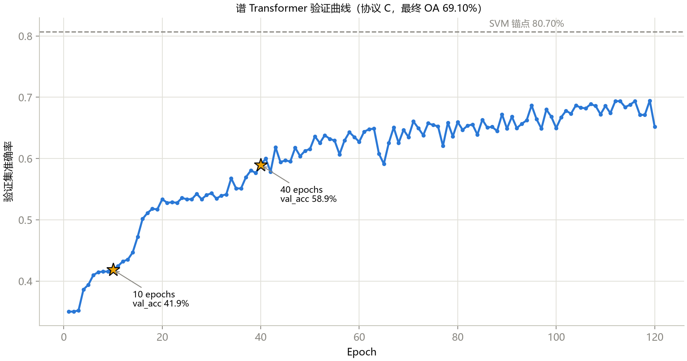
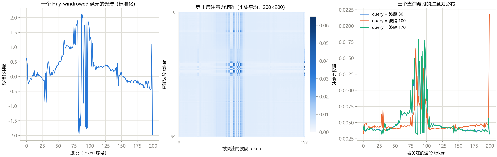
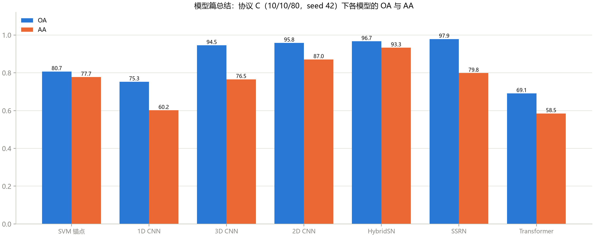

# 第 10 章 注意力与 Transformer

> **Attention & Transformers for Hyperspectral Images**

状态：✅ 已完成

---

## 本章定位

模型篇收官，也是通往研究前沿的入口。前九章的 CNN 靠"手工设计的先验"（局部性、平移不变、轴对齐）赢得小样本战场；本章换一套哲学——**让网络自己学习"该看谁"**。教学模型（`notebooks/07`）把 200 个波段当作 200 个 token 喂给标准 TransformerEncoder，与 1D CNN 完全同输入、同协议（协议 C）。结果是一个全书最重要的**负结果**：Transformer 在 10% 训练率下垫底（69.10%，即使训练 120 epochs）——而理解"为什么"恰好是理解深度学习设计空间的钥匙。章末以一张模型篇总结图收官，并给研究前沿画一张地图。

## 学习目标 / Learning Objectives

- 掌握 self-attention 的 QKV 机制、缩放点积与多头设计，理解它与卷积在"信息聚合范围"上的本质区别
- 会读注意力矩阵并从中反推模型学到的光谱知识
- 理解 token 化、位置编码、池化头这套 Transformer 范式，以及"波段即 token"为何天然适配高光谱
- 建立"归纳偏置 vs 数据量"的权衡直觉，并以此为透镜看懂 SpectralFormer、Mamba、HSI 基础模型等前沿方向

---

## 10.1 Self-Attention 速览

卷积的回答是"固定权重、局部窗口、全局共享"；self-attention 的回答是**"每个位置动态决定看谁、看多少"**。机制四步：

1. 每个位置的向量 $x_i$ 经三个投影得到**查询** $q_i$、**键** $k_i$、**值** $v_i$；
2. 位置 $i$ 对位置 $j$ 的**相关性** = $\langle q_i, k_j \rangle / \sqrt{d}$（缩放防止内积过大）；
3. softmax 归一成注意力权重 $a_{ij}$（每行和为 1）；
4. 输出 $o_i = \sum_j a_{ij} v_j$——**所有位置的值的加权和，权重是学出来的**。

与卷积的本质区别一张表说清：

| | 卷积 | Self-Attention |
|---|---|---|
| 聚合范围 | 固定（感受野，随深度缓慢扩大） | **全局**（一层即可看全序列） |
| 权重 | 静态（训练后固定，与输入无关） | **动态**（每个输入现算） |
| 位置信息 | 结构自带（平移不变） | 必须额外注入（位置编码） |
| 复杂度 | O(L·k·C²) | **O(N²·d)**——token 数的平方 |

**多头**（multi-head）：把 $d$ 维空间切成 h 份，每头独立做 attention——不同头可以关注不同类型的关系（本章的图 10-1 是 4 头平均）。

## 10.2 注意力进 HSI 的三条路

把 attention 塞进高光谱模型有三条经典路线，token 的选择决定一切：

1. **波段即 token（谱注意力）**：每个波段一个 token，注意力学习"波段间的关系"——本章教学模型的路线，也是 SpectralFormer 等代表工作的出发点（光谱轴是天然的序列，无需任何 patch 工程）；
2. **像元即 token（空间注意力）**：patch 内每个像元一个 token，注意力学习"patch 内的空间关系"——第 6 章 6.4 节埋的问题（"中心像元与邻域像元地位对称"）在 attention 框架下的标准解法之一；
3. **谱空联合 token**：波段×空间展平或分组 token 化——表达力最强、N² 代价最大（patch 25 时 N=625，注意力矩阵 39 万项），工程上常退化为线性注意力或分组注意力（SpectralFormer 的 group-wise 设计正是为此）。

热身模块 SE 风格通道注意力（squeeze-excitation：全局池化 → 两层 FC → sigmoid → 通道加权）可以看作"每个通道一个 token 的退化版 attention"，是插入现有 CNN 的最小改造——留作配套实操。

## 10.3 Transformer 范式：逐块解读教学模型

`SpectralTransformerClassifier`（`notebooks/07` 与 `scripts/train_transformer.py` 同步实现）把 10.2 路线 1 完整走了一遍：

- **token 化**：标准化光谱 `(N, 200)` → `unsqueeze(-1)` → 每个 band 的标量经 `Linear(1→64)` 投影成 64 维 token `(N, 200, 64)`。光谱值本身只有一维信息量，投影层负责把它"撑开"到可交互的维度；
- **位置编码**：`nn.Parameter(randn(1, 200, 64) * 0.02)`——可学习的位置嵌入。attention 对顺序完全无感，波段序号（即物理波长顺序）全靠它注入；
- **编码器**：`nn.TransformerEncoder`，2 层 × 4 头，`d_model=64`，FFN 128，GELU，Pre-LN 结构（PyTorch 现代实现）；
- **池化与头**：200 个 token 取**均值池化** → LayerNorm → FC(64→64→16)。

**表 10-1**　模型规模与代价（`scripts/generate_ch10_figures.py` 实测；协议 C，输入 `(1, 200)`）

| 项 | 值 | 对照 |
|---|---|---|
| 总参数 | 85,200 | 介于 1D（76.9k）与 2D（105.6k）之间 |
| MACs/样本 | 16.81M | **3D CNN（4.23M）的 4 倍**——N² 注意力的代价 |

MACs 明细可以手算验证：每层 attention 的 QK^T 与 attn@V 各贡献 $N^2 \times d = 200^2 \times 64 = 2.56\text{M}$ MACs，两层合计约 10.2M，加上 QKV/输出投影与 FFN 的线性层开销就是 16.81M。**token 数的平方项**提醒我们：第 6 章 6.4 节说的"patch 25 token 化会让 N 爆炸"，算术上就是 N 从 200 涨到 625 时注意力部分涨 9.8 倍。

### 实验：一个诚实到刺眼的负结果

**表 10-2**　谱 Transformer 在协议 C 下的成绩（单种子 42；SVM 锚点与 1D CNN 同协议）

| 训练预算 | OA | AA | Kappa | best epoch |
|---|---:|---:|---:|---|
| 10 epochs（notebook 默认） | 41.48 | 17.59 | 0.2753 | 10/10 |
| 40 epochs | 57.95 | 42.37 | 0.5022 | 40/40 |
| **120 epochs** | **69.10** | **58.48** | **0.6438** | 119/120 |

**图 10-2**　120 epochs 的验证曲线。10 epochs 时 41.5%、40 epochs 时 58.0%——与第 5–8 章的"训练不足"不同，这次即使训练到 119/120 epochs 的平台期，**仍比 SVM 锚点（80.70%）低 11.6 个百分点**，也低于同输入的 1D CNN（75.27%）。逐类召回补充细节：Alfalfa 意外地高（0.811），但 Corn-mintill 0.414、Soybean-clean 0.211、Buildings 0.299，Grass-pasture-mowed 与 Oats 为 0。

**为什么 attention 打不过卷积？** 不是 attention 不行，而是**归纳偏置的经济学**：

- CNN 把"光谱特征是局部的、与位置无关的"这两条先验**硬编码**进结构，网络只需在先验内微调——1024 个样本就够；
- Transformer 把这些先验全部撤掉，换来自由度——但**先验要用数据买**。1024 个样本既要学"波段是局部相关的"（CNN 免费送的），又要学注意力本身，入不敷出。ViT 论文的核心结论之一（Dosovitskiy et al., 2021）在 200-token 光谱序列上原样重演。

这个负结果与第 9 章的 SIR 负结果共同构成模型篇的方法论收尾：**结构的选择本质上是"先验 vs 数据"的预算分配**；在你的数据规模下验证，而不是在论文的声量里选边。

### 注意力矩阵：模型学到了什么

尽管精度垫底，训练后的注意力矩阵仍有可读的结构（图 10-1）——**读注意力是解释类研究的标准起点**（同时记住它的局限：权重图 ≠ 因果解释）。

**图 10-1**　左：一个 Hay-windrowed 像元的标准化光谱（注意 199 号 token 的边界尖峰）；中：第 1 层 4 头平均注意力矩阵（200×200）；右：三个查询波段的注意力分布。三个 query 都强烈聚焦**75–105 波段（近红外/红边区）**——模型自主发现了全图判别力最强的光谱区间（对照第 1 章图 1-2）；199 号 token 的强关注对应光谱末端的边界伪影，模型在"警惕噪声源"。

## 10.4 前沿地图：从这里出发

模型篇到此覆盖了卷积（1D/2D/3D）、混合（HybridSN）、残差（SSRN）与注意力（本章）四大家族。往下走，三条活跃的前沿线索（**只做地图，不做深读**——每一条都是第 11 章文献精读的现成选题）：

1. **Transformer 的 HSI 特化**：SpectralFormer（Hong et al., *TGRS* 2022）提出 group-wise attention（相邻波段分组做 token，压 N² 代价）与"从浅层残差学习光谱细节"；后续大量工作在 token 化方式（波段/像元/分组/谱空联合）上做文章——每个选择都是一篇论文的消融表；
2. **线性序列模型（Mamba/SSM）**：注意力 O(N²) 在大 token 数下不可持续，SS-Mamba 类工作用状态空间模型把序列建模降到 O(N)，2024 年起在高光谱上爆发（谱维扫描、空谱双向扫描等变体）——"把光谱当一维信号扫描"与第 5 章 1D CNN 的视角遥相呼应；
3. **高光谱基础模型与自监督预训练**：用大规模无标签光谱数据（千万级像元）预训练通用 backbone（SpectroFM、SpectralGPT 等），下游小样本微调——直接攻击本章暴露的"数据饥饿"问题，也重新定义了"基线"的含义（预训练 vs 从零训练是新的协议轴）。

读这一章地图的方式：每条线索找 1 篇代表论文 + 2 篇引用它的后续工作，用第 11 章的精读模板拆开。

### 模型篇总结

**图 10-4**　模型篇收官：协议 C 下全部模型的真实成绩（每模型最优训练预算，详见 `docs/benchmark.md`）。五条演化线索在此合流：空间上下文（1D→2D/3D）是最大增益；结构精化（HybridSN/SSRN）在 95%+ 区间挤出最后几个点；而换更"先进"的范式（Transformer）在小样本下反而倒退。**没有最好的模型，只有与数据规模和先验匹配的模型**——带着这句话进入科研篇。

---

## 配套实操 / Hands-on

- `notebooks/07_transformer_teaching.ipynb` —— 教学版谱 Transformer（协议 C）；
- `scripts/train_transformer.py` —— 工程版（含 `best_model.pth` 保存，供注意力可视化）；产物入 `results/transformer/IP/`；
- `scripts/generate_ch10_figures.py` —— 复现本章四张图（含从 `in_proj_weight` 手动计算注意力矩阵的完整代码）；
- 改动重跑建议：
  - `--epochs 300` → 观察 Transformer 最终能到多少（仍未过 SVM？为什么）；
  - 把 `num_layers` 从 2 加到 4 → 参数与 MACs 线性上涨，精度呢；
  - 进阶（10.2 路线 2）：给第 6 章 2D CNN 的 patch 加一个 SE 风格通道注意力模块，重跑协议 C——你的第一个"即插即用"实验。

## 本章要点 / Key Takeaways

- 中文：attention 用"动态、全局、学出来的权重"替代卷积"静态、局部、硬编码的感受野"，代价是 O(N²) 与位置信息的额外注入；波段天然是 token（谱注意力三路线之一），本章 85k 参数的谱 Transformer 逐块实现该范式；但协议 C 下它 120 epochs 只到 69.10%——弱归纳偏置需要数据来买，1024 样本喂不起，负结果与 SIR 消融共同指向"先验 vs 数据的预算分配"这一设计哲学；注意力矩阵可读（模型自主聚焦近红外/红边区），OA 冠军不等于好解释；模型篇以四大家族（卷积/混合/残差/注意力）的协议 C 对照收官，三条前沿线索（SpectralFormer、Mamba、基础模型）通往科研篇。
- English: Attention replaces convolution's static local receptive fields with dynamic, global, learned weights — at O(N²) cost plus explicit positional injection. Bands are natural tokens; our 85k-parameter spectral Transformer implements the paradigm block by block, yet under protocol C it reaches only 69.10% after 120 epochs — weak inductive biases must be paid for in data, and 1,024 samples cannot afford it. Together with Chapter 9's SIR ablation, this closes Part II on the design philosophy of "prior vs data budget". The attention matrix is readable (the model self-discovers the NIR/red-edge region), and the Part II capstone chart lines up all four families (convolution / hybrid / residual / attention) under one protocol — three frontier threads (SpectralFormer, Mamba, foundation models) lead into the research part.

## 自测题 / Self-check

1. token 数 N=200、d=64、h=4、2 层 encoder：单样本仅 attention 部分（QK^T 与 attn@V）的 MACs 是多少？N 涨到 625（patch 25 token 化）时涨多少倍？
2. 为什么"波段即 token"天然适配高光谱，而"把 200 个波段当 200 个通道的 1×1 卷积"不是同一个东西？
3. 本章 Transformer 120 epochs 后仍输 SVM 11.6 个点。从"归纳偏置 vs 数据量"的角度给出解释，并设计一个（原则上的）实验验证你的解释。
4. 图 10-1 中三个 query 的注意力都聚焦 75–105 波段。这能证明"模型靠这个区间做分类"吗？注意力解释有什么已知局限？

<strong>参考答案（先自己回答再看）</strong>

1. 单层：QK^T 为 N²·d_head·h = 200²×64 = 2.56M MACs，attn@V 同样 2.56M，每层 5.12M，两层 10.2M。N=625 时：N² 涨 (625/200)² ≈ 9.77 倍 → 仅 attention 部分就 ~100M MACs——这就是第 6 章"谱空联合 token 化代价爆炸"的算术。
2. "波段即 token"把每个波段值投影成 64 维向量，token 之间通过 attention **动态交互**，波段关系是数据驱动的、每个样本不同；"200 通道的 1×1 卷积"对通道做的是**静态线性组合**（权重训练后固定），没有"每个样本现算关系"的动态性——形式的相似掩盖了机制的不同。
3. 解释：Transformer 撤掉了 CNN 免费提供的两条先验（局部性、权重共享的平移不变），1024 个样本不足以同时学好"注意力模式 + 光谱特征"。验证实验（原则性设计）：固定结构，把训练率从 10% 提到 80%——若 Transformer 与 CNN 的差距随训练数据增加而收窄甚至反转，则"数据饥饿"假说成立；反之差距稳定则要找别的原因（如优化/正则配置）。另一个更便宜的检验：给 attention 加局部窗口限制（把 CNN 的局部先验还回去），看小样本下是否回升。
4. 不能。注意力权重高只说明"这个位置的值被大量聚合"，不说明"分类决策因果地依赖它"。已知局限：(a) 权重与梯度贡献并不等价（有高梯度低注意力的反例）；(b) 多头平均会掩盖单头行为；(c) 相关结构（如 75–105 区间）也可能是位置编码与残差流的产物。标准做法是把注意力图当**假设生成器**，再用遮挡/扰动实验（遮住 75–105 区间重测）验证因果贡献。

## 延伸阅读 / Further Reading

- Dosovitskiy, A., et al., "An image is worth 16×16 words: Transformers for image recognition at scale," *ICLR*, 2021.——ViT 原始论文；"归纳偏置 vs 数据量"结论的出处，本章负结果的理论背景。
- Hong, D., et al., "SpectralFormer: Rethinking hyperspectral image classification with transformers," *IEEE TGRS*, 2022.——HSI Transformer 的代表工作（group-wise attention），10.4 前沿线索 1 的第一篇精读对象。
- Vaswani, A., et al., "Attention is all you need," *NeurIPS*, 2017.——Transformer 原始论文。
- He, X., et al. 的 SS-Mamba 系列与 SpectroFM/SpectralGPT 等基础模型工作（10.4 线索 2/3 的入口文献；逐章写实时核对最新版本）。
- PyTorch 文档：`nn.TransformerEncoderLayer`（Pre-LN 细节、fast path 的触发条件）、`nn.MultiheadAttention` 的 `in_proj_weight`（图 10-1 的实现基础）。
