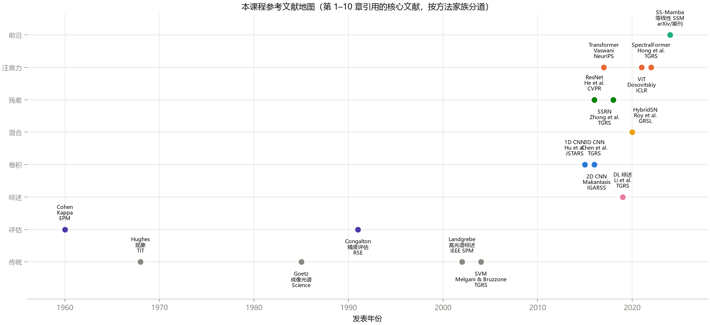

# 第 11 章 文献检索与论文精读

> **Literature Search & Paper Reading**

状态：✅ 已完成

---

## 本章定位

科研篇第一章：从"学教材"转向"读论文"。模型篇给了你完整的实验能力（第 5–10 章），但写论文的第一步不是跑实验，而是**知道别人已经做了什么、做到哪、缺什么**。本章给出四件套：检索策略、领域版图、三遍精读法与笔记模板、复现 checklist——并以 HybridSN 论文为范文交付一份完整精读笔记（`chapters/part3-research/notes/`），它同时是第 12 章实验规范和第 14 章 Capstone 的输入。

## 学习目标 / Learning Objectives

- 掌握检索工具与关键词策略，会用"滚雪球"法构建一个方向的核心文献列表
- 熟悉高光谱领域的期刊/会议版图，会判断一篇论文的分量与影响力
- 掌握三遍精读法，会产出结构化精读笔记（模板 + 范文）
- 会用复现 checklist 核对论文协议——并把"未核实项"显式标注而非含糊带过
- 会用 Zotero 管理文献，会用 related work 矩阵组织综述

---

## 11.1 检索工具与关键词策略

### 四个入口，各司其职

| 工具 | 定位 | 用法要点 |
|---|---|---|
| **Google Scholar** | 覆盖面最广的默认入口 | 用"Cited by"做正向滚雪球；设邮件提醒跟踪新论文 |
| **Web of Science / Scopus** | 期刊质量过滤与引文分析 | 评定期刊档次、找高被引综述 |
| **arXiv** | 预印本，比期刊早 6–18 个月 | 跟踪最新工作；**注意未经同行评审** |
| **Connected Papers / Semantic Scholar** | 引文图谱与半自动滚雪球 | 输入种子论文，得到相关度图——比手动滚雪球快一个量级 |

辅助：dblp（计算机文献的权威书目，消灭"作者拼错/年份错"）；Papers with Code（找开源实现）。

### 关键词的三层展开

高光谱分类的检索词不是一句话，而是一个**词表**：

1. **核心词**：`hyperspectral image classification`、`hyperspectral image` + `classification/segmentation`；
2. **邻域词**：`imaging spectroscopy`（学界的另一个名字）、`land-cover classification`、`spectral-spatial`、以及邻接任务词（`unmixing`、`anomaly detection`、`band selection`——它们的技巧常迁移到分类）；
3. **组合词**：方法词 × 任务词（`Mamba hyperspectral`、`foundation model hyperspectral`）、**数据集词**（`Indian Pines`、`Pavia University`——用数据集名检索是找"同协议论文"的最快方式，第 12 章对比实验的候选基线就从这里来）。

### 滚雪球

选定 2–3 篇种子论文（本章末的精读范文 HybridSN 是现成种子）后：

- **向后滚**（追溯）：读种子的 related work 与参考文献——找到思想的源头；
- **向前滚**（追踪）：在 Scholar 里看"Cited by"——找到思想的后续演化；
- 双向各滚一轮，去掉重复与低相关，通常能得到 20 篇左右的核心列表（3–5 篇综述 + 10–15 篇代表作）。**这个列表进 Zotero，就是你的领域地图**。

## 11.2 领域版图

### 期刊与会议分层

**表 11-1**　高光谱分类相关工作的主要发表去向（按惯例分层，非官方排名）

| 去向 | 定位 | 对应本课程文献 |
|---|---|---|
| TPAMI | 顶刊：方法论级别的突破 | —— |
| **TGRS** | 遥感旗舰期刊，HSI 深度学习**主战场**，篇幅长、实验全 | Chen 2016（3D）、Li 2019（综述）、Zhong 2018（SSRN）、Hong 2022（SpectralFormer） |
| **JSTARS** | TGRS 姊妹刊，偏数据/应用/工程 | Hu 2015（1D CNN） |
| **GRSL** | 5 页快报：**新 idea 的首发地** | Roy 2020（HybridSN） |
| ISPRS Journal | 摄影测量视角，偏严谨的几何/应用 | —— |
| Remote Sensing (MDPI) | 开源快审，数量大、质量参差 | 谨慎引用，逐篇评估 |
| CVPR/ICCV/ECCV、AAAI | CV/AI 顶会：HSI 少而精，方法向 | He 2016（ResNet）、Dosovitskiy 2021（ViT） |
| IGARSS / WHISPERS | 会议：入门友好、短文多 | Makantasis 2015（2D CNN） |

判断一篇论文的分量，看四件事的合取：发表 venue、引用增长曲线（滞后但可靠）、**代码开源与社区复现度**（HybridSN 是正面典型）、是否被后续工作当作基线。引用量对 2 年内的论文几乎无信息量——新论文看 venue + 作者 + 代码。

### 本课程的文献地图



**图 11-1**　第 1–10 章引用的核心文献，按方法家族分道。注意两条规律：**方法家族的演化有清晰的时间断层**（传统统计 1960–2010 → 深度卷积 2015 起 → 组合/残差 2016–2020 → 注意力/前沿 2017–），以及**评估类文献（Kappa、Congalton）几乎五十年不变**——协议与指标的半衰期远长于模型，这正是第 2 章敢于"统一课程协议"的底气。

## 11.3 三遍精读法与笔记模板

精读不是从头读到尾。三遍分层推进，每遍有明确的产出：

**Pass 1 · 鸟瞰（约 10 分钟）**：标题 → 摘要 → 引言末段（贡献列表）→ 所有图表标题 → 结论。能回答五问即可：解决什么问题？已有方法的缺点？核心思路一句话？怎么验证的？值不值得进入 Pass 2？**90% 的论文止步于此——这是筛选，不是精读。**

**Pass 2 · 细节（约 1 小时）**：通读全文，重点两条线：方法节的符号系统（每个符号第一次出现时写下定义）与实验节的数据集/划分/超参。所有看不懂的点**记下来但不死磕**——它们构成 Pass 3 的问题清单。

**Pass 3 · 复现视角（数小时，只对核心论文）**：合上论文，凭 Pass 2 的理解写出伪代码；对照原文补齐差异；列出"论文没写清楚的所有细节"——这份缺口清单决定了你能否复现（11.4 的 checklist 就是它的表格化）。

### 精读笔记模板（九节）

```markdown
1. 元信息        标题/作者/venue/DOI/arXiv/代码链接
2. 一句话总结    用一句中文说清论文做了什么
3. 问题与缺口    已有方法的缺点、论文瞄准的空档
4. 方法拆解      逐层/逐模块的伪代码级理解（含核心创新点标注）
5. 实验协议表    数据集/划分/预处理/预算/指标（→ 11.4 checklist 的输入）
6. 结果与声称    论文报告了什么（含数字与协议绑定）
7. 可复现性      checklist 逐项：写明了吗？与我一致吗？差异影响方向？
8. 缺点与可扩展点 你的批判清单——也是你的选题清单
9. 与我的想法的联系 一段话：这篇论文把你的想法推进了哪一步
```

**范文**：[`chapters/part3-research/notes/hybridsn-roy2020-grsl-reading-notes.md`](notes/hybridsn-roy2020-grsl-reading-notes.md)——以 HybridSN 为对象的完整精读笔记，第 7 节现场演示了 checklist 的用法，第 8 节填入了本课程第 8 章的复现数据（这是课程笔记相对普通笔记的独特优势：你能真的跑它）。特别注意范文中的 ⚠️ **待核对** 标记：写作笔记时无法核实的信息（如论文的划分比例），**显式标注而不是转述成事实**——网络上的二手转述经常互相矛盾（作者在准备本章时亲历：两次检索对同一论文的协议给出了不一致的说法）。精读笔记的诚信标准与实验记录相同。

## 11.4 复现 checklist

复现失败的最常见原因不是代码 bug，而是**协议没有对齐**。拿到一篇要复现的论文，先过这张表：

**表 11-2**　复现协议 checklist（逐项回答三问：写明了吗 / 与我一致吗 / 差异往哪边偏）

| # | 检查项 | 常见坑 |
|---|---|---|
| 1 | 数据集版本（corrected? 哪一年的 ground truth?） | 用错 raw 版本 |
| 2 | 划分方式（随机/分层/空间不相交）与比例 | 比例差 5 倍，数字差 10 个点（第 3 章表 3-1） |
| 3 | 随机种子是否公开 | 不公开 ⇒ 只能期望"同量级"，不可能逐位一致 |
| 4 | patch 大小与填充方式 | patch 7 与 25 的稀有类表现天差地别（第 9 章） |
| 5 | 预处理：PCA 维数、拟合范围（整图 vs 训练集）、标准化范围 | 三种约定并存（第 4/6/9 章各见过一种） |
| 6 | 训练预算：epochs / early stop / 学习率调度 | "训练不足"在默认 10 epochs 时是常态（第 5–9 章反复出现） |
| 7 | 指标口径：OA 算在 test 还是整图？AA 缺席类怎么处理？ | 口径不同，数字不可比（第 2 章） |
| 8 | 最优模型选择：按 val 还是按 test？ | 按 test 选模型 = 泄漏（第 2 章陷阱 2） |
| 9 | 结果统计：单次还是多种子均值 ± 方差？ | 单点数字不能支撑稀有类结论（第 7/9 章） |
| 10 | 代码是否开源、与论文是否一致 | 论文-代码不一致是常态，以代码为准并注明 |

checklist 的产出不是"能/不能复现"的二值判断，而是一张**差异-影响方向表**（范文第 7 节即成品）。它与第 12 章（可复现工程）互为表里：**本章教你读别人的协议，第 12 章教你让别人读得懂你的协议**。

## 11.5 文献管理与 related work 矩阵

- **Zotero**：库内按"方法家族/任务/状态（待读/精读完/已复现）"打标签；浏览器插件一键抓取元数据；Better BibTeX 插件导出引用键（命名规范 `第一作者年份单词`，如 `roy2020hybridsn`）；写作时 Word/LaTeX 直插引用，杜绝手工排版参考文献；
- **related work 矩阵**：综述的骨架不是"年代罗列"而是**对比矩阵**——行是方法，列是"数据集 / 协议 / 核心组件 / 报告指标 / 未解决问题"。本课程模型篇就是一张现成的矩阵（表 9-3 的扩展版），每个 cell 都有真实数字；
- **从矩阵到文字**：related work 节的每一段 = 矩阵的一行（或一列）+ 一句"它没做什么"——最后一句就是你的入场券；
- **阅读节奏**：泛读与精读的比例约 10:1（每周 10 篇 Pass 1、1 篇 Pass 2/3）；精读只对"要复现或要对比"的论文执行。

---

## 配套实操 / Hands-on

- **本章交付物**：`chapters/part3-research/notes/hybridsn-roy2020-grsl-reading-notes.md` —— 精读笔记范文（九节模板 + checklist 现场 + 课程复现数据回填）；
- 练习 1（检索）：以"SS-Mamba"或"SpectralFormer"为种子，用 Connected Papers 或 Scholar 引用列表滚一轮雪球，产出 20 篇核心列表并导入 Zotero；
- 练习 2（精读）：对练习 1 列表中挑出的 1 篇，用九节模板独立写一份 Pass 2 级别的笔记——重点填满第 5 节协议表（每个 ⚠️ 待核对 项都要么解决、要么保持标注）；
- 练习 3（checklist 实战）：拿第 12 章的任意一次课程复现（如 `train_hybridsn.py`），把 run_config.json 与范文第 7 节的 checklist 逐项对照，验证"一棵种子树"的承诺；
- `scripts/generate_ch11_figures.py` —— 生成图 11-1 文献地图（本课程引用文献的结构化清单即脚本内的 `PAPERS` 表，新章节引用新论文时同步维护）。

## 本章要点 / Key Takeaways

- 中文：检索 = 四入口（Scholar/WoS/arXiv/引文图谱）+ 三层词表（核心/邻域/数据集词）+ 双向滚雪球，产出约 20 篇核心列表；领域版图按 venue 定位（GRSL 快报首发、TGRS 主战场、顶会方法向），影响力看 venue + 引用曲线 + 开源复现度；精读三遍分层（10 分钟鸟瞰五问 → 1 小时细节 → 复现视角），九节笔记模板允许"⚠️ 待核对"但禁止伪装事实；复现 checklist 十项三问，产出差异-影响方向表；Zotero 管理 + related work 对比矩阵（本课程模型篇即现成矩阵）。科研篇的一切下游工作（实验、写作、投稿）都建立在这张协议核对表上。
- English: Searching = four entry points, a three-layer keyword list, and two-way snowballing to a ~20-paper core list; the venue map positions GRSL letters, TGRS full papers, and top-tier conference methods, with impact judged by venue + citation curve + reproducibility. Read in three passes (10-minute five-question scan → 1-hour detail → reproduction view), record nine-section notes that allow explicit "to verify" flags but never disguise guesses as facts; align protocols with the ten-item checklist before running any code; manage it all in Zotero and organize reviews as comparison matrices — everything downstream in Part III builds on this protocol-audit discipline.

## 自测题 / Self-check

1. 三遍精读法中，Pass 1 的五问是什么？为什么说"90% 的论文止步于此"是正常且必要的？
2. 复现 checklist 的十项里，哪三项的差异最可能导致"数字对不上"？各举一个本课程遇到过的实例。
3. 为什么精读笔记要保留"⚠️ 待核对"标记？如果把不确定的信息写成事实，会对下游（第 12–14 章）造成什么影响？
4. related work 矩阵的行列分别是什么？为什么说"每段最后一句就是你的入场券"？

<details>
<summary><strong>参考答案（先自己回答再看）</strong></summary>

1. 五问：解决什么问题 / 已有方法缺点 / 核心思路一句话 / 怎么验证 / 值得读吗。领域论文产出远超任何人的精读容量——Pass 1 的价值在于**用 10 分钟做出进入/放弃的决策**，把精读预算留给真正相关的 10%。没有 Pass 1 的筛选，"精读"会退化成"收藏"。
2. 最致命的三项：(a) 划分比例——第 3 章表 3-1 显示 10% 与 80% 训练率下同一模型差 13 个点；(b) 指标口径——OA 算在 test 还是整图、AA 是否剔除缺席类，口径不同数字不可比（第 2 章）；(c) 最优模型选择——按 val 还是 test 选 checkpoint，后者是泄漏（第 2 章陷阱 2，本章范文第 7 节有对应行）。种子不公开排第四——它决定"逐位一致"是否可能。
3. 因为下游会把你的笔记当作事实来源：第 12 章的对比实验会按笔记里的协议设置跑，第 13 章会把笔记里的"论文声称"写进 related work。一个被伪装成事实的错误（如把 30% 训练率写成 10%）会让整个对比实验失效，且错误会沿着笔记 → 实验 → 论文传播且难以追溯。标注"待核对"的成本是几分钟的核对，收益是整条链路的可信。
4. 行是方法（通常按思想线索分组而非年代），列是数据集 / 协议 / 核心组件 / 报告指标 / 未解决问题。"入场券"指的是：矩阵里相邻方法的"未解决问题"列横向对比后出现的空档，就是你论文引言第三段的 gap 句——related work 的写作不是文献总结，而是为你的贡献腾出逻辑位置的论证。
</details>

## 延伸阅读 / Further Reading

- Keshav, S., "How to read a paper," *ACM SIGCOMM Computer Communication Review*, 2007.——三遍读法的原始出处（Pass 1/2/3 与"五问"均源于此）。
- Audebert, N., Le Saux, B., Lefèvre, S., "Deep learning for classification of hyperspectral data: A comparative review," *IEEE Geoscience and Remote Sensing Magazine*, 2019.——作为领域综述的精读范本：其协议章节与本章 checklist 高度互补。
- Zotero + Better BibTeX 文档（文献管理与引用键规范）。
- Connected Papers / Semantic Scholar（引文图谱工具）。
- 本课程精读范文：[`notes/hybridsn-roy2020-grsl-reading-notes.md`](notes/hybridsn-roy2020-grsl-reading-notes.md)；HybridSN 原文 DOI: 10.1109/LGRS.2019.2918719（arXiv:1904.05849）。
