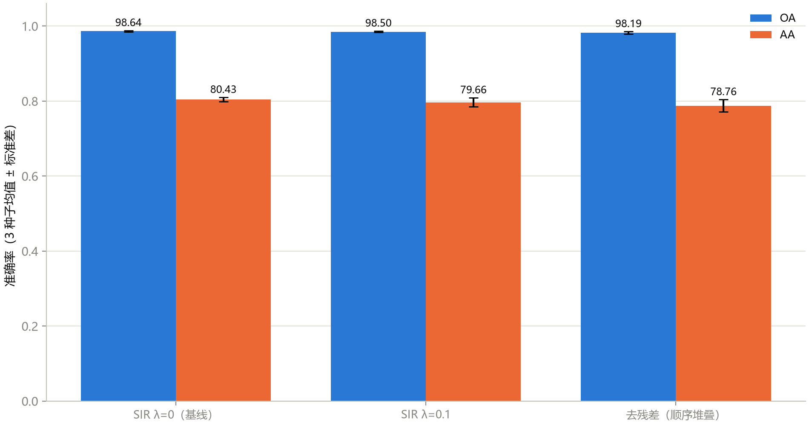
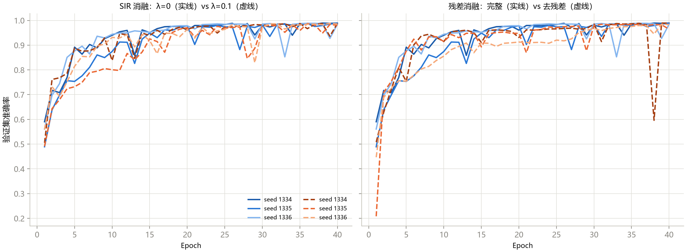

# 第 12 章 科研实验设计与可复现工程

> **Experimental Design & Reproducibility**

状态：✅ 已完成（含 9 次训练的多种子消融研究，mean ± std 结论入板）

---

## 本章定位

从"跑通模型"升级到"科研级实验"。模型篇的每一次实验其实都在为这一章提供反面教材：默认 10 epochs 的训练不足（第 5–9 章）、单种子的稀有类翻转（第 7/9 章）、两次未复现的正则收益（第 9/10 章）——它们不是失败，而是**实验设计教学的真实素材**。本章把散落各章的教训收拢成一套规范：从 gap 到假设、对比协议、消融设计、可复现工程、结果呈现——并以一个真正的多种子消融研究（重做第 9 章的 SIR 消融 + 新增去残差消融）现场示范，结果直接进入课程记分板的 mean ± std 格式。

## 学习目标 / Learning Objectives

- 会从文献缺口（gap）出发提出**可检验**的实验假设（自变量/因变量/控制变量三件套）
- 掌握对比实验协议：固定划分、同预算、多种子均值 ± 标准差
- 掌握消融实验设计：一次只改一个变量，模块化代码结构是前提
- 建立可复现工程习惯：一棵种子树、`run_config.json` 存档、统一输出目录
- 会产出规范的结果呈现：LaTeX `booktabs` 三线表与预测图配色约定

---

## 12.1 从 gap 到假设

第 11 章精读笔记的第 9 节（缺点与可扩展点）产出了原始素材，但"论文没做 X"不是假设，**可检验的假设 = 自变量 + 因变量 + 控制变量**。把第 9/10 章的两个悬而未决的问题格式化：

**H1（SIR 的收益存在吗？）**

- 自变量：谱不变性正则开关（λ = 0 vs 0.1）；
- 因变量：OA / AA / Kappa（测试集）；
- 控制变量：协议 D 划分、SSRN 结构、40 epochs、batch 64、RMSprop(3e-4, wd 1e-4)；
- 背景：第 9 章单种子显示 λ=0.1 略降（98.73→98.52）——**单种子差异可能是噪声**，需要多种子才能区分"稳定的负效应"与"单次波动"。

**H2（残差连接的贡献可测吗？）**

- 自变量：残差 shortcut 开关（完整 vs 去残差顺序堆叠，`--no-residual`）；
- 因变量：同上 + 收敛速度（前 10 个 epoch 的验证曲线）；
- 控制变量：同 H1，λ=0；
- 背景：9.1 节的"梯度高速公路"是教科书结论，但**在本课程的 40 epochs 预算内它值多少个点**从未被测量。

两个假设的共同点：都来自第 9 章的未决问题、都能用同一套管线检验（`train_ssrn.py` 的 `--lambda-sir` / `--no-residual` / `--seed`）、都不需要新代码——**模块化写法的回报时刻**（12.3 节展开）。

## 12.2 对比实验协议

### 公平性原则

一次可信的对比实验，所有组除了自变量外**必须逐项相同**：

1. **同划分**：同一份 train/val/test（划分由种子决定，种子进实验矩阵）；
2. **同预算**：相同的 epochs 与 batch size——"我的模型训 200 epochs、基线训 20"是最常见的自欺（第 5 章的诊断已经证明训练预算本身就是大变量）；
3. **同预处理**：PCA 维数、标准化范围逐项写明（第 4 章 4.2 节的三种约定必须选定一个）；
4. **算力对齐的诚实声明**：本课程在 CPU 上做消融，batch 从 notebook 的 16 调到 64（单次训练从 ~17 分钟降到 ~13 分钟）——batch 是控制变量的一部分，**在本章内部所有组一致即可**，与第 9 章 notebook 口径的数字不混排。

### 多种子：均值 ± 标准差

单次运行的数字是 `随机变量` 的一个样本（第 7 章 Alfalfa 0.595→0.000 的教训）。规范：

- **至少 3 个种子**（正式论文建议 3–5 个，追求严谨可上 10）；种子只改一处（`--seed`），它同时驱动划分、初始化、dropout——第 8 章"一棵种子树"的兑现；
- 报告 **mean ± std**（标准差用 ddof=1 的样本标准差）；
- 解释差异时用分布说话："SIR 比基线低 0.21 个点"若 std 为 0.4，这只是描述性波动比较；std不是显著性阈值，应报告配对差值与预先选定的统计方法。

### 数据集维度

正式论文要求 ≥3 个数据集（IP/SA/PU 是惯例组合）。本课程代码已支持三者（`--dataset SA/PU`，见第 1 章 `DATASET_SPECS`），但 `dataset/` 目前只有 IP——**协议、代码、文档先行，数据集扩展是练习**（下载 SA/PU 后每行实验 ×3）。本章消融以 IP 单数据集演示方法，Capstone 按此扩展。

## 12.3 消融实验设计

消融（ablation）回答"**这个组件值多少**"：从完整模型出发，一次只移除/替换一个组件，其余全部不动。三条纪律：

1. **一次一个变量**——SIR 消融不动残差，残差消融不动 SIR；两个消融各自与同一基线（λ=0、完整残差）比较；
2. **对照组在前**：先跑基线（λ=0、完整），再跑消融组——基线数字必须来自同一实验矩阵，不能引用"差不多设置"的旧数字；
3. **模块化是前提**：如果残差散落在 forward 的各处，`--no-residual` 这种开关根本无法实现。`train_ssrn.py` 的写法（残差块接收 `use_shortcut` 参数）与 `src/hsi_learning/` 的模块划分就是为此——**代码结构决定实验自由度**。

本章实验矩阵（3 配置 × 3 种子 = 9 次训练）：

| 配置 | λ_SIR | 残差 | 种子 | 目录 |
|---|---|---|---|---|
| 基线 | 0 | ✓ | 1334/1335/1336 | `results/ch12/sir0_seed<N>/` |
| 消融 A | 0.1 | ✓ | 同上 | `results/ch12/sir01_seed<N>/` |
| 消融 B | 0 | ✗（`--no-residual`） | 同上 | `results/ch12/nores_seed<N>/` |

执行命令即文档（每条可直接复制重跑）：

```bash
python scripts/train_ssrn.py --epochs 40 --batch-size 64 --seed 1334 \
    --output-dir results/ch12/sir0_seed1334
python scripts/train_ssrn.py --epochs 40 --batch-size 64 --seed 1334 \
    --lambda-sir 0.1 --output-dir results/ch12/sir01_seed1334
python scripts/train_ssrn.py --epochs 40 --batch-size 64 --seed 1334 \
    --no-residual --output-dir results/ch12/nores_seed1334
# … seeds 1335/1336 同理；汇总：
python scripts/aggregate_ch12_ablation.py
```

## 12.4 可复现工程规范

把 `train_hybridsn.py`（第 8 章）确立的约定推广为全仓库规范：

1. **一棵种子树**：`set_seed(seed)` 一次调用覆盖 Python/NumPy/PyTorch 三个全局状态，下游的划分（sklearn `random_state`）、索引 shuffle（numpy）、初始化与 dropout（torch）全部挂在这一棵树上。**一个实验一个种子参数，没有第二个随机源**；
2. **配置存档**：每个实验目录的 `run_config.json` 必须足以独立重跑——全部命令行参数 + 数据形状 + 预处理描述（含 PCA 拟合范围这类易漏项）+ 模型逐层表。检查标准：**把 `run_config.json` 给三个月后的自己，不看聊天记录能重跑出同目录**；
3. **输出目录约定**：`results/<model>/<dataset>/`（主实验）与 `results/ch<NN>/<配置>_seed<N>/`（消融矩阵）分离；产物命名固定（`metrics.json` / `run_config.json` / `training_history.json` / `confusion_matrix.npy` / `prediction_map.npy`）——`aggregate_ch12_ablation.py` 能零修改地批量读取，正是命名约定的回报；
4. **环境记录**：`requirements.txt` + `.venv`（uv 锁定 Python 版本）；论文投稿前的最后一项是把环境导出（`pip freeze > requirements.lock`）。

## 12.5 结果呈现

### 记分板的 mean ± std 格式

单点数字升级为统计结论后的记分板行（`aggregate_ch12_ablation.py` 自动生成）：

| 配置 | OA (mean±std) | AA (mean±std) | Kappa (mean±std) |
|---|---|---|---|
| 格式示例 | 98.73 ± 0.42 | 83.33 ± 1.75 | 0.9856 ± 0.0031 |

### LaTeX 三线表模板（booktabs）

论文主表的标准形态——三线表、数字右对齐、最优加粗、协议写进表注：

```latex
\begin{table*}[!t]
  \centering
  \caption{Comparison under protocol C (10/10/80, seed 42) on Indian Pines.}
  \label{tab:main}
  \begin{tabular}{lcccc}
    \toprule
    Model & Input & OA (\%) & AA (\%) & $\kappa$ \\
    \midrule
    SVM (RBF)          & spectra   & 80.70 & 77.73 & 0.7795 \\
    1D CNN             & spectra   & 75.27 & 60.15 & 0.7147 \\
    3D CNN             & 9$\times$9 patch & 94.55 & 76.53 & 0.9377 \\
    2D CNN             & 9$\times$9 patch & 95.83 & 87.04 & 0.9525 \\
    HybridSN           & 25$\times$25 patch & \textbf{96.66} & \textbf{93.28} & 0.9619 \\
    SSRN               & 7$\times$7 patch & 97.87 & 79.84 & \textbf{0.9756} \\
    \bottomrule
  \end{tabular}
\end{table*}
```

三条排版纪律：**数字精度全文统一**（OA 统一两位小数）；**最优加粗但并列最优都加粗**；**表注写协议**（划分/种子/预处理一句带过，正文引用细节）——审稿人核对协议时第一眼看的就是表注。

### 图规范回顾

全课程已建立的约定，论文同样适用：预测图统一 `nipy_spectral` 配色 + 背景掩除（第 1 章）；训练曲线必须标注 best epoch 或协议锚线（第 5 章）；类别数 ≥10 的热力图用单色系渐变 + 计数标注（第 2 章）；误差棒从本章节起加入词汇表。

### 本章实验结果（3 种子 mean ± std）

9 次训练完成后由 `scripts/aggregate_ch12_ablation.py` 汇总（标准差为样本标准差，ddof=1）：

**表 12-2**　消融结果（协议 D，batch 64，40 epochs，种子 1334/1335/1336）

| 配置 | OA (mean±std) | AA (mean±std) | Kappa (mean±std) | best epoch |
|---|---|---|---|---|
| 基线（λ=0，完整残差） | **98.64 ± 0.16** | **80.43 ± 0.53** | **0.9845 ± 0.0018** | 37–40 |
| SIR λ=0.1 | 98.50 ± 0.17 | 79.66 ± 1.20 | 0.9829 ± 0.0020 | 36–40 |
| 去残差（顺序堆叠） | 98.19 ± 0.32 | 78.76 ± 1.61 | 0.9793 ± 0.0037 | 31–40 |



**图 12-1**　三配置的 OA/AA 对照（误差棒 = 种子间标准差）。SIR 组与基线的柱体几乎重合；去残差组可见下降且误差棒更大。



**图 12-2**　全部 9 条验证曲线。左（SIR 消融）：实线与虚线交织，组间差异淹没在种子间波动里；右（残差消融）：一条去残差曲线（seed 1336）在 epoch 38 出现 **0.60 的骤降**。这是一条运行轨迹的观察，尚不能把骤降唯一归因于shortcut缺失。

#### 两个假设的判定

**H1（课程自定义空间方差惩罚）**：这三次历史运行的平均OA较基线低约0.14个百分点，是描述性结果。组间标准差0.16/0.17不能直接作为差值的检验门槛；应先计算每颗种子的配对差值，说明训练划分/初始化的随机性、重复单位与样本相关性。未经相应推断程序，不写“未检测到差异”或“统计证明无效”。更不能据此评价SSRN原论文的收益，因为该惩罚的原论文归属未核实，现仅作为课程扩展。

**H2（去残差对照）**：所记录三颗种子的OA都低于基线，可报告“在这三次运行中观察到一致方向的下降”。这不证明总体必然下降，也不能将一次验证曲线骤降归因于梯度通路。历史best epoch为31–40，并非全部37–40；靠近预算末端仅提示检查训练动态，不证明延长训练一定兑现更多红利。需要另外控制优化过程、初始化和预算来检验机制。

两条结论的适用域声明：**协议 D + batch 64 + 单数据集（IP）+ 单种子组（n=3）**。外推到其他协议、数据集或模型前，重新跑矩阵（第 14 章 Capstone 的选题 3 就是这个扩展）。

---

## 配套实操 / Hands-on

- `scripts/train_ssrn.py` —— 消融的两个开关（`--lambda-sir` / `--no-residual`）+ `--seed`（一棵种子树）；
- `scripts/aggregate_ch12_ablation.py` —— 3×3 实验矩阵的汇总器（mean ± std，ddof=1），输出 `results/ch12_ablation_summary.json`；
- `scripts/generate_ch12_figures.py` —— 图 12-1（误差棒柱状图）与图 12-2（种子间波动曲线）；
- 练习 1：把种子扩到 1337/1338（各补 3 次训练），观察 std 如何变化；
- 练习 2：把消融搬到协议 C（`--mode sklearn`），检验结论是否随协议改变——"结论对协议的敏感性"本身就是一张论文表；
- 练习 3：为本章矩阵补一组 λ=0.01（λ 扫描的起点），回应第 9 章归因清单的第二条。

## 本章要点 / Key Takeaways

- 中文：可检验假设 = 自变量 + 因变量 + 控制变量三件套；对比实验的四同（划分/预算/预处理/算力）缺一不可，多种子均值 ± 标准差把"单点数字"升级为"分布结论"；消融三纪律（一次一变量、对照在前、模块化是前提）；可复现四件套（一棵种子树、run_config 存档、目录命名约定、环境记录）；呈现端的三线表纪律（精度统一、并列最优都加粗、协议写进表注）。本章用 SIR 与去残差两个消融现场示范——无论结果方向如何，结论只对声明的协议成立。
- English: A testable hypothesis declares its independent variable, dependent variables, and controls; fair comparisons hold data splits, budgets, preprocessing, and compute constant, and multi-seed mean ± std upgrades single numbers into distributions. Ablation discipline: one variable at a time, baselines from the same matrix, modular code as the enabler. Reproducibility kit: one seed tree, archived run configs, canonical output layout, recorded environments. Presentation: booktabs three-line tables with uniform precision, bolded ties, and protocols in captions. The SIR and no-residual ablations demonstrate all of it live — and whatever the outcome, conclusions hold only for the declared protocol.

## 自测题 / Self-check

1. H1 的三种可能结局（正效应 / 负效应 / 噪声范围内）分别该怎么写进论文？"差异在噪声范围内"是不是等于"两种方法一样好"？
2. 本章消融为什么把 batch 从 16 调到 64？这算不算破坏了与第 9 章结果的可比性？边界在哪里？
3. `run_config.json` 里哪个字段最容易被漏掉，而它恰恰决定能否复现？（提示：第 4 章 4.2 节的三种约定）
4. 你的消融显示组件 A 贡献 +1.2±0.3、组件 B 贡献 +1.2±1.1。哪个结论更强？写作时分别怎么措辞？

<details>
<summary><strong>参考答案（先自己回答再看）</strong></summary>

1. 先写配对运行的观察方向和幅度，再说明样本量、独立性及是否做过预先约定的统计检验。“差大于2倍std”不是通用显著性规则，“差小于std”也不能替代未拒绝原假设的检验结论。若未检验，应写“本次描述性对照中观察到……，尚不能断言总体效应”。未发现支持证据不等于等价，等效性主张需要额外的界值设定与检验设计。
2. 原因是 CPU 算力预算（单次 17 分钟 → 13 分钟，9 次实验省 1 小时）。它**不破坏本章内部的可比性**（所有组同 batch），但确实切断了与第 9 章 notebook 口径数字的直接比较——所以本章消融表不与第 9 章单种子行混排。边界原则：批内可比，跨批只做方向性参考并声明。这也正是"协议写进表注"存在的原因。
3. **预处理的拟合范围**（PCA 整图 vs 训练集拟合、StandardScaler 的拟合范围）——它不改变任何超参数的"看起来"，却系统性改变输入分布（第 4 章 4.2 节的三种约定数字互不可比）。其次是随机种子数（单种子还是多种子）。
4. A 的观察波动较小，B 的观察波动较大，但不能用“均值是标准差的几倍”直接宣称统计显著。先明确这是配对种子的差值分布还是各组独立标准差、检查实验单位与相关性，再选择适当推断程序并报告不确定性。n=3 仅支持谨慎的描述性结论；不能在未检验时写“significantly contributes”，也不能把未检测到差异当作等价证据。
</details>

## 延伸阅读 / Further Reading

- Pineau, J., et al., "Improving reproducibility in machine learning research: A report from the NeurIPS 2019 reproducibility program," *JMLR*, 2021.——可复现性清单的期刊级实践。
- Wasserman, L., *All of Statistics*（或任意数理统计教材）——为什么"未检测到差异 ≠ 等价"（假设检验的功效）。
- 本仓库 `docs/benchmark.md` —— mean ± std 格式在课程记分板中的落地。
- `scripts/aggregate_ch12_ablation.py` / `scripts/generate_ch12_figures.py` —— 本章全部产出的可复现入口。
