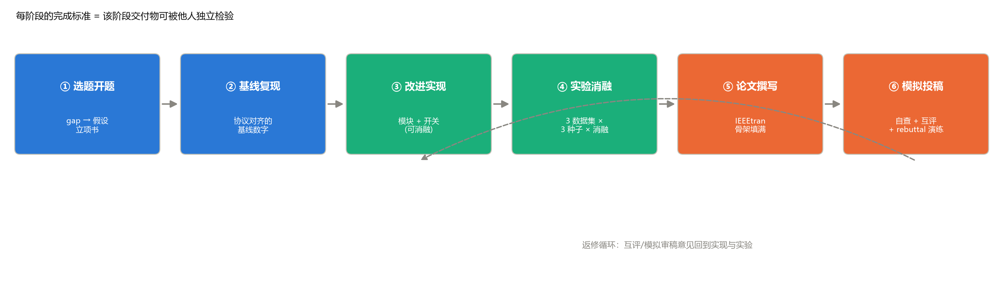

# 第 14 章 毕业实战：完成一篇论文

> **Capstone: Your First Paper**

状态：✅ 已完成（方法论；执行需要数周——本章给的是完整作战手册）

---

## 本章定位

全课程综合实战，对标参考课程的"从零实现迷你 Claude Code"章节：选定一个小而实的创新点，独立走完 **文献精读 → 基线复现 → 模块改进 → 实验与消融 → 论文撰写 → 模拟投稿** 的完整闭环。本章是前十三章的总装手册——每一步都标注了它调用的前序章节与交付物。完成本章，即达到课程目标：**能成熟撰写和发表论文**。

## 学习目标 / Learning Objectives

- 综合运用第 11–13 章的方法论，独立完成一个小型科研项目的全流程
- 学会评估选题：小切口（一个模块/一个损失/一个结构改动）而非大框架
- 体验完整决策链：从 gap 假设到实验取舍，从写作表达到投稿判断
- 产出一份完整的论文稿件（可先以 arXiv 预印本形态存在）



**图 14-1**　Capstone 六阶段流程。每阶段的完成标准 = 交付物可被他人独立检验；⑥ 的审稿意见会回到 ③/④ 形成返修循环——真实科研的"投稿即修改的开始"。

---

## 14.1 选题与开题

### 从 gap 到候选

选题的原材料在第 11 章已经备齐：每份精读笔记的第 9 节（缺点与可扩展点）。把 2–3 份笔记的清单合并，得到候选池。三条筛选标准（"够小够实"测试）：

1. **一个变量可陈述**：能用一句话写出假设（第 12 章 12.1 的三件套格式），而不是"把模型做得更好"；
2. **消融可干净验证**：改动是模块级的，加一个开关就能开/关（本章三个示例选题全部满足）；
3. **单卡/CPU 可承受**：预算内能跑完 3 数据集 × 3 种子 × 消融（第 12 章 12.2 的算力对齐）。

### 立项书（半页，交给导师/同伴审）

立项书 = 假设 + 协议 + 预算 + 风险。模板：

```markdown
## 立项：〈一句话标题〉
- 假设：在〈协议〉下，〈自变量〉能提升〈因变量〉，预期幅度〈X 点〉
- 基线：〈模型 + 协议 + 复现数字（引用课程记分板）〉
- 实验矩阵：〈数据集〉×〈种子数〉×〈消融开关〉
- 预算：〈卡时/CPU 时估计，用第 12 章的单次训练时长 × 矩阵规模〉
- 风险：〈若假设不成立，论文的退路是什么——负结果如何组织〉
```

> **风险栏是必须项**：第 9/10 章的两次负结果已经证明，"假设不成立"是常态而非事故。立项时就写清楚负结果的退路（如"负结果将组织为'正则在饱和协议下失效'的协议敏感性分析"），实验才不会白做。

### 三个示例选题（与课程资产直接衔接）

| 选题 | 组合 | 工作量 | 备注 |
|---|---|---|---|
| HybridSN + 谱注意力 | 第 8 + 10 章 | ★★☆ | 在 3D 阶段插入 (1,1,7) 谱注意力块；开关即消融 |
| HybridSN 轻量化：全局池化替代 flatten | 第 8 章 | ★☆☆ | dense1 的 4.7M 参数（表 8-1）→ 1.6 万；精度损失消融 |
| SSRN 的 λ 扫描与空间不相交对照 | 第 9 + 12 章 | ★★☆ | 回应第 9 章负结果的归因清单（协议饱和/λ 未调） |

## 14.2 基线复现

- 用第 12 章的 checklist（十项三问）对齐基线协议——**基线数字必须来自你自己的实验矩阵**，不能引用论文数字（他们的协议你无法复刻）；
- 复用课程管线：`train_hybridsn.py` / `train_ssrn.py` / `train_transformer.py` 的参数化开关已经覆盖大部分需求，新模块照 `--no-residual` 的模式加开关；
- 基线的交付物：3 种子 mean ± std + `run_config.json` 存档（第 12 章 12.4 规范）。

## 14.3 改进实现

- 新模块进 `src/hsi_learning/models/`（照 `hybridsn.py` 的风格），开关式设计保证"一次一变量"消融（12.3 纪律）；
- 先写最小可运行版本 + 单元级冒烟（形状、一行数据的前向），再谈精度；
- **每个设计决策当场写两行注释**（为什么这么做、放弃了什么）——这些注释就是论文 Method 节与 rebuttal 的原材料。

## 14.4 实验与消融

按第 12 章规范执行，交付物清单：

1. 主实验矩阵：3 数据集（IP/SA/PU——需先补 `dataset/`，见第 1 章）× 3 种子；
2. 消融矩阵：你的改进开关 on/off，其余全同；
3. `aggregate_ch12_ablation.py` 式的汇总（mean ± std）+ 记分板新行；
4. 可视化三件：总览图（13.3 规范）、预测图对照（nipy_spectral）、训练曲线（标注协议锚线）；
5. **负结果同样入表**——第 9/10/12 章已经示范了三次负结果的组织方式。

## 14.5 论文撰写

- 骨架：第 13 章交付的 `latex/paper_skeleton.tex`，写作顺序 Method → Experiments → Introduction → Related Work → Abstract；
- 素材映射：方法节 ← 14.3 的注释；实验节 ← 14.4 的矩阵与图表；related work ← 第 11 章笔记的对比矩阵；引言三段式 ← 精读笔记第 3 节的 gap；
- 图表生成脚本进 `scripts/generate_chNN_figures.py` 同款体系——**论文里的每张图都有一条可复现的命令**。

## 14.6 模拟投稿与互评

1. **自查**：`paper_skeleton.tex` 文末的投稿前 checklist 逐项打勾（\todo 清零、引用无 "？"、协议入表注）；
2. **互评/模拟审稿**：交换稿件，按表 13-1 的"拒稿理由列"逐节出意见——模拟审稿人是课程流程里最接近真实投稿的练习；
3. **返修演练**：把收到的意见写成 response letter（先谢后答、有问必答、用新实验说话）——第 13 章 13.6 的三条原则落地；
4. **归档**：代码 + `run_config.json` + 记分板行 + 论文 LaTeX 源一起打 tag——这就是可写进简历/申请材料的完整科研档案。

---

## 配套实操 / Hands-on

本章本身就是实操——六阶段各有一份交付物（图 14-1）。启动方式：从 14.1 的三个示例选题中选一个（或自拟并通过"够小够实"测试），写半页立项书，找一位同伴/导师过目，然后按图推进。

时间预算参考（CPU/单卡档）：② 基线复现 1 周、③ 改进实现 1–2 周、④ 实验矩阵 1–2 周（后台排队，参照第 12 章节奏）、⑤ 写作 2 周、⑥ 模拟投稿 1 周——合计 6–8 周的业余时间体量。

## 本章要点 / Key Takeaways

- 中文：Capstone 的关键是"小切口、全流程"——一个能被消融干净验证的改动走完六阶段，胜过一个庞大的未完成想法；三道筛选（一个变量可陈述/消融可验证/预算可承受）+ 半页立项书（含风险栏与负结果退路）防止选题膨胀；每阶段完成标准 = 交付物可被他人独立检验；基线数字来自自己的实验矩阵而非论文转述；负结果与正结果同权入表；最终交付 = 代码 + 配置 + 记分板行 + LaTeX 源的完整档案。
- English: The capstone favors a small, clean contribution carried through six stages — an ablation-verifiable change beats a grand unfinished idea. Three filters (one-statement hypothesis, switchable ablation, affordable budget) plus a half-page proposal with an explicit risk-and-negative-result plan keep the scope honest; each stage is done when its deliverable is independently checkable; baseline numbers come from your own matrix, negative results enter the tables with equal standing, and the final artifact is the full archive: code, configs, scoreboard row, and LaTeX source.

## 自测题 / Self-check

1. 判断一个选题是否"够小够实"的三条标准是什么？用第 9 章 SIR 负结果做一道练习：如果把"λ 扫描与空间不相交对照"写成立项书，它的假设、实验矩阵与风险栏各是什么？
2. 为什么基线数字必须来自自己的实验矩阵？引用论文原报告的基线数字会引入哪两类不可控偏差？
3. 六阶段中哪一阶段的交付物最容易被跳过？跳过它的后果会在哪一阶段暴露？
4. 你的 Capstone 论文写完后，用哪份清单做最后一轮自查？清单里哪一项对应第 12 章的规范、哪一项对应第 11 章？

<details>
<summary><strong>参考答案（先自己回答再看）</strong></summary>

1. 三条标准：一个变量可陈述 / 消融可干净验证 / 预算可承受。SIR 立项书示例——假设："在协议 D 与空间不相交划分下，λ ∈ {0.01, 0.1, 1} 中的某个值能带来可测的 AA 提升"；矩阵：{λ=0, 0.01, 0.1, 1} × {随机划分, 空间不相交} × 3 种子；风险栏："若仍无收益，论文退路为'正则收益对协议的敏感性分析'（负结果组织法，第 12 章 12.1）"。
2. (a) 协议偏差：原论文的划分/预处理/预算你无法逐位复刻，其数字属于它的协议而非你的；(b) 泄漏口径偏差：不同协议的泄漏量不同（第 6 章账本），转述数字与你的数字不在同一口径上。两者都会让"提升 X 点"的声称失去证据基础——审稿人用 checklist 一查即穿。
3. 最容易被跳过的是 ②（基线复现）——"论文有数字，我直接比"。后果在 ④⑤ 暴露：实验矩阵没有同协议基线行，主表的第一列只能填论文数字（口径不符），或临时补跑基线（时间失控），审稿意见几乎必然出现 "unfair comparison"。
4. 用 `paper_skeleton.tex` 文末的投稿前 checklist。"协议声明（划分/种子/预处理拟合范围/预算）"对应第 12 章；"贡献点与实验表一一对应"与 related work 的对比矩阵对应第 11 章（缺口句的引用与 gap 的真实性）。
</details>

## 延伸阅读 / Further Reading

- 第 11–13 章全部参考文献与交付物（精读笔记范文、checklist、IEEEtran 骨架）。
- 本仓库 `docs/benchmark.md` —— 你的 Capstone 行将加入的位置。
- Papers with Code 的高光谱分类榜单 —— 检查你的协议与社区公认可比性。
- 选定数据集后的官方说明页（EHU Hyperspectral Remote Sensing Scenes，第 1 章已引）——SA/PU 数据的获取入口。
