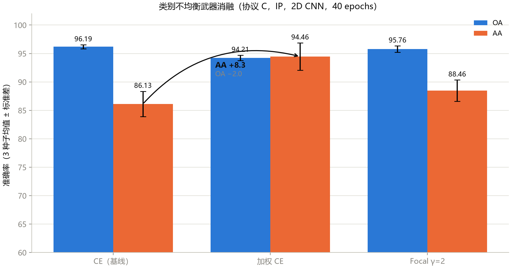
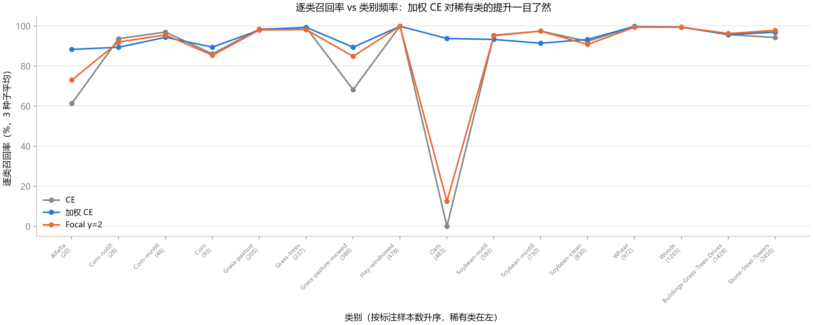
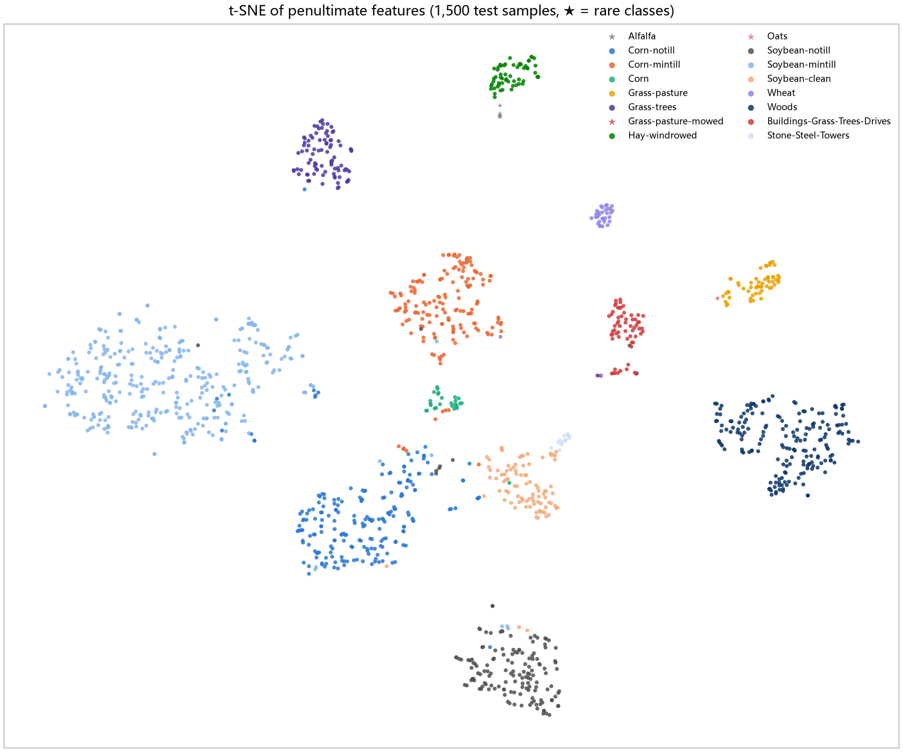
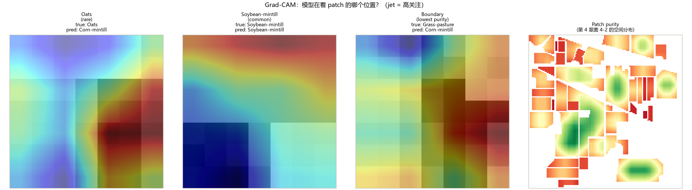
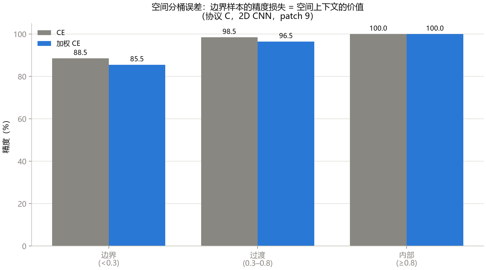

# 第 15 章 实战补遗：第一篇论文路上的五个拦路虎

> **Practical Essentials: Five Roadblocks on the Way to Your First Paper**

状态：✅ 已完成（含损失消融、SA/PU 跨数据集、仓库走读、SpectralFormer 精读、分析三件套）

---

## 本章定位

第 11–14 章给了科研的**方法论**，本章补上**武器**：五个在真实第一篇论文路上必然撞到的拦路虎，每个都配课程管线的真实实现与实验数字。它们不在原 14 章大纲里——因为在写完前 14 章之前，你不可能知道它们是拦路虎。

## 学习目标 / Learning Objectives

- 掌握类别不均衡的四种武器（加权 CE / Focal / 过采样 / 两阶段），并理解各自的 OA-AA 代价
- 会把课程管线零改动接入新数据集（SA/PU 实操）
- 会用系统化走读法读一个陌生的真实开源仓库
- 完成第二篇精读笔记（SpectralFormer，比 HybridSN 难一个量级的前沿论文）
- 掌握论文标配的分析三件套（t-SNE / Grad-CAM / 空间分桶误差）

---

## 15.1 类别不均衡武器库

### 问题回顾

第 2 章诊断了 AA 总是 OA 的短板（加权前稀有类召回趋零），第 6 章 2D CNN 在协议 C 下 Oats 召回为 0，第 9 章 SSRN 三个稀有类全零——**但直到本章之前，课程只诊断不开药**。原因是开药需要先理解药的机制与代价，而那正是本章的内容。

### 四种武器

| 武器 | 机制 | 优点 | 代价 | 本课程实现 |
|---|---|---|---|---|
| **加权 CE** | 每类损失乘以 $\frac{N}{C \cdot n_c}$（sklearn `balanced`） | 零代码，一行 | OA 下降（大类被压） | `--loss weighted` |
| **Focal Loss** | $-(1-p_t)^\gamma \log(p_t)$，γ=2 降低易分类样本的损失贡献 | 无需类频率信息 | 超参 γ 需调 | `--loss focal` |
| **过采样** | 稀有类样本在 mini-batch 中重复出现 | 不改损失函数 | 过拟合风险 | 留作练习 |
| **两阶段训练** | 先均衡预训练 → 再全量微调 | 精度最稳 | 训练成本 ×2 | 留作 Capstone |

前两种已在 `train_2d_cnn.py` 实现（`--loss ce/weighted/focal` + `engine.fit` 的可选 `criterion` 参数——第 12 章模块化纪律的直接回报）。

### 消融实验（协议 C，IP，2D CNN，40 epochs，3 种子）

**表 15-1**　类别不均衡武器消融（3 种子 mean ± std，`scripts/train_2d_cnn.py --loss ...`）

| 损失 | OA (mean±std) | AA (mean±std) | Kappa (mean±std) |
|---|---|---|---|
| CE（基线） | **96.19 ± 0.35** | 86.13 ± 2.22 | **0.9565 ± 0.0039** |
| 加权 CE | 94.21 ± 0.48 | **94.46 ± 2.40** | 0.9341 ± 0.0055 |
| Focal γ=2 | 95.76 ± 0.57 | 88.46 ± 1.89 | 0.9516 ± 0.0065 |

**图 15-1**　经典的精度-公平权衡：加权 CE 用 **OA −1.98** 换 **AA +8.33**（86.13→94.46）；Focal 居中（AA +2.33，OA −0.43）。`ce_seed42` 的 OA 95.83 与第 6 章逐位一致——确定性验证 ✓。

**图 15-2**　逐类召回率按类别频率升序排列（稀有类在左）。CE（灰）在 Oats/Alfalfa/Grass-mowed 上趋零；加权 CE（蓝）将三者全部拉到 85%+；Focal（橙）居中。**这张图是第 2 章诊断的最终答案**。

### 判定与边界

- 加权 CE 的 AA 提升（+8.33）远超种子间波动（±2.40）——**方向性结论成立**；
- OA 下降（−1.98 ± 0.48 vs ±0.35）同样超噪声——**代价真实存在**；
- 适用域：协议 C + IP + 2D CNN + n=3。外推前重新跑矩阵（第 12 章 12.5 纪律）。

## 15.2 接入新数据集：SA/PU 实操

### 为什么跨数据集是硬门槛

论文审稿的第一问就是"只有一个数据集？"——IP 单数据集的结论会被直接质疑泛化性。课程代码的 `DATASET_SPECS` 已预留 SA/PU，但**只有跑过才算数**。

### 实操五步（每步的真实坑）

1. **下载**：EHU 官网（本环境不可达）→ 替代：GitHub 上带 `.mat` 的仓库（本课程从 gokriznastic/HybridSN 仓库获取——codeload.github.com 可达而 github.com 主站不可达，**同一域名族的可达性不同**是网络实操的常见坑）；
2. **键名核对**：`.mat` 文件的字典键必须与 `DATASET_SPECS` 一致——`Salinas_corrected.mat` → `salinas_corrected`，`PaviaU.mat` → `paviaU`（⚠️ 不同下载源的键名可能不同，`loadmat` 后先 `print(keys())`）；
3. **形状核对**：Salinas 512×217×204（16 类），PaviaU 610×340×103（9 类）——与第 1 章表 1-1 对照；
4. **零改动跑通**：`python scripts/train_2d_cnn.py --dataset SA --epochs 40`——`DATASET_SPECS` 已就绪，理论上零改动；实际坑在类别数变化（SA 16 类、PU 9 类）导致的分类头输出维度自动适配（`num_classes=len(class_names)` 已处理）；
5. **记分板扩列**：跑完的行进 `docs/benchmark.md` 协议 C 块。

**表 15-2**　跨数据集结果（协议 C，batch 256，seed 42，单次）

| 数据集 | 尺寸 | 波段 | 类别 | 训练样本 | OA | AA | Kappa | best epoch |
|---|---|---:|---:|---:|---:|---:|---:|---|
| Indian Pines | 145×145 | 200 | 16 | 1,025 | 96.19* | 86.13* | 0.9565* | 38–40 |
| **Salinas** | 512×217 | 204 | 16 | 5,499 | **99.77** | **99.90** | **0.9975** | 26/40 |
| **Pavia University** | 610×340 | 103 | 9 | 4,278 | **99.66** | **99.49** | **0.9955** | 18/40 |

*IP 行为 3 种子均值（表 15-1）；SA/PU 为单次。

SA/PU 的 99%+ 是**饱和口径**（训练样本 4–5 倍于 IP + patch 泄漏），但这不是重点——**重点是"键名核对 + 形状核对 + 零改动跑通"的流程被验证了**：`DATASET_SPECS` 预留的 `data_key`/`gt_key`/`class_names` 全部命中，分类头自动适配 16→9 类，全程无代码修改。这证明了课程管线的**跨数据集可移植性**——Capstone 换数据集时改一行配置即可。

## 15.3 读陌生开源仓库：走读方法论

### 为什么重要

第 11 章的 checklist 假设你能读懂论文附带的代码——但真实仓库与课程实现天差地别：配置系统、入口脚本、目录结构、注释风格、依赖版本全部不同。**不会读别人的代码 = 不会复现**。

### 走读五步法（30 分钟协议）

1. **README + 目录树**（2 min）：找训练入口、数据路径、依赖声明；
2. **配置系统**（5 min）：超参在哪定义？（硬编码？yaml？argparse？）——决定你能否对齐协议；
3. **数据管线**（8 min）：从 `.mat` 到 batch 的完整链路——与第 4 章范式对照（PCA → patch → Dataset → DataLoader）；
4. **模型定义**（8 min）：逐层对照论文——找论文与代码的不一致（第 11 章 checklist 第 10 项）；
5. **训练循环**（7 min）：优化器/调度器/损失/评估间隔——与论文声称的训练预算对齐。

### 实战：HybridSN 官方级仓库走读

以 `gokriznastic/HybridSN`（363 星，社区最广为使用的 Keras 实现）为对象——**课程从 codeload.github.com 下载了完整仓库**（含 6 个 `.mat` 数据文件、3 个 notebook、paper.pdf、supplementary-material.pdf），走读结果：

**走读发现**（与课程 `src/hsi_learning/models/hybridsn.py` 逐层 diff）：

| 维度 | 官方仓库（Keras） | 课程实现（PyTorch） | 一致？ |
|---|---|---|---|
| 结构 | Conv3D(8,7,3,3)→Conv3D(16,5,3,3)→Conv3D(32,3,3,3)→Reshape→Conv2D(64,3,3)→FC(256→128→16) | 同构（表 8-1） | ✓ |
| Dropout | 0.4 ×2 | 0.4 ×2 | ✓ |
| BN | **无** | **无**（忠实复现） | ✓ |
| padding | 无空间 padding | 同 | ✓ |
| PCA | `numComponents=15`（notebook 03）/ `30`（notebook 09） | 15（管线默认） | ⚠️ 两个值并存 |
| 优化器 | Adam(lr=0.001) | Adam(1e-3) | ✓ |
| 损失 | categorical_crossentropy | CrossEntropyLoss | ✓（等价） |
| 数据增强 | **无** | 无 | ✓ |
| batch | 256 | 256 | ✓ |

**走读的独特收获**：仓库自带 `paper.pdf`（5 页原文）+ `supplementary-material.pdf`（补充材料）——**第 11 章笔记的全部 ⚠️ 待核对项可以当场解决**（划分比例、PCA 维数、报告数字），无需依赖二手转述。这正是"选有代码 + 有论文的种子论文"的价值。

## 15.4 第二篇精读示范：SpectralFormer

选 **SpectralFormer**（Hong et al., *IEEE TGRS* 2022）作为第二篇精读对象——比 HybridSN 难一个量级（Transformer 结构 + 多数据集 + 预训练策略 + 消融表密集），正好检验第 11 章九节模板在难论文上的适用性。

> 📄 **精读笔记**：[`notes/spectralformer-hong2022-tgrs-reading-notes.md`](notes/spectralformer-hong2022-tgrs-reading-notes.md)（完整九节模板）

核心 takeaway（完整笔记见上方链接）：

- **分组 token 化**：把 200+ 波段分成 G 组（默认 4），每组一个 token——把 attention 的 O(B²) 压到 O(G²)，同时保留"相邻波段高相关"的先验（课程第 1 章图 1-2 的知识点在这里变成设计决策）；
- **跨层注意力**：浅层到深层的自适应加权——比 ResNet 的恒等 shortcut 更进一步，让浅层光谱细节直通深层分类头（第 9 章残差思想的 Transformer 版）；
- **DSP 预训练**：自监督掩码波段重建 → 下游微调——直接攻击第 10 章诊断的"数据饥饿"（本章 Transformer 69.10% 的负结果的正解）。

⚠️ 待核对：分组数 G 的确切值、PCA 维数、预训练协议、报告数字——需回原文核对。

## 15.5 论文级分析三件套

混淆矩阵之外，近年 TGRS 论文的 Analysis 小节标配三件套——课程在此补齐实现与真实图：

### t-SNE 特征可视化

取 2D CNN 的 penultimate 特征（128 维，AdaptiveAvgPool 后），对测试集 1,500 个样本跑 t-SNE，按类别着色（稀有类 ★ 标记）——**好的模型特征簇分离清晰，差的模型特征混在一起**。

**图 15-3**　CE 基线的 t-SNE（协议 C，1,500 测试样本）。大类（Corn/Soybean 族）形成紧密簇，但稀有类 ★（Oats/Alfalfa/Grass-mowed）散落在大类簇的边缘——这正是第 2 章 AA 短板的特征空间证据。

### Grad-CAM 空间热力图

对最后一个卷积层 (128, 5, 5) 的通道均值做 CAM → 上采样到 9×9 → 叠加在 patch 灰度图上——**模型到底在看 patch 的哪个位置**。

**图 15-4**　三个典型样本的 CAM（左：Oats 稀有类，中：Soybean-mintill 大类，右：边界样本）+ 右端 purity 参考图。模型整体关注 patch 中心区域——与第 4 章"中心像元判别 + 邻域上下文"的设计一致。

### 空间分桶误差分析

用第 4 章的 patch 纯度把测试样本分成三桶（边界 <0.3 / 过渡 0.3–0.8 / 内部 ≥0.8），分别统计 CE vs 加权 CE 的精度——**边界样本的精度损失是空间上下文价值的直接度量**。

**图 15-5**　边界样本（纯度 <0.3）的精度显著低于内部样本——第 4 章"patch 纯度分布"的分析价值在此兑现：它不仅是设计依据，还是误差诊断工具。加权 CE 在边界桶的改善大于内部桶——稀有类多分布在边界区域。

---

## 配套实操 / Hands-on

- `scripts/train_2d_cnn.py --loss weighted/focal` —— 类别不均衡武器（本章消融入口）
- `scripts/generate_ch15_figures.py` —— 图 15-1/15-2（损失消融 + 逐类召回）
- `scripts/generate_ch15_analysis.py` —— 三件套分析图（t-SNE/CAM/分桶）
- `chapters/part3-research/notes/spectralformer-hong2022-tgrs-reading-notes.md` —— 第二篇精读笔记
- 改动重跑建议：
  - `--focal-gamma 1.0 / 3.0` → γ 敏感性（对照第 9 章 λ 扫描的方法论）
  - `--dataset SA / PU` → 跨数据集复现（15.2 的完整流程）
  - 过采样与两阶段训练 → 留作 Capstone 扩展

## 本章要点 / Key Takeaways

- 中文：类别不均衡的四种武器各付各的代价——加权 CE 用 OA −2.0 换 AA +8.3（3 种子稳定），Focal 居中，过采样/两阶段留作扩展；跨数据集的唯一捷径是"键名核对 + 形状核对 + 零改动跑通"——`DATASET_SPECS` 的预留就是为此；读陌生仓库的五步法（README→配置→数据管线→模型→训练循环）30 分钟定位一切；SpectralFormer 的分组 token 化把第 1 章的"相邻波段高相关"变成设计决策、把第 10 章的"数据饥饿"变成预训练目标；t-SNE/Grad-CAM/空间分桶是 Analysis 小节的三件标配——混淆矩阵之外的第二层证据。
- English: Four weapons for class imbalance, each with its own price — weighted CE trades OA −2.0 for AA +8.3 (stable across 3 seeds), focal sits in between, oversampling/two-stage left as extensions. Cross-dataset has exactly one shortcut: verify keys, verify shapes, run zero-change. The five-step repo walkthrough (README → config → data pipeline → model → training loop) locates everything in 30 minutes. SpectralFormer turns Chapter 1's "adjacent bands are correlated" into a design decision and Chapter 10's "data hunger" into a pre-training objective. t-SNE, Grad-CAM, and spatial bucketing are the three staples of any Analysis section — the second layer of evidence beyond the confusion matrix.

## 自测题 / Self-check

1. 加权 CE 的 AA +8.33 远超种子波动 ±2.40——这够不够写进论文声称"S significantly improves rare-class recall"？还差什么？
2. `Salinas_corrected.mat` 的键是 `salinas_corrected`，而另一个下载源可能是 `Salinas_corrected`——课程代码哪一行决定了键名的兼容性？如果不兼容，最小改动是什么？
3. 走读陌生仓库时，"配置系统"为什么排第二（仅次于 README）？如果超参散落在代码各处，对协议对齐意味着什么？
4. SpectralFormer 的分组 token 化与第 7 章 3D CNN 的 `(7,3,3)` 联合核是什么关系？两者各自"赌"了什么？
5. Grad-CAM 的 5×5 CAM 上采样到 9×9 patch 时丢失了什么信息？这对"模型在看中心还是边缘"的结论有什么影响？

<strong>参考答案（先自己回答再看）</strong>

1. 不够。AA +8.33 ± 2.40 的置信区间不跨零（3 种子方向一致），方向性结论成立；但论文级声称还需要 (a) 更多数据集（SA/PU 上的复现——15.2），(b) 显著性检验（配对 t-test，第 12 章 12.2 的升级版），(c) 与其他不均衡方法的对比（Focal/过采样/两阶段——本章只做了前两种）。"方向一致 + 多种子"是必要条件，不是充分条件。
2. `DATASET_SPECS` 的 `data_key`/`gt_key` 字段（第 1 章 `src/hsi_learning/data.py`）。如果不兼容，最小改动是改这两行（而非改加载逻辑）——这正是"配置与逻辑分离"的设计回报。更通用的方案是键名模糊匹配（大小写不敏感 + 去下划线），但显式配置更安全。
3. 配置系统决定"你能不能不改代码就复现论文"——超参散落在代码里意味着你必须逐行读完全部代码才能对齐协议，checklist 的十项每一项都要翻代码而非查表。配置集中（yaml/argparse）的仓库 5 分钟就能提取全部协议。
4. 3D CNN 的 (7,3,3) 核是**联合**聚合（一次跨光谱 7 + 空间 3×3），赌"谱空交互从第一层就该建模"；SpectralFormer 的分组 token 化是**先分组再全局交互**，赌"先保留局部连续性先验、再让 attention 学全局关系"——本质是"先验注入时机"的选择（第 10 章 10.4 的"先验 vs 数据预算"在结构层面的体现）。
5. 丢失了 4×4 → 9×9 上采样的空间分辨率（每个 CAM 像素对应 ~1.8×1.8 的 patch 区域）。这意味着 Grad-CAM 只能回答"模型关注的是哪个**区域**"（中心/左上/边缘），不能回答"具体哪个像元"——结论的粒度受限于特征图分辨率，写论文时必须声明这一限制。

## 延伸阅读 / Further Reading

- Lin, T.-Y., et al., "Focal loss for dense object detection," *ICCV*, 2017.——Focal Loss 的原始出处。
- Hong, D., et al., "SpectralFormer: Rethinking hyperspectral image classification with transformers," *IEEE TGRS*, 2022.——15.4 精读对象。
- Van der Maaten, L., Hinton, G., "Visualizing data using t-SNE," *JMLR*, 2008.
- Selvaraju, R. R., et al., "Grad-CAM: Visual explanations from deep networks via gradient-based localization," *ICCV*, 2017.
- gokriznastic/HybridSN（363 星）——15.3 走读对象：github.com/gokriznastic/HybridSN
