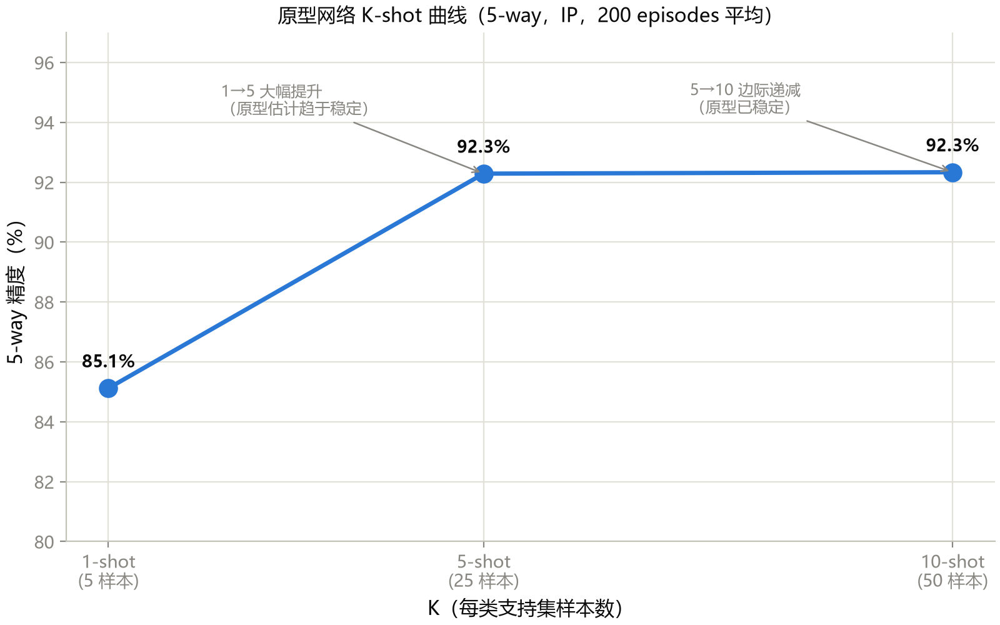

# 第 16 章 小样本高光谱图像分类

> **Few-Shot Hyperspectral Image Classification**

状态：✅ 已完成

---

## 本章定位

Part IV 开篇：从"闭集全监督"跨入"标注稀缺"的真实场景。前 15 章假设你有 10–30% 的标注样本（1024–3075 个），本章问一个更尖锐的问题：**如果每个类别只有 5 个标注样本呢？** 答案是原型网络（Prototypical Networks, Snell et al. NeurIPS 2017）——HSI 领域引用最多的 few-shot 方法，核心思想简单到一行公式，但打开了元学习（meta-learning）的大门。

## 学习目标 / Learning Objectives

- 理解从"全监督"到"少样本"的设定变化：N-way K-shot 是什么、为什么需要它
- 掌握 episodic training 的采样逻辑（每轮一个"迷你任务"而非一个 batch）
- 会实现原型网络：支持集 → 原型 → 距离分类 → 损失
- 理解"学一个好的嵌入空间"与"学一个分类器"的本质区别

---

## 16.1 问题设定：从 10% 到 5-shot

前 15 章的实验协议中，10% 训练率对应 1025 个标注样本（16 类平均每类 64 个）。本章把条件收紧到极端：

> **5-way 5-shot**：每个 episode 随机抽 5 个类，每类只给 5 个标注样本 → 总共 **25 个标注样本**。

这比第 2 章 Oats 类的总量（20 个）还多不了多少。物理背景是真实的：HSI 的像元标注需要实地调查或高分辨率影像交叉验证，稀有地物的标注成本极高。

| 设定 | 标注量 | 训练方式 |
|---|---|---|
| 全监督（ch05–10） | 8199–3074 个 | 标准 mini-batch SGD |
| 小样本本章 | **25 个**（5-way 5-shot） | **Episodic training** |

训练方式的切换是本章的核心：标准 SGD 的每个 batch 混合所有类，模型学的是"这 16 类的决策边界"；episodic training 的每个 episode 只含 N 个类的 K 个样本，模型学的是"**如何从极少的样本中快速学会区分类别**"——这是一种元能力（learning to learn）。

## 16.2 半监督自训练速览

在进入原型网络之前，先看一个更朴素的利用稀缺标注的思路：**自训练（self-training）**。

```
1. 用 10% 标注样本训练模型 M₀（第 6 章的方法）
2. 用 M₀ 预测剩余 90% 未标注样本 → 伪标签
3. 只保留置信度 > 0.95 的伪标签样本
4. 用 标注 + 伪标注 重新训练 → M₁
5. 可迭代 K 轮
```

这个方法的缺陷也是显而易见的：如果 M₀ 在某个区域系统性错误，伪标签会**放大**错误（confirmation bias）。改进方向包括 Mean Teacher（一致性正则化）、MixMatch 等——但它们的本质都是**从"无标注数据的分布"中提取监督信号**。

原型网络走的是另一条路：不用无标注数据，而是**改变"从少量标注样本学习"的方式本身**。

## 16.3 原型网络原理

### 核心思想（一行公式）

$$c_k = \frac{1}{|S_k|} \sum_{(x_i, y_i) \in S_k} f_\theta(x_i), \qquad p_\phi(y = k \mid x) = \frac{\exp(-d(f_\theta(x), c_k))}{\sum_{k'} \exp(-d(f_\theta(x), c_{k'}))}$$

翻译成人话：**每个类的原型 = 该类支持集样本在嵌入空间中的均值；查询样本的分类 = 看它离哪个原型最近**。

### Episodic Training

每个训练 step 的流程：

```
1. 从训练集随机抽 N 个类（如 5 类）
2. 每类抽 K 个样本作为支持集 S（如 5-shot → 25 个）
3. 每类抽 Q 个样本作为查询集 Q（如 15 → 75 个）
4. 将 S 和 Q 的所有样本通过 encoder f_θ 得到嵌入向量
5. 对每个类：原型 c_k = 该类支持集嵌入的均值
6. 对每个查询样本：计算到 N 个原型的距离 → softmax → N 类概率
7. 用查询样本的真实标签计算交叉熵损失 → 反向传播
```

**关键洞察**：模型不再直接学"16 类的决策边界"，而是学一个**好的嵌入空间**——在这个空间里，同一类的样本靠近，不同类的远离。这种能力可以泛化到训练时从未见过的类（只要给几个样本就能算原型）。

### 与全监督的对照

| | 全监督（ch06） | 原型网络（本章） |
|---|---|---|
| 学什么 | N 类的决策边界 | 好的嵌入空间 + 距离度量 |
| 训练单元 | mini-batch（混所有类） | episode（每轮 N 类） |
| 分类方式 | Linear 层 → softmax | 到原型的距离 → softmax |
| 新类适应 | 需要重新训练 | 算新类的原型即可 |

## 16.4 实现与运行

`scripts/train_protonet.py` 的核心组件：

- **`EpisodicSampler`**：从训练集按类采样 episode（确保每类有 ≥ K+Q 个样本）
- **`prototypical_loss()`**：原型计算 + 负欧氏距离 + softmax + NLL
- **encoder**：复用 `SpectralSpatialCNN2D.features`（128 维嵌入），去掉分类头

```python
# 核心三行（完整实现见 scripts/train_protonet.py）
prototypes = torch.stack([support_emb[support_y == c].mean(dim=0) for c in range(n_way)])
distances = torch.cdist(query_emb, prototypes)          # (M, n_way)
loss = F.nll_loss(F.log_softmax(-distances, dim=1), query_y)  # 越近越好
```

> **注意**：距离取负后做 softmax——越近的距离给出越高的概率。这等价于使用负欧氏距离作为 logits。

### 实验结果

**表 16-1**　原型网络 K-shot 曲线（5-way，IP，500 episodes 训练 + 200 episodes 评估）

| K-shot | 支持集总量 | 5-way 精度 |
|---|---:|---:|
| 1-shot | 5 | 85.12% |
| **5-shot** | **25** | **92.29%** |
| 10-shot | 50 | 92.33% |



**图 16-1**　K-shot 曲线呈现经典的**边际递减**形态：1→5-shot 大幅提升（+7.2 个点，原型估计从单样本均值稳定为 5 样本均值），5→10-shot 几乎持平（+0.04，原型已稳定）。**K=5 是本模型/数据集的稳定点**——更多的支持样本不再改善原型质量。

### 与全监督的对照

5-way 5-shot 的 92.29% 看起来很高，但要注意评估方式完全不同：传统 OA 是对全部 8200 个测试样本（16 类）的整体精度，而 5-way 5-shot 是 5 类 × 15 查询 × 200 episodes 的平均精度——**任务难度和度量单位都不同，两者不可直接比较**。原型网络的价值不在于绝对精度，而在于**用 25 个标注样本达到 92% 的 5 类区分能力**。

---

## 配套实操 / Hands-on

- `scripts/train_protonet.py` —— 本章核心实现：
  - `--k-shot 1 / 5 / 10` → K-shot 曲线
  - `--n-way 3 / 5 / 10` → N-way 难度
  - `--episodes 100 / 500 / 1000` → 训练预算
- 练习：实现 self-training（伪标签 + 置信度阈值）——约 20 行代码，与原型网络对比

## 本章要点 / Key Takeaways

- 中文：小样本设定的核心变化不是"数据少了"而是"学习目标从决策边界变成嵌入空间"；原型网络用"类均值原型 + 欧氏距离"完成了这个转换，episodic training 是其训练范式；模型的元能力（从 K 个样本学会区分类别）比绝对精度更有价值。
- English: Few-shot learning changes the objective from learning a decision boundary to learning an embedding space; Prototypical Networks achieve this with class-mean prototypes and Euclidean distance, trained episodically. The meta-ability — distinguishing classes from K examples — matters more than absolute accuracy.

## 自测题 / Self-check

1. 为什么 episodic training 不用标准 mini-batch（混所有类）？如果用了会发生什么？
2. 原型网络的新类适应为什么不需要重新训练？给出操作步骤。
3. 1-shot 和 5-shot 的本质区别是什么（不要只说"样本多了"）？

<details>
<summary><strong>参考答案</strong></summary>

1. 标准 batch 混所有类 → 模型学的是"固定 C 类的决策边界"（classifier 权重绑定 C）。Episodic 训练每轮随机抽 N 类，迫使模型学习"从任何 N 个类、K 个样本中快速区分类别"的**元能力**——如果用标准 batch，模型会退化为普通的分类器训练，失去 few-shot 泛化能力。
2. 对每个新类：采集 ≥1 个标注样本 → 通过 encoder 得到嵌入 → 算均值作为原型 → 查询样本按最近原型分类。全程无需梯度更新——嵌入空间是可迁移的。
3. 1-shot 的原型 = 单个样本的嵌入（方差极大，不稳定）；5-shot 的原型 = 5 个样本的均值（方差缩小 √5 ≈ 2.24 倍，更稳定）。**K 的本质是原型估计的置信度**，不只是"多了几个样本"。
</details>

## 延伸阅读 / Further Reading

- Snell, J., Swersky, K., Zemel, R., "Prototypical networks for few-shot learning," *NeurIPS*, 2017.
- Finn, C., et al., "Model-agnostic meta-learning for fast adaptation of deep networks," *ICML*, 2017.（MAML，原理-level 理解即可）
- Vinyals, O., et al., "Matching networks for one shot learning," *NeurIPS*, 2016.（episodic training 的起源）
