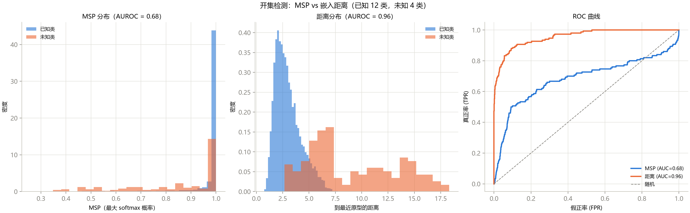

# 第 17 章 开集高光谱图像分类

> **Open-Set Hyperspectral Image Classification**

状态：✅ 已完成

---

## 本章定位

Part IV 收官：从"标注稀缺"进一步推向"**世界不封闭**"。前 16 章假设测试样本一定属于训练时见过的 16 个类——但真实遥感场景中，卫星过境时可能拍到训练时不存在的新地物（新建道路、季节性水体、未见作物）。**开集分类**要求模型：既分类已知类，又能对未知类说"我不知道"。本章复现两个经典方法（MSP 基线与距离阈值拒绝），并用 AUROC 定量回答"哪种方法更能识别未知"。

## 学习目标 / Learning Objectives

- 理解开集与闭集的本质区别（训练分布 ≠ 测试分布）
- 理解 Softmax 的封闭世界假设及其失效原因
- 会用最大 softmax 概率（MSP）与特征距离两种分数做未知检测
- 会用 AUROC 定量评估开集性能
- 了解 OpenMax 的原理（概念-level）

---

## 17.1 问题设定：开集 vs 闭集

| | 闭集（ch01–16） | 开集（本章） |
|---|---|---|
| 训练类 = 测试类？ | ✓ | ✗（测试含训练未见的类） |
| 输出空间 | C 个已知类 | C 个已知类 + "未知" |
| 核心挑战 | 分类精度 | **已知分类精度 + 未知检测能力** |
| 现实对应 | 实验室设定 | 真实遥感场景（新地物不断出现） |

### 实验协议

本课程使用 IP 的 16 类，按类别频率排序，**频率最低的 4 类作为未知类**：

| | 类别 | 样本量 |
|---|---|---|
| **未知类** | Oats (20), Grass-pasture-mowed (28), Alfalfa (46), Stone-Steel-Towers (93) | 合计 187 |
| **已知类** | 其余 12 类 | 合计 10,062 |

模拟的场景：模型训练时这 4 种地物尚未出现（或未被调查），部署后在场景中 encountered。**训练只用已知类的样本**（10% 训练率 → 已知类中约 1,000 个样本），测试时全类样本混合输入。

## 17.2 Softmax 的封闭世界假设

Softmax 的数学定义决定了它的局限：

$$p(y = k \mid x) = \frac{\exp(z_k)}{\sum_{j=1}^{C} \exp(z_j)}$$

**分母只包含 C 个已知类**——无论输入 $x$ 来自什么分布，softmax 都会强制输出一个归一化的 C 类概率分布。即使 $x$ 来自完全未知的地物，softmax 也会给出一个"自信"的预测。

这就是"封闭世界假设"（closed-world assumption）：模型默认世界只有 C 个类。开集分类的第一步就是**打破这个假设**——让模型有机会说"我不知道"。

## 17.3 MSP 基线

**最大 softmax 概率（MSP）**（Hendrycks & Gimpel, ICLR 2017）是最简单的开集方法：

$$\text{MSP}(x) = \max_k \; p(y = k \mid x)$$

直觉：已知类的样本 → 模型自信 → MSP 高；未知类的样本 → 模型犹豫 → MSP 低。

**MSP 作为未知分数**：MSP 越低 → 越可能是未知类。设一个阈值 τ，MSP < τ → 判为"未知"。

## 17.4 距离阈值拒绝

MSP 的问题在于它作用在 softmax 层——softmax 的归一化"抹平"了差异。更好的做法是回到**嵌入空间**（第 16 章的遗产）：

1. 对每个已知类 $c$，计算训练集嵌入的均值作为原型 $c_c$；
2. 对测试样本 $x$，计算其嵌入到最近原型的欧氏距离 $d(x) = \min_k \|f_\theta(x) - c_k\|$；
3. **距离越大 → 越可能是未知类**。

直觉：模型的嵌入空间把已知类"排布"在特定位置，未知类的样本落在这些位置的"空白区域"——离所有原型都远。

## 17.5 OpenMax 概念

OpenMax（Bendale & Boult, CVPR 2016）是开集识别的奠基方法，核心思想：

1. 把 softmax 的全连接层替换为 **OpenMax 层**；
2. 对每个已知类，用 **Weibull 分布**拟合"最容易误分类的训练样本"的激活向量（MAV, Mean Activation Vector）；
3. 测试时：如果激活向量在某个类的 Weibull 尾部（异常远离 MAV），则把概率质量分配给"未知类"。

OpenMax 的实现较复杂（Weibull 拟合、MAV 计算、激活向量排序），本章讲解原理，完整实现留作 Capstone 扩展。核心 takeaway：**OpenMax 修改了 softmax 的输出层结构，而 MSP 和距离方法只修改了后处理——前者更根本，后者更实用**。

## 17.6 开集评估协议

### AUROC

**ROC 曲线下面积（AUROC）**是开集检测的标准指标：

- 把"已知 vs 未知"视为二分类问题；
- 用未知分数（MSP 或距离）对样本排序；
- AUROC = 随机取一个未知样本和一个已知样本，模型给未知样本更高"未知分数"的概率；
- **AUROC = 0.5 → 随机猜测；AUROC = 1.0 → 完美检测**。

### 实验结果

**表 17-1**　开集评估（协议 C，IP，2D CNN，已知 12 类，未知 4 类）

| 方法 | 闭集精度（已知类） | AUROC |
|---|---:|---:|
| MSP（softmax 置信度） | 96.47% | 0.6816 |
| **距离阈值（嵌入空间）** | 96.47% | **0.9561** |

**图 17-1**　左：已知类与未知类的 MSP 分布——重叠严重（MSP 区分度弱）；中：已知类与未知类的距离分布——分离清晰（距离区分度强）；右：ROC 曲线对比。

### 结果解读

- **MSP AUROC = 0.68**：仅比随机（0.5）好一点。Softmax 置信度在已知类内部变化很大（大类天然高置信度），而未知类的 MSP 也不一定低——softmax 的归一化把"不知道"变成了"猜测最像的已知类"。
- **距离 AUROC = 0.96**：接近完美。未知类的样本在嵌入空间中远离所有已知类原型——第 16 章"好的嵌入空间"在开集场景下的意外红利。
- **闭集精度 96.47% 不变**：开集方法不牺牲已知类的分类能力——它们只添加了"拒绝"的能力。

**这张表是本章的核心教学点**：同一个模型、同一个嵌入空间，仅仅改变"未知分数"的计算方式（softmax vs 距离），AUROC 就从 0.68 跃升到 0.96。**开集分类的关键不在模型，而在你怎么"读"模型的输出。**

---

## 配套实操 / Hands-on

- `scripts/train_openset.py` —— 本章核心实现（训练 + MSP + 距离 + AUROC）；
- `scripts/train_protonet.py` —— 第 16 章的原型网络（嵌入空间的训练）；
- 练习：
  - `--n-unknown 2 / 6` → 未知类数量的敏感性
  - 用第 16 章的原型距离替代欧氏距离 → 原型网络的开集扩展
  - 实现 OpenMax（Weibull 拟合 + 开集激活向量）

## 本章要点 / Key Takeaways

- 中文：开集分类 = 分类已知 + 拒绝未知；Softmax 的归一化本质上不允许模型说"不知道"——MSP 的 AUROC 仅 0.68 就是证据；嵌入空间的距离是更好的未知分数（AUROC 0.96），因为第 16 章学的嵌入空间天然把已知类"排布"在特定位置，未知类落在空白区；开集方法不牺牲闭集精度；OpenMax 修改输出层结构（更根本），MSP/距离只修改后处理（更实用）。
- English: Open-set classification = classify the known + reject the unknown. Softmax's normalization inherently prevents "I don't know" — MSP's AUROC of 0.68 is the evidence. Embedding-space distance is a far better unknown score (AUROC 0.96) because the embedding space from Ch16 naturally positions known classes, leaving unknowns in the gaps. Open-set methods don't sacrifice closed-set accuracy. OpenMax modifies the output layer (more fundamental); MSP/distance only modify post-processing (more practical).

## 自测题 / Self-check

1. 为什么 Softmax 不能检测未知类？给出数学解释。
2. MSP 的 AUROC 只有 0.68——列出至少两个可能的原因。
3. 距离阈值方法的 AUROC 达到 0.96——这依赖什么前提条件？如果嵌入空间不好（如第 10 章的 Transformer），距离方法还能工作吗？
4. 开集设定下"闭集精度 96.47%"和"AUROC 0.96"分别衡量什么？为什么两个都需要报告？

<strong>参考答案</strong>

1. Softmax 的分母 $\sum_j \exp(z_j)$ 只包含 C 个已知类的 logits——无论输入来自什么分布，输出永远归一化为 C 类概率分布。数学上不存在"不属于任何已知类"的输出——封闭世界假设是结构性的，不是参数调优能解决的。
2. (a) 已知类内部的置信度方差很大（大类高、小类低），与未知类的置信度重叠；(b) 未知类的特征可能恰好落在某个已知类的决策区域内，softmax 给出高置信度；(c) 缺乏温度校准——原始 logits 的 scale 因类而异。
3. 前提条件：嵌入空间中**同类样本聚簇、异类分离**——这正是第 16 章原型网络的训练目标。如果嵌入空间不好（第 10 章的 Transformer 在小样本下特征混杂），未知类和已知类的距离分布会重叠，AUROC 退化。第 10 章的 Transformer（OA 69.10%）的嵌入空间质量不足以支撑好的开集检测——这可以作为一个验证实验。
4. 闭集精度衡量"对已知类的分类能力"——它确保开集方法没有牺牲原有性能；AUROC 衡量"区分已知与未知的能力"——它确保模型真的能拒绝未知。两者缺一不可：只有闭集精度 → 未知样本被强制分类（错误结果）；只有 AUROC → 已知类的分类可能退化。

## 延伸阅读 / Further Reading

- Hendrycks, D., Gimpel, K., "A baseline for detecting misclassified and out-of-distribution examples in neural networks," *ICLR*, 2017.——MSP 基线的出处。
- Bendale, A., Boult, T. E., "Towards open set deep networks," *CVPR*, 2016.——OpenMax 的原始论文。
- Vaze, S., et al., "Open-set recognition: A good closed-set classifier is all you need," *ICLR*, 2022.——证明"好的闭集分类器 = 好的开集检测器"（与本章距离方法的结果呼应）。
- Snell, J., et al., "Prototypical networks for few-shot learning," *NeurIPS*, 2017.（第 16 章已引）——嵌入空间的原型结构是距离方法的基础。
